CJ meta-analysis
================
George Kinnear
2025-04-10

# About the sample

    ## # A tibble: 1 × 1
    ##   n_datatsets
    ##         <int>
    ## 1         101

## SSR correction

The `ssr` column stores the `mle.rel` value from `sirt::btm` which is
incorrect; here, we replace the `ssr` values with the correct ones,
computed from `sepG`:

# RQ1: How do study characteristics and reliability measures vary across CJ studies?

## Study characteristics

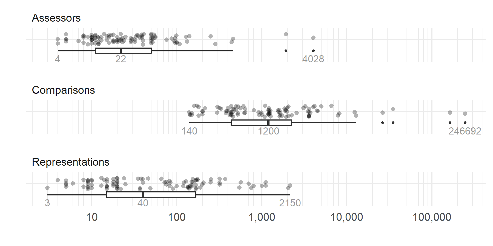<!-- -->

<table class="table table-striped" style="width: auto !important; margin-left: auto; margin-right: auto;">
<thead>
<tr>
<th style="text-align:left;">
N_A
</th>
<th style="text-align:right;">
expert
</th>
<th style="text-align:right;">
layperson
</th>
<th style="text-align:right;">
novice
</th>
<th style="text-align:right;">
peer
</th>
</tr>
</thead>
<tbody>
<tr>
<td style="text-align:left;">
\<= 10
</td>
<td style="text-align:right;">
16
</td>
<td style="text-align:right;">
2
</td>
<td style="text-align:right;">
3
</td>
<td style="text-align:right;">
0
</td>
</tr>
<tr>
<td style="text-align:left;">
\<= 100
</td>
<td style="text-align:right;">
40
</td>
<td style="text-align:right;">
16
</td>
<td style="text-align:right;">
10
</td>
<td style="text-align:right;">
4
</td>
</tr>
<tr>
<td style="text-align:left;">
\<= 1000
</td>
<td style="text-align:right;">
3
</td>
<td style="text-align:right;">
3
</td>
<td style="text-align:right;">
0
</td>
<td style="text-align:right;">
2
</td>
</tr>
<tr>
<td style="text-align:left;">
1000+
</td>
<td style="text-align:right;">
0
</td>
<td style="text-align:right;">
2
</td>
<td style="text-align:right;">
0
</td>
<td style="text-align:right;">
0
</td>
</tr>
</tbody>
</table>

## Relationships between study characteristics

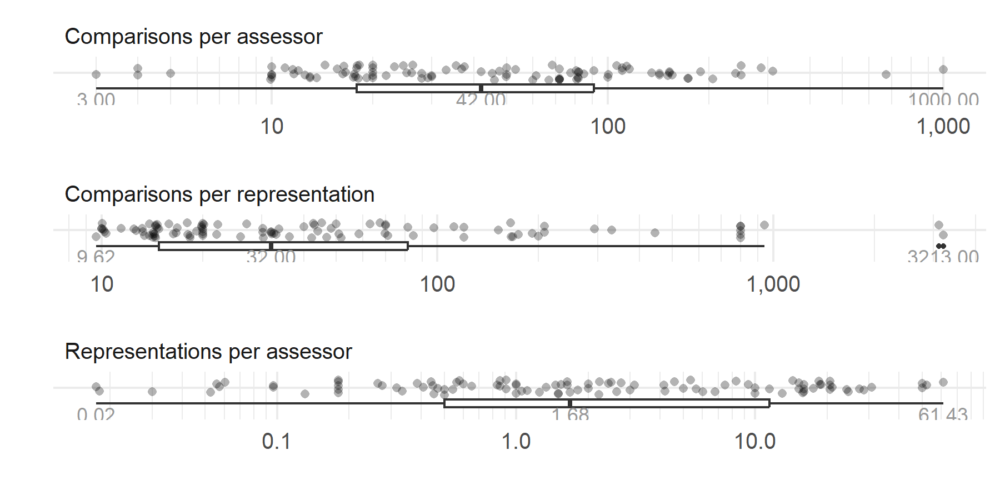<!-- -->

Top 3:

<table class="table table-striped" style="width: auto !important; margin-left: auto; margin-right: auto;">
<thead>
<tr>
<th style="text-align:left;">
judging_session
</th>
<th style="text-align:left;">
feature
</th>
<th style="text-align:right;">
count
</th>
</tr>
</thead>
<tbody>
<tr>
<td style="text-align:left;">
Ofqual2015
</td>
<td style="text-align:left;">
Comparisons per assessor
</td>
<td style="text-align:right;">
1000.00000
</td>
</tr>
<tr>
<td style="text-align:left;">
Hunter2018
</td>
<td style="text-align:left;">
Comparisons per assessor
</td>
<td style="text-align:right;">
676.00000
</td>
</tr>
<tr>
<td style="text-align:left;">
McMahon2014_teachers
</td>
<td style="text-align:left;">
Comparisons per assessor
</td>
<td style="text-align:right;">
310.00000
</td>
</tr>
<tr>
<td style="text-align:left;">
Esen2019
</td>
<td style="text-align:left;">
Comparisons per representation
</td>
<td style="text-align:right;">
3213.00000
</td>
</tr>
<tr>
<td style="text-align:left;">
Isnac2020
</td>
<td style="text-align:left;">
Comparisons per representation
</td>
<td style="text-align:right;">
3108.00000
</td>
</tr>
<tr>
<td style="text-align:left;">
Vatavu2020
</td>
<td style="text-align:left;">
Comparisons per representation
</td>
<td style="text-align:right;">
942.14286
</td>
</tr>
<tr>
<td style="text-align:left;">
Ofqual2015
</td>
<td style="text-align:left;">
Representations per assessor
</td>
<td style="text-align:right;">
61.42857
</td>
</tr>
<tr>
<td style="text-align:left;">
Hunter2018
</td>
<td style="text-align:left;">
Representations per assessor
</td>
<td style="text-align:right;">
52.17949
</td>
</tr>
<tr>
<td style="text-align:left;">
Jones2015a_all-scripts
</td>
<td style="text-align:left;">
Representations per assessor
</td>
<td style="text-align:right;">
50.00000
</td>
</tr>
<tr>
<td style="text-align:left;">
Jones2015a_subset-of-scripts
</td>
<td style="text-align:left;">
Representations per assessor
</td>
<td style="text-align:right;">
50.00000
</td>
</tr>
</tbody>
</table>

Bottom 3:

<table class="table table-striped" style="width: auto !important; margin-left: auto; margin-right: auto;">
<thead>
<tr>
<th style="text-align:left;">
judging_session
</th>
<th style="text-align:left;">
feature
</th>
<th style="text-align:right;">
count
</th>
</tr>
</thead>
<tbody>
<tr>
<td style="text-align:left;">
Luckett2018_coldbrew
</td>
<td style="text-align:left;">
Comparisons per assessor
</td>
<td style="text-align:right;">
3.0000000
</td>
</tr>
<tr>
<td style="text-align:left;">
Luckett2018_pizza
</td>
<td style="text-align:left;">
Comparisons per assessor
</td>
<td style="text-align:right;">
4.0000000
</td>
</tr>
<tr>
<td style="text-align:left;">
Zucco2019_legislators
</td>
<td style="text-align:left;">
Comparisons per assessor
</td>
<td style="text-align:right;">
4.0000000
</td>
</tr>
<tr>
<td style="text-align:left;">
Jones2015a_all-scripts
</td>
<td style="text-align:left;">
Comparisons per representation
</td>
<td style="text-align:right;">
9.6186667
</td>
</tr>
<tr>
<td style="text-align:left;">
Jones2015a_subset-of-scripts
</td>
<td style="text-align:left;">
Comparisons per representation
</td>
<td style="text-align:right;">
10.0000000
</td>
</tr>
<tr>
<td style="text-align:left;">
PollittX_business
</td>
<td style="text-align:left;">
Comparisons per representation
</td>
<td style="text-align:right;">
10.0000000
</td>
</tr>
<tr>
<td style="text-align:left;">
Esen2019
</td>
<td style="text-align:left;">
Representations per assessor
</td>
<td style="text-align:right;">
0.0174292
</td>
</tr>
<tr>
<td style="text-align:left;">
Isnac2020
</td>
<td style="text-align:left;">
Representations per assessor
</td>
<td style="text-align:right;">
0.0180180
</td>
</tr>
<tr>
<td style="text-align:left;">
Luckett2018_coldbrew
</td>
<td style="text-align:left;">
Representations per assessor
</td>
<td style="text-align:right;">
0.0300000
</td>
</tr>
</tbody>
</table>

Proportion below certain levels:

<table class="table table-striped" style="width: auto !important; margin-left: auto; margin-right: auto;">
<thead>
<tr>
<th style="text-align:left;">
feature
</th>
<th style="text-align:left;">
prop_below_10
</th>
<th style="text-align:left;">
prop_below_100
</th>
</tr>
</thead>
<tbody>
<tr>
<td style="text-align:left;">
Representations per assessor
</td>
<td style="text-align:left;">
74.3%
</td>
<td style="text-align:left;">
100.0%
</td>
</tr>
<tr>
<td style="text-align:left;">
Comparisons per representation
</td>
<td style="text-align:left;">
3.0%
</td>
<td style="text-align:left;">
77.2%
</td>
</tr>
<tr>
<td style="text-align:left;">
Comparisons per assessor
</td>
<td style="text-align:left;">
8.9%
</td>
<td style="text-align:left;">
76.2%
</td>
</tr>
</tbody>
</table>
<table class="table table-striped" style="width: auto !important; margin-left: auto; margin-right: auto;">
<thead>
<tr>
<th style="text-align:left;">
feature
</th>
<th style="text-align:left;">
prop_above_10
</th>
<th style="text-align:left;">
prop_above_20
</th>
<th style="text-align:left;">
prop_above_37
</th>
</tr>
</thead>
<tbody>
<tr>
<td style="text-align:left;">
Comparisons per representation
</td>
<td style="text-align:left;">
99.0%
</td>
<td style="text-align:left;">
63.4%
</td>
<td style="text-align:left;">
43.6%
</td>
</tr>
</tbody>
</table>

Representations per assessor:

    ## # A tibble: 1 × 1
    ##   median_N_RA
    ##         <dbl>
    ## 1        1.68

    ## # A tibble: 45 × 5
    ##    judging_session        Assessors Representations Comparisons   N_RA
    ##    <chr>                      <dbl>           <dbl>       <dbl>  <dbl>
    ##  1 Esen2019                     459               8       12852 0.0174
    ##  2 Isnac2020                    444               8       12432 0.0180
    ##  3 Luckett2018_coldbrew         100               3         300 0.03  
    ##  4 Luckett2018_pizza             95               5         380 0.0526
    ##  5 Vatavu2020                   251              14        6595 0.0558
    ##  6 Luckett2018_icecream          87               5         435 0.0575
    ##  7 Luckett2018_cola              99               6         990 0.0606
    ##  8 LuckettX_odor-familiar        52               5         520 0.0962
    ##  9 LuckettX_odor-pleasant        52               5         520 0.0962
    ## 10 Zucco2019_experts            283              37        3101 0.131 
    ## # ℹ 35 more rows

    ## # A tibble: 11 × 5
    ##    judging_session                   Assessors Representations Comparisons  N_RA
    ##    <chr>                                 <dbl>           <dbl>       <dbl> <dbl>
    ##  1 Kinnear2021_experts-withsolutions        13              20         302  1.54
    ##  2 Jones2014_Bowland070211data              11              18         143  1.64
    ##  3 Jones2014_GCSE070211data                 11              18         150  1.64
    ##  4 Jones2013a_peer1                        100             168        1200  1.68
    ##  5 Jones2013a_peer2                         93             168        1210  1.81
    ##  6 Bisson2016_stats                         10              20         453  2   
    ##  7 Holmes2017                               33              66        1650  2   
    ##  8 Kinnear2021_students-withsolutio…         9              20         331  2.22
    ##  9 Jones2016b_perfect                       17              38         810  2.24
    ## 10 Daal2017_sample1                         56             136        1229  2.43
    ## 11 Kinnear2021_students-withsolutio…         8              20         142  2.5

    ## # A tibble: 101 × 3
    ##    judging_session     feature                       count
    ##    <chr>               <chr>                         <dbl>
    ##  1 AlMaimani2017       Representations per assessor  0.333
    ##  2 Bisson2016_algebra  Representations per assessor  4.6  
    ##  3 Bisson2016_calculus Representations per assessor  1.33 
    ##  4 Bisson2016_stats    Representations per assessor  2    
    ##  5 Bisson2019          Representations per assessor 20.6  
    ##  6 Bramley2018_1a      Representations per assessor  8.33 
    ##  7 Bramley2018_1b      Representations per assessor  1.11 
    ##  8 Bramley2018_2       Representations per assessor  9.38 
    ##  9 Clark2018_Study1    Representations per assessor  1.46 
    ## 10 Clark2018_Study2    Representations per assessor  0.854
    ## # ℹ 91 more rows

## Reliability measures

- Scale Separation Reliability (SSR) is the value of SSR computed from
  the item scores and standard errors using all of the available
  judgement data,
- Split-halves reliability comes from computing the Pearson correlation
  coefficient of the scores produced by fitting the Bradley-Terry model
  separately on two randomly-selected partitions of the judges, and
  taking the median of 100 such random splits,

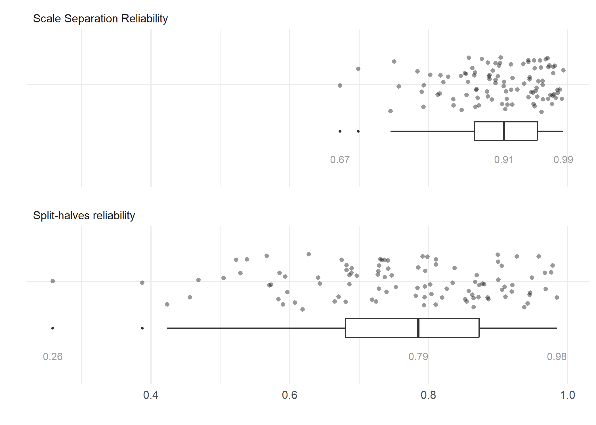<!-- -->

# RQ2: How do study characteristics influence reliability?

## Investigating the influence of adaptivity

Verhavert et al. (2019) analysed data from 49 different CJ sessions. We
load their data and combine it with ours to produce an updated version
of their Figure 4.

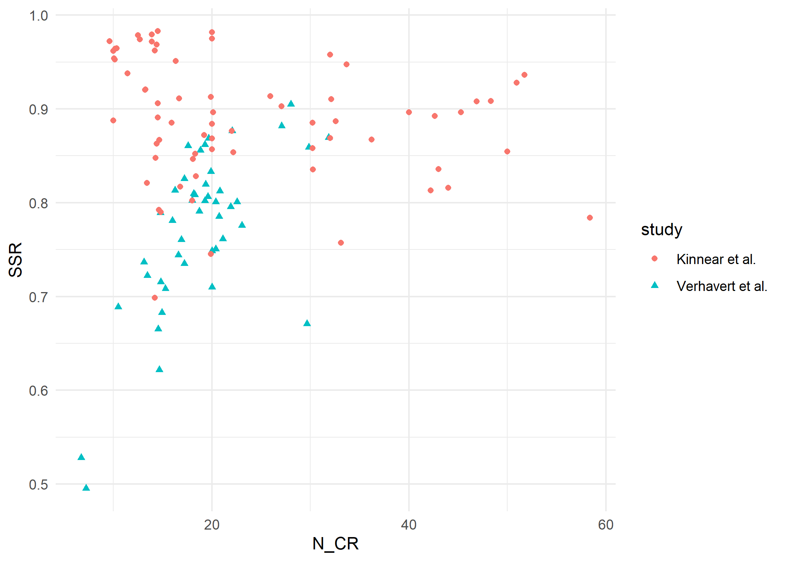<!-- -->

The studies with low N_CR yet high SSR are all either adaptive or
“unknown” (but come from Pollitt who likely did use adaptivity).

<table class="table table-striped" style="width: auto !important; margin-left: auto; margin-right: auto;">
<thead>
<tr>
<th style="text-align:left;">
judging_session
</th>
<th style="text-align:left;">
adaptivity
</th>
<th style="text-align:right;">
N_CR
</th>
<th style="text-align:right;">
SSR
</th>
</tr>
</thead>
<tbody>
<tr>
<td style="text-align:left;">
Bramley2018_1a
</td>
<td style="text-align:left;">
TRUE
</td>
<td style="text-align:right;">
14.386667
</td>
<td style="text-align:right;">
0.9685921
</td>
</tr>
<tr>
<td style="text-align:left;">
Jones2013a_expert1
</td>
<td style="text-align:left;">
TRUE
</td>
<td style="text-align:right;">
14.488095
</td>
<td style="text-align:right;">
0.9058558
</td>
</tr>
<tr>
<td style="text-align:left;">
Jones2013a_novice
</td>
<td style="text-align:left;">
TRUE
</td>
<td style="text-align:right;">
14.488095
</td>
<td style="text-align:right;">
0.9827716
</td>
</tr>
<tr>
<td style="text-align:left;">
Jones2014_GCSE070211data
</td>
<td style="text-align:left;">
TRUE
</td>
<td style="text-align:right;">
16.666667
</td>
<td style="text-align:right;">
0.9113619
</td>
</tr>
<tr>
<td style="text-align:left;">
Jones2015a_all-scripts
</td>
<td style="text-align:left;">
TRUE
</td>
<td style="text-align:right;">
9.618667
</td>
<td style="text-align:right;">
0.9722026
</td>
</tr>
<tr>
<td style="text-align:left;">
Jones2015a_subset-of-scripts
</td>
<td style="text-align:left;">
TRUE
</td>
<td style="text-align:right;">
10.000000
</td>
<td style="text-align:right;">
0.9618014
</td>
</tr>
<tr>
<td style="text-align:left;">
Pollitt2012a
</td>
<td style="text-align:left;">
TRUE
</td>
<td style="text-align:right;">
12.478723
</td>
<td style="text-align:right;">
0.9784732
</td>
</tr>
<tr>
<td style="text-align:left;">
Pollitt2017_example4
</td>
<td style="text-align:left;">
TRUE
</td>
<td style="text-align:right;">
16.338338
</td>
<td style="text-align:right;">
0.9510762
</td>
</tr>
<tr>
<td style="text-align:left;">
PollittX_art1
</td>
<td style="text-align:left;">
unknown
</td>
<td style="text-align:right;">
13.226667
</td>
<td style="text-align:right;">
0.9205022
</td>
</tr>
<tr>
<td style="text-align:left;">
PollittX_art2
</td>
<td style="text-align:left;">
unknown
</td>
<td style="text-align:right;">
13.253333
</td>
<td style="text-align:right;">
0.9207349
</td>
</tr>
<tr>
<td style="text-align:left;">
PollittX_college
</td>
<td style="text-align:left;">
unknown
</td>
<td style="text-align:right;">
11.416667
</td>
<td style="text-align:right;">
0.9377198
</td>
</tr>
<tr>
<td style="text-align:left;">
PollittX_design
</td>
<td style="text-align:left;">
unknown
</td>
<td style="text-align:right;">
13.886487
</td>
<td style="text-align:right;">
0.9792182
</td>
</tr>
<tr>
<td style="text-align:left;">
PollittX_efl-oracy
</td>
<td style="text-align:left;">
unknown
</td>
<td style="text-align:right;">
13.910448
</td>
<td style="text-align:right;">
0.9716803
</td>
</tr>
<tr>
<td style="text-align:left;">
PollittX_ielts-writing
</td>
<td style="text-align:left;">
unknown
</td>
<td style="text-align:right;">
14.200000
</td>
<td style="text-align:right;">
0.9623624
</td>
</tr>
<tr>
<td style="text-align:left;">
PollittX_music
</td>
<td style="text-align:left;">
unknown
</td>
<td style="text-align:right;">
10.318408
</td>
<td style="text-align:right;">
0.9646965
</td>
</tr>
<tr>
<td style="text-align:left;">
PollittX_peer-assessment
</td>
<td style="text-align:left;">
unknown
</td>
<td style="text-align:right;">
19.875000
</td>
<td style="text-align:right;">
0.9127419
</td>
</tr>
<tr>
<td style="text-align:left;">
PollittX_philosophy1
</td>
<td style="text-align:left;">
unknown
</td>
<td style="text-align:right;">
12.674286
</td>
<td style="text-align:right;">
0.9741318
</td>
</tr>
<tr>
<td style="text-align:left;">
PollittX_philosophy2a
</td>
<td style="text-align:left;">
unknown
</td>
<td style="text-align:right;">
10.062500
</td>
<td style="text-align:right;">
0.9538946
</td>
</tr>
<tr>
<td style="text-align:left;">
PollittX_philosophy2b
</td>
<td style="text-align:left;">
unknown
</td>
<td style="text-align:right;">
10.131250
</td>
<td style="text-align:right;">
0.9526881
</td>
</tr>
<tr>
<td style="text-align:left;">
PollittX_philosophy2c
</td>
<td style="text-align:left;">
unknown
</td>
<td style="text-align:right;">
10.193750
</td>
<td style="text-align:right;">
0.9641178
</td>
</tr>
</tbody>
</table>

The adaptivity seems to produce separate clusters in our sample:

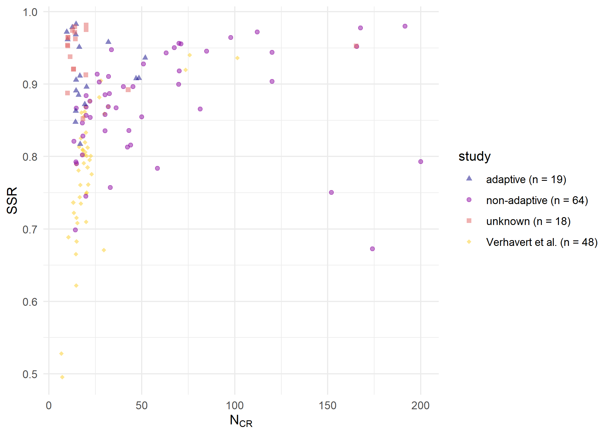<!-- -->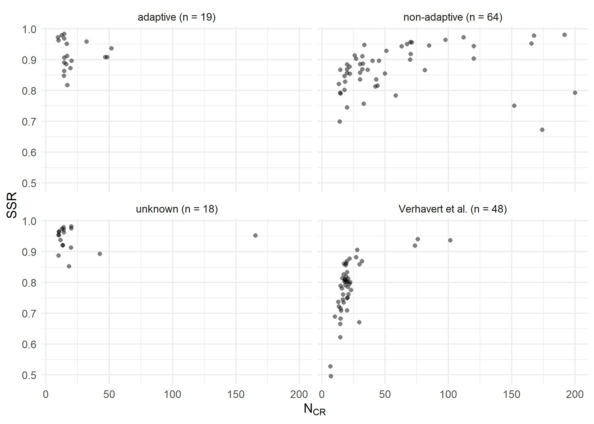<!-- -->

    ## Omitted 14 judging sessions, all with SSR > 0.871:

<table class="table table-striped" style="width: auto !important; margin-left: auto; margin-right: auto;">
<caption>
Omitted studies
</caption>
<thead>
<tr>
<th style="text-align:left;">
study
</th>
<th style="text-align:left;">
judging_session
</th>
<th style="text-align:right;">
N_CR
</th>
<th style="text-align:right;">
SSR
</th>
<th style="text-align:left;">
adaptivity
</th>
<th style="text-align:right;">
n_sessions
</th>
</tr>
</thead>
<tbody>
<tr>
<td style="text-align:left;">
non-adaptive
</td>
<td style="text-align:left;">
Spehar2016_expt2-Plain
</td>
<td style="text-align:right;">
800.0000
</td>
<td style="text-align:right;">
0.8707116
</td>
<td style="text-align:left;">
FALSE
</td>
<td style="text-align:right;">
64
</td>
</tr>
<tr>
<td style="text-align:left;">
non-adaptive
</td>
<td style="text-align:left;">
Luckett2018_cola
</td>
<td style="text-align:right;">
330.0000
</td>
<td style="text-align:right;">
0.8875400
</td>
<td style="text-align:left;">
FALSE
</td>
<td style="text-align:right;">
64
</td>
</tr>
<tr>
<td style="text-align:left;">
non-adaptive
</td>
<td style="text-align:left;">
Spehar2016_expt2-Edges
</td>
<td style="text-align:right;">
800.0000
</td>
<td style="text-align:right;">
0.9012437
</td>
<td style="text-align:left;">
FALSE
</td>
<td style="text-align:right;">
64
</td>
</tr>
<tr>
<td style="text-align:left;">
non-adaptive
</td>
<td style="text-align:left;">
LuckettX_odor-familiar
</td>
<td style="text-align:right;">
208.0000
</td>
<td style="text-align:right;">
0.9188574
</td>
<td style="text-align:left;">
FALSE
</td>
<td style="text-align:right;">
64
</td>
</tr>
<tr>
<td style="text-align:left;">
non-adaptive
</td>
<td style="text-align:left;">
Spehar2016_expt2-Thr
</td>
<td style="text-align:right;">
800.0000
</td>
<td style="text-align:right;">
0.9435376
</td>
<td style="text-align:left;">
FALSE
</td>
<td style="text-align:right;">
64
</td>
</tr>
<tr>
<td style="text-align:left;">
non-adaptive
</td>
<td style="text-align:left;">
Spehar2016_expt2-Mountain
</td>
<td style="text-align:right;">
800.0000
</td>
<td style="text-align:right;">
0.9454278
</td>
<td style="text-align:left;">
FALSE
</td>
<td style="text-align:right;">
64
</td>
</tr>
<tr>
<td style="text-align:left;">
non-adaptive
</td>
<td style="text-align:left;">
LuckettX_odor-pleasant
</td>
<td style="text-align:right;">
208.0000
</td>
<td style="text-align:right;">
0.9604810
</td>
<td style="text-align:left;">
FALSE
</td>
<td style="text-align:right;">
64
</td>
</tr>
<tr>
<td style="text-align:left;">
non-adaptive
</td>
<td style="text-align:left;">
Spehar2016_expt2-Fracts
</td>
<td style="text-align:right;">
800.0000
</td>
<td style="text-align:right;">
0.9791406
</td>
<td style="text-align:left;">
FALSE
</td>
<td style="text-align:right;">
64
</td>
</tr>
<tr>
<td style="text-align:left;">
non-adaptive
</td>
<td style="text-align:left;">
Vatavu2020
</td>
<td style="text-align:right;">
942.1429
</td>
<td style="text-align:right;">
0.9855553
</td>
<td style="text-align:left;">
FALSE
</td>
<td style="text-align:right;">
64
</td>
</tr>
<tr>
<td style="text-align:left;">
non-adaptive
</td>
<td style="text-align:left;">
Jones2020_brightness-equalised
</td>
<td style="text-align:right;">
293.7840
</td>
<td style="text-align:right;">
0.9858682
</td>
<td style="text-align:left;">
FALSE
</td>
<td style="text-align:right;">
64
</td>
</tr>
<tr>
<td style="text-align:left;">
non-adaptive
</td>
<td style="text-align:left;">
Isnac2020
</td>
<td style="text-align:right;">
3108.0000
</td>
<td style="text-align:right;">
0.9886882
</td>
<td style="text-align:left;">
FALSE
</td>
<td style="text-align:right;">
64
</td>
</tr>
<tr>
<td style="text-align:left;">
non-adaptive
</td>
<td style="text-align:left;">
Jones2020_main-study
</td>
<td style="text-align:right;">
444.0900
</td>
<td style="text-align:right;">
0.9920209
</td>
<td style="text-align:left;">
FALSE
</td>
<td style="text-align:right;">
64
</td>
</tr>
<tr>
<td style="text-align:left;">
Verhavert et al. 
</td>
<td style="text-align:left;">
Number Estimation Novices (Group 2)
</td>
<td style="text-align:right;">
296.9000
</td>
<td style="text-align:right;">
0.9932329
</td>
<td style="text-align:left;">
NA
</td>
<td style="text-align:right;">
48
</td>
</tr>
<tr>
<td style="text-align:left;">
non-adaptive
</td>
<td style="text-align:left;">
Esen2019
</td>
<td style="text-align:right;">
3213.0000
</td>
<td style="text-align:right;">
0.9938654
</td>
<td style="text-align:left;">
FALSE
</td>
<td style="text-align:right;">
64
</td>
</tr>
</tbody>
</table>

    ## # A tibble: 2 × 4
    ##   study        mean_SSR sd_SSR     n
    ##   <chr>           <dbl>  <dbl> <int>
    ## 1 non-adaptive    0.850 0.0545    32
    ## 2 adaptive        0.917 0.0478    19

## Identifying characteristics that influence reliability

Look at how representations, assessors, comparisons and their
derivatives relate to SSR and SHR.

Note that here we restrict to only the *non-adaptive* CJ sessions.

### Regression

There are three characteristics of interest: N_A, N_C and N_R. We will
use these as predictors of SSR and of SHR, in separate regression
models.

#### Log-transforming the predictors

First, we log-transform the predictor variables, since our earlier
exploration of their distributions showed that they are best presented
on a logarithmic scale.

Here we see how each of the log-transformed variables individually
correlate with the two reliability measures:

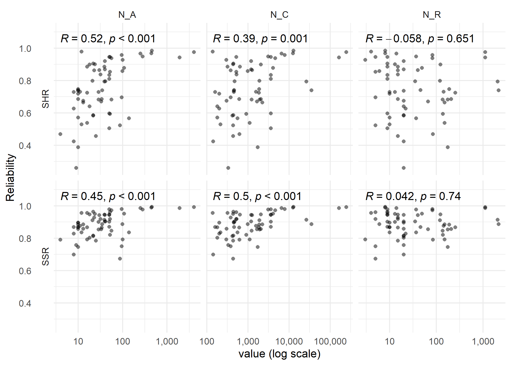<!-- -->

#### Regression model building

We use a stepwise selection procedure to build up the best fitting
model:

    ## Start:  AIC=-330.71
    ## ssr ~ 1
    ## 
    ##           Df Sum of Sq     RSS     AIC
    ## + log_N_C  1  0.088506 0.26504 -347.15
    ## + log_N_A  1  0.071129 0.28242 -343.09
    ## <none>                 0.35355 -330.71
    ## + log_N_R  1  0.000634 0.35292 -328.83
    ## 
    ## Step:  AIC=-347.15
    ## ssr ~ log_N_C
    ## 
    ##           Df Sum of Sq     RSS     AIC
    ## + log_N_R  1  0.040713 0.22433 -355.83
    ## <none>                 0.26504 -347.15
    ## + log_N_A  1  0.006860 0.25818 -346.83
    ## - log_N_C  1  0.088506 0.35355 -330.71
    ## 
    ## Step:  AIC=-355.83
    ## ssr ~ log_N_C + log_N_R
    ## 
    ##                   Df Sum of Sq     RSS     AIC
    ## <none>                         0.22433 -355.83
    ## + log_N_A          1  0.002080 0.22225 -354.42
    ## + log_N_R:log_N_C  1  0.000121 0.22421 -353.86
    ## - log_N_R          1  0.040713 0.26504 -347.15
    ## - log_N_C          1  0.128585 0.35292 -328.83

This results in a model with both N_C and N_R as significant predictors.

    ## 
    ## Call:
    ## lm(formula = ssr ~ log_N_C + log_N_R, data = reliability_predictors)
    ## 
    ## Residuals:
    ##       Min        1Q    Median        3Q       Max 
    ## -0.214910 -0.024555  0.005735  0.039012  0.105553 
    ## 
    ## Coefficients:
    ##             Estimate Std. Error t value Pr(>|t|)    
    ## (Intercept)  0.69992    0.03553  19.697  < 2e-16 ***
    ## log_N_C      0.08386    0.01418   5.913 1.64e-07 ***
    ## log_N_R     -0.04833    0.01453  -3.327  0.00149 ** 
    ## ---
    ## Signif. codes:  0 '***' 0.001 '**' 0.01 '*' 0.05 '.' 0.1 ' ' 1
    ## 
    ## Residual standard error: 0.06064 on 61 degrees of freedom
    ## Multiple R-squared:  0.3655, Adjusted R-squared:  0.3447 
    ## F-statistic: 17.57 on 2 and 61 DF,  p-value: 9.427e-07

This model overall explains 37% of the variance.

#### Interpreting the model coefficients

Interpreting the coefficients is a bit fiddly. To interpret (say) the
coefficient for N_C you need to keep N_R fixed.

Here each predictor is shown separately, along with the regression line
given by the best-fitting model:

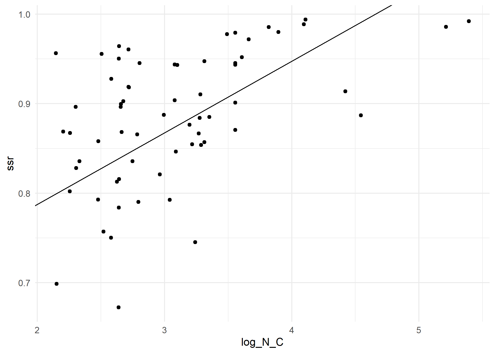<!-- -->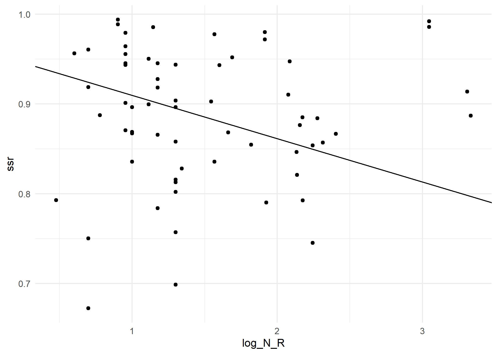<!-- -->

So for instance, assuming the number of representations is kept
constant, increasing the number of comparisons by 10% would increase the
SSR by $0.08386 \times \log_{10}(1.1)=0.0034$.

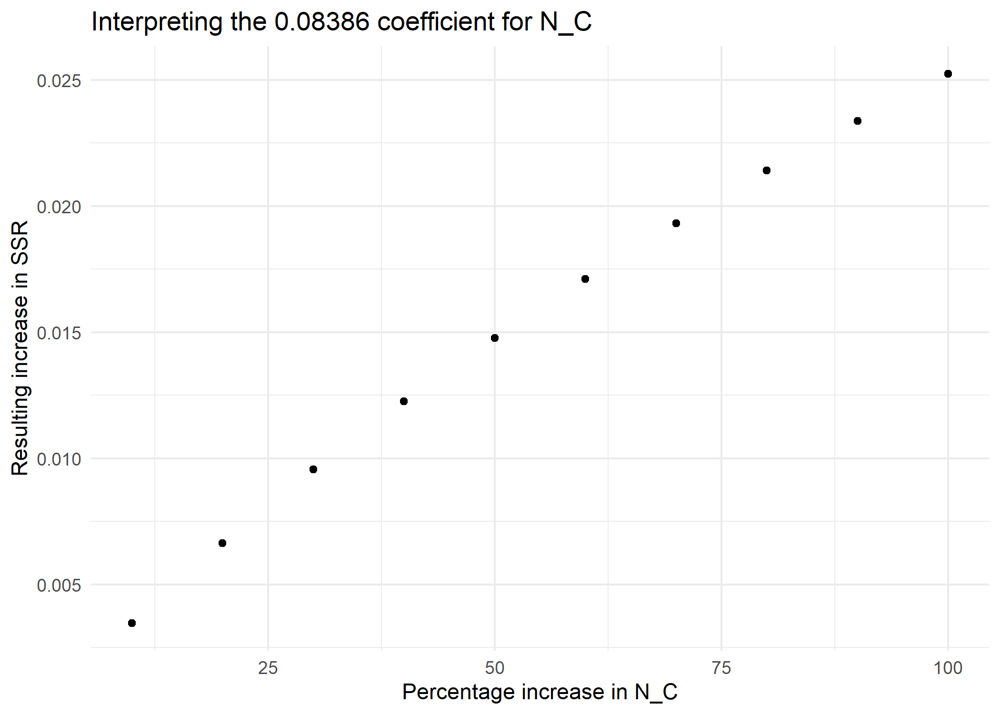<!-- -->

Alternatively, using log with base 2, the coefficients show e.g. “what
happens to SSR if you double N_C”:

    ## 
    ## Call:
    ## lm(formula = ssr ~ log2(N_C) + log2(N_R), data = reliability_predictors)
    ## 
    ## Residuals:
    ##       Min        1Q    Median        3Q       Max 
    ## -0.214910 -0.024555  0.005735  0.039012  0.105553 
    ## 
    ## Coefficients:
    ##              Estimate Std. Error t value Pr(>|t|)    
    ## (Intercept)  0.699919   0.035535  19.697  < 2e-16 ***
    ## log2(N_C)    0.025244   0.004269   5.913 1.64e-07 ***
    ## log2(N_R)   -0.014550   0.004373  -3.327  0.00149 ** 
    ## ---
    ## Signif. codes:  0 '***' 0.001 '**' 0.01 '*' 0.05 '.' 0.1 ' ' 1
    ## 
    ## Residual standard error: 0.06064 on 61 degrees of freedom
    ## Multiple R-squared:  0.3655, Adjusted R-squared:  0.3447 
    ## F-statistic: 17.57 on 2 and 61 DF,  p-value: 9.427e-07

(Here, the 0.025 coefficient for N_C matches up with what we see in the
previous plot, since a 100% increase in N_C is a doubling of N_C.)

#### How does N_CR fit in?

Note that from the definition of N_CR,
$\log N_{CR} = \log(2 N_C / N_R) = \log(2) + \log(N_C) - \log(N_R)$.

In the best fitting model, we see that the relative magnitude of the
coefficients of N_C and N_R is about 2 to 1, so we have approximately
$SSR = \beta_1 \times (2 \log N_C - \log N_R) + \beta_0$

So we could re-express the best-fitting model using N_C and N_CR:

    ## 
    ## Call:
    ## lm(formula = ssr ~ log10(N_C) + log10(N_CR), data = reliability_predictors)
    ## 
    ## Residuals:
    ##       Min        1Q    Median        3Q       Max 
    ## -0.214910 -0.024555  0.005735  0.039012  0.105553 
    ## 
    ## Coefficients:
    ##             Estimate Std. Error t value Pr(>|t|)    
    ## (Intercept)  0.68537    0.03644  18.810  < 2e-16 ***
    ## log10(N_C)   0.03552    0.01255   2.830  0.00629 ** 
    ## log10(N_CR)  0.04833    0.01453   3.327  0.00149 ** 
    ## ---
    ## Signif. codes:  0 '***' 0.001 '**' 0.01 '*' 0.05 '.' 0.1 ' ' 1
    ## 
    ## Residual standard error: 0.06064 on 61 degrees of freedom
    ## Multiple R-squared:  0.3655, Adjusted R-squared:  0.3447 
    ## F-statistic: 17.57 on 2 and 61 DF,  p-value: 9.427e-07

But that model doesn’t really make sense, since the two predictors are
not independent – e.g., to interpret the coefficient for N_C you would
need to keep N_CR fixed and to do this you would need to adjust N_R.

Using only N_CR as a predictor does make the model a bit worse – the
$R^2$ goes down to .28 – but it’s not hugely much worse:

    ## 
    ## Call:
    ## lm(formula = ssr ~ log10(N_CR), data = reliability_predictors)
    ## 
    ## Residuals:
    ##      Min       1Q   Median       3Q      Max 
    ## -0.23729 -0.02564  0.00939  0.04597  0.08549 
    ## 
    ## Coefficients:
    ##             Estimate Std. Error t value Pr(>|t|)    
    ## (Intercept)  0.75917    0.02684  28.281  < 2e-16 ***
    ## log10(N_CR)  0.06721    0.01361   4.937  6.3e-06 ***
    ## ---
    ## Signif. codes:  0 '***' 0.001 '**' 0.01 '*' 0.05 '.' 0.1 ' ' 1
    ## 
    ## Residual standard error: 0.06398 on 62 degrees of freedom
    ## Multiple R-squared:  0.2822, Adjusted R-squared:  0.2706 
    ## F-statistic: 24.37 on 1 and 62 DF,  p-value: 6.299e-06

#### Check on the log transformation

Note that if we did not log-transform the variables, we get a less
predictive model. Applying stepwise selection in this case results in a
model with N_A as the only predictor, explaining 8% of the variance:

    ## Start:  AIC=-330.71
    ## ssr ~ 1
    ## 
    ##        Df Sum of Sq     RSS     AIC
    ## + N_A   1 0.0294217 0.32413 -334.27
    ## + N_C   1 0.0278012 0.32575 -333.95
    ## <none>              0.35355 -330.71
    ## + N_R   1 0.0053955 0.34815 -329.70
    ## 
    ## Step:  AIC=-334.27
    ## ssr ~ N_A
    ## 
    ##        Df Sum of Sq     RSS     AIC
    ## <none>              0.32413 -334.27
    ## + N_R   1 0.0000484 0.32408 -332.28
    ## + N_C   1 0.0000007 0.32413 -332.27
    ## - N_A   1 0.0294217 0.35355 -330.71

    ## 
    ## Call:
    ## lm(formula = ssr ~ N_A, data = reliability_predictors)
    ## 
    ## Residuals:
    ##       Min        1Q    Median        3Q       Max 
    ## -0.210820 -0.044835  0.005185  0.062658  0.097289 
    ## 
    ## Coefficients:
    ##              Estimate Std. Error t value Pr(>|t|)    
    ## (Intercept) 8.799e-01  9.362e-03  93.991   <2e-16 ***
    ## N_A         3.916e-05  1.651e-05   2.372   0.0208 *  
    ## ---
    ## Signif. codes:  0 '***' 0.001 '**' 0.01 '*' 0.05 '.' 0.1 ' ' 1
    ## 
    ## Residual standard error: 0.0723 on 62 degrees of freedom
    ## Multiple R-squared:  0.08322,    Adjusted R-squared:  0.06843 
    ## F-statistic: 5.628 on 1 and 62 DF,  p-value: 0.02079

### Correlations (Table 3)

This table shows the Pearson correlation of each characteristic with SSR
and with SHR:

<table class="table table-striped" style="width: auto !important; margin-left: auto; margin-right: auto;">
<thead>
<tr>
<th style="text-align:left;">
var1
</th>
<th style="text-align:left;">
N_A
</th>
<th style="text-align:left;">
N_R
</th>
<th style="text-align:left;">
N_C
</th>
<th style="text-align:left;">
N_CA
</th>
<th style="text-align:left;">
N_CR
</th>
<th style="text-align:left;">
N_RA
</th>
</tr>
</thead>
<tbody>
<tr>
<td style="text-align:left;">
SHR
</td>
<td style="text-align:left;">
.28\*
</td>
<td style="text-align:left;">
.09
</td>
<td style="text-align:left;">
.25\*
</td>
<td style="text-align:left;">
-.03
</td>
<td style="text-align:left;">
.32\*\*
</td>
<td style="text-align:left;">
-.14
</td>
</tr>
<tr>
<td style="text-align:left;">
SSR
</td>
<td style="text-align:left;">
.29\*
</td>
<td style="text-align:left;">
.12
</td>
<td style="text-align:left;">
.28\*
</td>
<td style="text-align:left;">
.03
</td>
<td style="text-align:left;">
.37\*\*
</td>
<td style="text-align:left;">
-.11
</td>
</tr>
</tbody>
</table>

LaTeX table

    ## \begin{table}
    ## \centering
    ## \begin{tabular}{lllllll}
    ## \toprule
    ## var1 & N\_A & N\_R & N\_C & N\_CA & N\_CR & N\_RA\\
    ## \midrule
    ## SHR & .28* & .09 & .25* & -.03 & .32** & -.14\\
    ## SSR & .29* & .12 & .28* & .03 & .37** & -.11\\
    ## \bottomrule
    ## \end{tabular}
    ## \end{table}

**TODO** Note that for the log transformed version of the
characteristics, we get similar results – but also find N_RA to be
significant:

    ## # A tibble: 8 × 8
    ##   var1              var2         cor statistic       p conf.low conf.high method
    ##   <chr>             <chr>      <dbl>     <dbl>   <dbl>    <dbl>     <dbl> <chr> 
    ## 1 median_split_corr observed_…  0.52      4.83 9.35e-6    0.318    0.681  Pears…
    ## 2 median_split_corr observed_…  0.39      3.36 1.34e-3    0.162    0.582  Pears…
    ## 3 median_split_corr N_CR        0.52      4.78 1.10e-5    0.314    0.679  Pears…
    ## 4 median_split_corr N_RA       -0.4      -3.42 1.12e-3   -0.587   -0.169  Pears…
    ## 5 ssr               observed_…  0.45      3.95 2.02e-4    0.228    0.625  Pears…
    ## 6 ssr               observed_…  0.5       4.55 2.55e-5    0.290    0.664  Pears…
    ## 7 ssr               N_CR        0.53      4.94 6.30e-6    0.328    0.687  Pears…
    ## 8 ssr               N_RA       -0.27     -2.19 3.27e-2   -0.482   -0.0231 Pears…

### Forced-entry linear regression models

#### Split-halves reliability

Sig correlations with SHR are observed_N_A, observed_N_C, N_CR. Check
scatter plots for SHR.

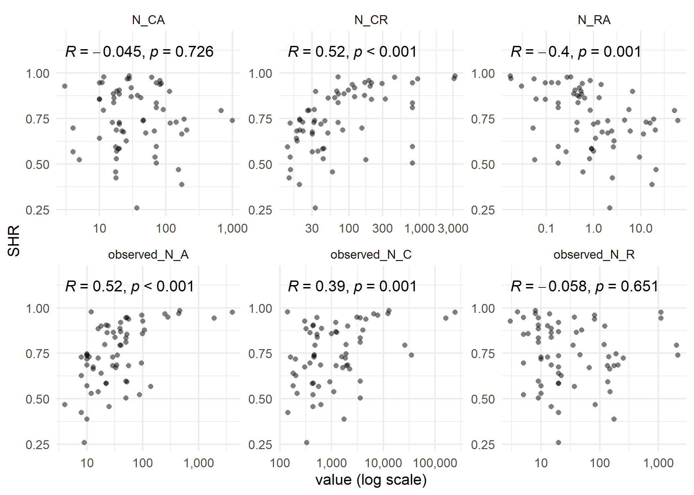<!-- -->

Forced linear regression SHR:

    ## median_split_corr ~ observed_N_A + observed_N_C + N_CR

    ## 
    ## Call:
    ## lm(formula = formula_shr, data = reliability_characteristics)
    ## 
    ## Residuals:
    ##      Min       1Q   Median       3Q      Max 
    ## -0.46045 -0.08076  0.00762  0.14120  0.25577 
    ## 
    ## Coefficients:
    ##               Estimate Std. Error t value Pr(>|t|)    
    ## (Intercept)  7.160e-01  2.237e-02  32.004   <2e-16 ***
    ## observed_N_A 3.992e-05  1.732e-04   0.230   0.8185    
    ## observed_N_C 4.598e-07  2.576e-06   0.179   0.8589    
    ## N_CR         8.599e-05  3.830e-05   2.245   0.0285 *  
    ## ---
    ## Signif. codes:  0 '***' 0.001 '**' 0.01 '*' 0.05 '.' 0.1 ' ' 1
    ## 
    ## Residual standard error: 0.1613 on 60 degrees of freedom
    ## Multiple R-squared:  0.1536, Adjusted R-squared:  0.1112 
    ## F-statistic: 3.629 on 3 and 60 DF,  p-value: 0.01785

    ## 
    ## Call:
    ## lm(formula = formula_shr, data = reliability_characteristics)
    ## 
    ## Standardized Coefficients::
    ##  (Intercept) observed_N_A observed_N_C         N_CR 
    ##           NA   0.12878042   0.09859018   0.28996489

**TODO** - log transformed predictors

1)  here is the model with the variables logged - R^2 is .322 and only
    N_CR is significant in the model

<!-- -->

    ## 
    ## Call:
    ## lm(formula = median_split_corr ~ log(N_CR) + log(observed_N_A) + 
    ##     log(observed_N_C), data = reliability_characteristics)
    ## 
    ## Residuals:
    ##      Min       1Q   Median       3Q      Max 
    ## -0.39902 -0.06812  0.01420  0.09713  0.28832 
    ## 
    ## Coefficients:
    ##                   Estimate Std. Error t value Pr(>|t|)    
    ## (Intercept)       0.403144   0.091045   4.428 4.09e-05 ***
    ## log(N_CR)         0.038255   0.018635   2.053   0.0445 *  
    ## log(observed_N_A) 0.034821   0.024538   1.419   0.1611    
    ## log(observed_N_C) 0.007651   0.016085   0.476   0.6360    
    ## ---
    ## Signif. codes:  0 '***' 0.001 '**' 0.01 '*' 0.05 '.' 0.1 ' ' 1
    ## 
    ## Residual standard error: 0.1443 on 60 degrees of freedom
    ## Multiple R-squared:  0.3225, Adjusted R-squared:  0.2886 
    ## F-statistic: 9.518 on 3 and 60 DF,  p-value: 3.111e-05

2)  model (1) has redundancy in N_C, since it appears in N_CR, and
    removing that term gives R^2 of .319 and both predictors significant

<!-- -->

    ## 
    ## Call:
    ## lm(formula = median_split_corr ~ log(N_CR) + log(observed_N_A), 
    ##     data = reliability_characteristics)
    ## 
    ## Residuals:
    ##      Min       1Q   Median       3Q      Max 
    ## -0.39980 -0.07071  0.01840  0.09811  0.27932 
    ## 
    ## Coefficients:
    ##                   Estimate Std. Error t value Pr(>|t|)    
    ## (Intercept)        0.43477    0.06180   7.035 2.02e-09 ***
    ## log(N_CR)          0.03779    0.01849   2.044   0.0453 *  
    ## log(observed_N_A)  0.04172    0.01966   2.122   0.0379 *  
    ## ---
    ## Signif. codes:  0 '***' 0.001 '**' 0.01 '*' 0.05 '.' 0.1 ' ' 1
    ## 
    ## Residual standard error: 0.1434 on 61 degrees of freedom
    ## Multiple R-squared:  0.3199, Adjusted R-squared:  0.2976 
    ## F-statistic: 14.35 on 2 and 61 DF,  p-value: 7.826e-06

3)  model (2) effectively just has N_C, N_R and N_A in it. So why not
    just use them directly? This also gives R^2 of .322 but now only N_R
    is significant - and the interpretation of (3) is maybe not so easy
    as (1)

<!-- -->

    ## 
    ## Call:
    ## lm(formula = median_split_corr ~ log(observed_N_A) + log(observed_N_C) + 
    ##     log(observed_N_R), data = reliability_characteristics)
    ## 
    ## Residuals:
    ##      Min       1Q   Median       3Q      Max 
    ## -0.39902 -0.06812  0.01420  0.09713  0.28832 
    ## 
    ## Coefficients:
    ##                   Estimate Std. Error t value Pr(>|t|)    
    ## (Intercept)        0.42966    0.08692   4.943 6.51e-06 ***
    ## log(observed_N_A)  0.03482    0.02454   1.419   0.1611    
    ## log(observed_N_C)  0.04591    0.02524   1.819   0.0740 .  
    ## log(observed_N_R) -0.03826    0.01863  -2.053   0.0445 *  
    ## ---
    ## Signif. codes:  0 '***' 0.001 '**' 0.01 '*' 0.05 '.' 0.1 ' ' 1
    ## 
    ## Residual standard error: 0.1443 on 60 degrees of freedom
    ## Multiple R-squared:  0.3225, Adjusted R-squared:  0.2886 
    ## F-statistic: 9.518 on 3 and 60 DF,  p-value: 3.111e-05

4)  or, going back to the correlations, we actually find that log(N_RA)
    is also significant – so we should return to model (1) and augment
    it with log(N_RA). This gives strange output – the estimates for the
    last predictor come out as NA, presumably because of redundancy in
    the predictors?

<!-- -->

    ## 
    ## Call:
    ## lm(formula = median_split_corr ~ log(N_RA) + log(N_CR) + log(observed_N_A) + 
    ##     log(observed_N_C), data = reliability_characteristics)
    ## 
    ## Residuals:
    ##      Min       1Q   Median       3Q      Max 
    ## -0.39902 -0.06812  0.01420  0.09713  0.28832 
    ## 
    ## Coefficients: (1 not defined because of singularities)
    ##                   Estimate Std. Error t value Pr(>|t|)    
    ## (Intercept)       0.397841   0.099479   3.999 0.000177 ***
    ## log(N_RA)         0.007651   0.016085   0.476 0.636032    
    ## log(N_CR)         0.045906   0.025244   1.819 0.073977 .  
    ## log(observed_N_A) 0.042472   0.019849   2.140 0.036452 *  
    ## log(observed_N_C)       NA         NA      NA       NA    
    ## ---
    ## Signif. codes:  0 '***' 0.001 '**' 0.01 '*' 0.05 '.' 0.1 ' ' 1
    ## 
    ## Residual standard error: 0.1443 on 60 degrees of freedom
    ## Multiple R-squared:  0.3225, Adjusted R-squared:  0.2886 
    ## F-statistic: 9.518 on 3 and 60 DF,  p-value: 3.111e-05

Build up the model stepwise?

    ## Start:  AIC=-243.93
    ## median_split_corr ~ log(N_CR) + log(N_RA) + log(N_CA) + log(observed_N_A) + 
    ##     log(observed_N_C) + log(observed_N_R)

    ## 
    ## Call:
    ## lm(formula = median_split_corr ~ log(N_CR) + log(N_RA) + log(N_CA) + 
    ##     log(observed_N_A) + log(observed_N_C) + log(observed_N_R), 
    ##     data = .)
    ## 
    ## Residuals:
    ##      Min       1Q   Median       3Q      Max 
    ## -0.39902 -0.06812  0.01420  0.09713  0.28832 
    ## 
    ## Coefficients: (3 not defined because of singularities)
    ##                   Estimate Std. Error t value Pr(>|t|)    
    ## (Intercept)       0.397841   0.099479   3.999 0.000177 ***
    ## log(N_CR)         0.045906   0.025244   1.819 0.073977 .  
    ## log(N_RA)         0.007651   0.016085   0.476 0.636032    
    ## log(N_CA)               NA         NA      NA       NA    
    ## log(observed_N_A) 0.042472   0.019849   2.140 0.036452 *  
    ## log(observed_N_C)       NA         NA      NA       NA    
    ## log(observed_N_R)       NA         NA      NA       NA    
    ## ---
    ## Signif. codes:  0 '***' 0.001 '**' 0.01 '*' 0.05 '.' 0.1 ' ' 1
    ## 
    ## Residual standard error: 0.1443 on 60 degrees of freedom
    ## Multiple R-squared:  0.3225, Adjusted R-squared:  0.2886 
    ## F-statistic: 9.518 on 3 and 60 DF,  p-value: 3.111e-05

    ##   Step Df Deviance Resid. Df Resid. Dev       AIC
    ## 1      NA       NA        60   1.249135 -243.9316

    ## Start:  AIC=-225.02
    ## median_split_corr ~ 1
    ## 
    ##                     Df Sum of Sq    RSS     AIC
    ## + log(observed_N_A)  1   0.50390 1.3397 -243.45
    ## + log(N_CR)          1   0.49719 1.3464 -243.13
    ## + log(N_RA)          1   0.29224 1.5514 -234.06
    ## + log(observed_N_C)  1   0.28389 1.5597 -233.72
    ## <none>                           1.8436 -225.02
    ## + log(observed_N_R)  1   0.00613 1.8375 -223.23
    ## + log(N_CA)          1   0.00368 1.8399 -223.15
    ## 
    ## Step:  AIC=-243.45
    ## median_split_corr ~ log(observed_N_A)
    ## 
    ##                     Df Sum of Sq    RSS     AIC
    ## + log(N_CR)          1  0.085863 1.2538 -245.69
    ## <none>                           1.3397 -243.45
    ## + log(N_RA)          1  0.021726 1.3180 -242.50
    ## + log(observed_N_R)  1  0.021726 1.3180 -242.50
    ## + log(N_CA)          1  0.002836 1.3369 -241.59
    ## + log(observed_N_C)  1  0.002836 1.3369 -241.59
    ## 
    ## Step:  AIC=-245.69
    ## median_split_corr ~ log(observed_N_A) + log(N_CR)
    ## 
    ##                     Df Sum of Sq    RSS     AIC
    ## <none>                           1.2538 -245.69
    ## + log(N_CA)          1 0.0047107 1.2491 -243.93
    ## + log(N_RA)          1 0.0047107 1.2491 -243.93
    ## + log(observed_N_C)  1 0.0047107 1.2491 -243.93
    ## + log(observed_N_R)  1 0.0047107 1.2491 -243.93

    ## 
    ## Call:
    ## lm(formula = median_split_corr ~ log(observed_N_A) + log(N_CR), 
    ##     data = reliability_characteristics)
    ## 
    ## Residuals:
    ##      Min       1Q   Median       3Q      Max 
    ## -0.39980 -0.07071  0.01840  0.09811  0.27932 
    ## 
    ## Coefficients:
    ##                   Estimate Std. Error t value Pr(>|t|)    
    ## (Intercept)        0.43477    0.06180   7.035 2.02e-09 ***
    ## log(observed_N_A)  0.04172    0.01966   2.122   0.0379 *  
    ## log(N_CR)          0.03779    0.01849   2.044   0.0453 *  
    ## ---
    ## Signif. codes:  0 '***' 0.001 '**' 0.01 '*' 0.05 '.' 0.1 ' ' 1
    ## 
    ## Residual standard error: 0.1434 on 61 degrees of freedom
    ## Multiple R-squared:  0.3199, Adjusted R-squared:  0.2976 
    ## F-statistic: 14.35 on 2 and 61 DF,  p-value: 7.826e-06

    ## Start:  AIC=-41.39
    ## median_split_corr ~ 1
    ## 
    ##                     Df Deviance     AIC
    ## + log(observed_N_A)  1   1.3397 -59.827
    ## + log(N_CR)          1   1.3464 -59.508
    ## + log(N_RA)          1   1.5514 -50.439
    ## + log(observed_N_C)  1   1.5597 -50.096
    ## <none>                   1.8436 -41.394
    ## + log(observed_N_R)  1   1.8375 -39.607
    ## + log(N_CA)          1   1.8399 -39.522
    ## 
    ## Step:  AIC=-59.83
    ## median_split_corr ~ log(observed_N_A)
    ## 
    ##                     Df Deviance     AIC
    ## + log(N_CR)          1   1.2538 -62.067
    ## <none>                   1.3397 -59.827
    ## + log(N_RA)          1   1.3180 -58.874
    ## + log(observed_N_R)  1   1.3180 -58.874
    ## + log(N_CA)          1   1.3369 -57.963
    ## + log(observed_N_C)  1   1.3369 -57.963
    ## - log(observed_N_A)  1   1.8436 -41.394
    ## 
    ## Step:  AIC=-62.07
    ## median_split_corr ~ log(observed_N_A) + log(N_CR)
    ## 
    ##                     Df Deviance     AIC
    ## <none>                   1.2538 -62.067
    ## + log(N_RA)          1   1.2491 -60.307
    ## + log(N_CA)          1   1.2491 -60.307
    ## + log(observed_N_C)  1   1.2491 -60.307
    ## + log(observed_N_R)  1   1.2491 -60.307
    ## - log(N_CR)          1   1.3397 -59.827
    ## - log(observed_N_A)  1   1.3464 -59.508

    ## 
    ## Call:
    ## glm(formula = median_split_corr ~ log(observed_N_A) + log(N_CR), 
    ##     data = reliability_characteristics)
    ## 
    ## Deviance Residuals: 
    ##      Min        1Q    Median        3Q       Max  
    ## -0.39980  -0.07071   0.01840   0.09811   0.27932  
    ## 
    ## Coefficients:
    ##                   Estimate Std. Error t value Pr(>|t|)    
    ## (Intercept)        0.43477    0.06180   7.035 2.02e-09 ***
    ## log(observed_N_A)  0.04172    0.01966   2.122   0.0379 *  
    ## log(N_CR)          0.03779    0.01849   2.044   0.0453 *  
    ## ---
    ## Signif. codes:  0 '***' 0.001 '**' 0.01 '*' 0.05 '.' 0.1 ' ' 1
    ## 
    ## (Dispersion parameter for gaussian family taken to be 0.02055485)
    ## 
    ##     Null deviance: 1.8436  on 63  degrees of freedom
    ## Residual deviance: 1.2538  on 61  degrees of freedom
    ## AIC: -62.067
    ## 
    ## Number of Fisher Scoring iterations: 2

    ## [1] 0.3198969

Approach used by Verhavert et al. (2019):

    ##                                                                                        df
    ## glm(ssr ~ 1, data = reliability_characteristics, family = gaussian(link = "logit"))     2
    ## glm(ssr ~ N_CR, data = reliability_characteristics, family = gaussian(link = "logit"))  3
    ##                                                                                              BIC
    ## glm(ssr ~ 1, data = reliability_characteristics, family = gaussian(link = "logit"))    -142.7694
    ## glm(ssr ~ N_CR, data = reliability_characteristics, family = gaussian(link = "logit")) -153.5535

    ## 
    ## Call:
    ## glm(formula = ssr ~ N_CR, family = gaussian(link = "logit"), 
    ##     data = reliability_characteristics)
    ## 
    ## Deviance Residuals: 
    ##       Min         1Q     Median         3Q        Max  
    ## -0.222757  -0.032873   0.007371   0.052066   0.089445  
    ## 
    ## Coefficients:
    ##              Estimate Std. Error t value Pr(>|t|)    
    ## (Intercept) 1.7803625  0.1010092  17.626   <2e-16 ***
    ## N_CR        0.0020979  0.0008948   2.345   0.0223 *  
    ## ---
    ## Signif. codes:  0 '***' 0.001 '**' 0.01 '*' 0.05 '.' 0.1 ' ' 1
    ## 
    ## (Dispersion parameter for gaussian family taken to be 0.004515218)
    ## 
    ##     Null deviance: 0.35355  on 63  degrees of freedom
    ## Residual deviance: 0.27993  on 62  degrees of freedom
    ## AIC: -160.03
    ## 
    ## Number of Fisher Scoring iterations: 13

    ## 
    ## Call:
    ## glm(formula = ssr ~ N_CR, data = reliability_characteristics)
    ## 
    ## Deviance Residuals: 
    ##       Min         1Q     Median         3Q        Max  
    ## -0.209664  -0.039666   0.005652   0.064737   0.097900  
    ## 
    ## Coefficients:
    ##              Estimate Std. Error t value Pr(>|t|)    
    ## (Intercept) 8.737e-01  9.532e-03  91.660  < 2e-16 ***
    ## N_CR        4.862e-05  1.529e-05   3.179  0.00231 ** 
    ## ---
    ## Signif. codes:  0 '***' 0.001 '**' 0.01 '*' 0.05 '.' 0.1 ' ' 1
    ## 
    ## (Dispersion parameter for gaussian family taken to be 0.004903261)
    ## 
    ##     Null deviance: 0.35355  on 63  degrees of freedom
    ## Residual deviance: 0.30400  on 62  degrees of freedom
    ## AIC: -154.75
    ## 
    ## Number of Fisher Scoring iterations: 2

<!-- -->

#### SSR

For SSR we have significant correlation with observed_N_A, observed_N_C,
N_CR.

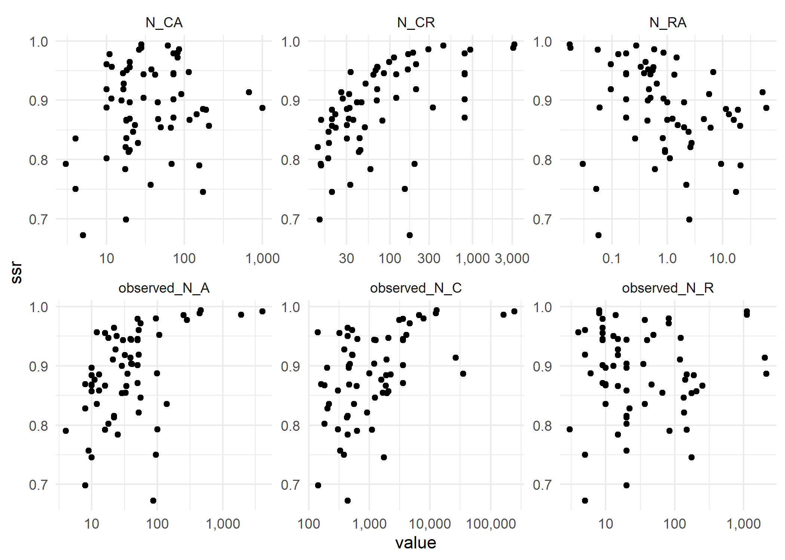<!-- -->

SSR forced linear regression:

    ## ssr ~ observed_N_A + observed_N_C + N_CR

    ## 
    ## Call:
    ## lm(formula = formula_ssr, data = reliability_characteristics)
    ## 
    ## Residuals:
    ##       Min        1Q    Median        3Q       Max 
    ## -0.202262 -0.031208 -0.001938  0.048620  0.109100 
    ## 
    ## Coefficients:
    ##                Estimate Std. Error t value Pr(>|t|)    
    ## (Intercept)   8.696e-01  9.486e-03  91.672  < 2e-16 ***
    ## observed_N_A -4.607e-05  7.344e-05  -0.627  0.53286    
    ## observed_N_C  1.176e-06  1.092e-06   1.077  0.28599    
    ## N_CR          4.957e-05  1.624e-05   3.052  0.00338 ** 
    ## ---
    ## Signif. codes:  0 '***' 0.001 '**' 0.01 '*' 0.05 '.' 0.1 ' ' 1
    ## 
    ## Residual standard error: 0.06838 on 60 degrees of freedom
    ## Multiple R-squared:  0.2064, Adjusted R-squared:  0.1667 
    ## F-statistic: 5.202 on 3 and 60 DF,  p-value: 0.002926

    ## 
    ## Call:
    ## lm(formula = formula_ssr, data = reliability_characteristics)
    ## 
    ## Standardized Coefficients::
    ##  (Intercept) observed_N_A observed_N_C         N_CR 
    ##           NA   -0.3394115    0.5757150    0.3816990

    ## Start:  AIC=-330.71
    ## ssr ~ 1
    ## 
    ##                     Df Sum of Sq     RSS     AIC
    ## + log(N_CR)          1  0.099766 0.25378 -349.93
    ## + log(observed_N_C)  1  0.088506 0.26504 -347.15
    ## + log(observed_N_A)  1  0.071129 0.28242 -343.09
    ## + log(N_RA)          1  0.025280 0.32827 -333.46
    ## + log(N_CA)          1  0.012357 0.34119 -330.99
    ## <none>                           0.35355 -330.71
    ## + log(observed_N_R)  1  0.000634 0.35292 -328.83
    ## 
    ## Step:  AIC=-349.93
    ## ssr ~ log(N_CR)
    ## 
    ##                     Df Sum of Sq     RSS     AIC
    ## + log(observed_N_C)  1 0.0294530 0.22433 -355.83
    ## + log(observed_N_R)  1 0.0294530 0.22433 -355.83
    ## + log(N_RA)          1 0.0255078 0.22828 -354.71
    ## + log(N_CA)          1 0.0255078 0.22828 -354.71
    ## <none>                           0.25378 -349.93
    ## + log(observed_N_A)  1 0.0041892 0.24959 -349.00
    ## 
    ## Step:  AIC=-355.83
    ## ssr ~ log(N_CR) + log(observed_N_C)
    ## 
    ##                     Df Sum of Sq     RSS     AIC
    ## <none>                           0.22433 -355.83
    ## + log(N_RA)          1 0.0020799 0.22225 -354.42
    ## + log(N_CA)          1 0.0020799 0.22225 -354.42
    ## + log(observed_N_A)  1 0.0020799 0.22225 -354.42

    ## 
    ## Call:
    ## lm(formula = ssr ~ log(N_CR) + log(observed_N_C), data = reliability_characteristics)
    ## 
    ## Residuals:
    ##       Min        1Q    Median        3Q       Max 
    ## -0.214910 -0.024555  0.005735  0.039012  0.105553 
    ## 
    ## Coefficients:
    ##                   Estimate Std. Error t value Pr(>|t|)    
    ## (Intercept)       0.685368   0.036436  18.810  < 2e-16 ***
    ## log(N_CR)         0.020992   0.006309   3.327  0.00149 ** 
    ## log(observed_N_C) 0.015427   0.005451   2.830  0.00629 ** 
    ## ---
    ## Signif. codes:  0 '***' 0.001 '**' 0.01 '*' 0.05 '.' 0.1 ' ' 1
    ## 
    ## Residual standard error: 0.06064 on 61 degrees of freedom
    ## Multiple R-squared:  0.3655, Adjusted R-squared:  0.3447 
    ## F-statistic: 17.57 on 2 and 61 DF,  p-value: 9.427e-07

    ##                  Step Df   Deviance Resid. Df Resid. Dev       AIC
    ## 1                     NA         NA        63  0.3535498 -330.7113
    ## 2         + log(N_CR) -1 0.09976614        62  0.2537837 -349.9300
    ## 3 + log(observed_N_C) -1 0.02945296        61  0.2243307 -355.8251

    ##                                                                                                           df
    ## lm(data = reliability_characteristics, formula = ssr ~ log(N_CR))                                          3
    ## lm(data = reliability_characteristics, formula = ssr ~ log(N_CR) + log(observed_N_C))                      4
    ## lm(data = reliability_characteristics, formula = ssr ~ log(N_CR) + log(observed_N_R))                      4
    ## lm(data = reliability_characteristics, formula = ssr ~ log(N_CR) + log(observed_N_C) + log(observed_N_R))  4
    ##                                                                                                                 AIC
    ## lm(data = reliability_characteristics, formula = ssr ~ log(N_CR))                                         -166.3059
    ## lm(data = reliability_characteristics, formula = ssr ~ log(N_CR) + log(observed_N_C))                     -172.2010
    ## lm(data = reliability_characteristics, formula = ssr ~ log(N_CR) + log(observed_N_R))                     -172.2010
    ## lm(data = reliability_characteristics, formula = ssr ~ log(N_CR) + log(observed_N_C) + log(observed_N_R)) -172.2010

    ## 
    ## Call:
    ## lm(formula = ssr ~ log(observed_N_C) + log(observed_N_R) + log(observed_N_A), 
    ##     data = reliability_characteristics)
    ## 
    ## Residuals:
    ##       Min        1Q    Median        3Q       Max 
    ## -0.207754 -0.019514  0.004951  0.036300  0.103931 
    ## 
    ## Coefficients:
    ##                    Estimate Std. Error t value Pr(>|t|)    
    ## (Intercept)        0.693546   0.036663  18.917  < 2e-16 ***
    ## log(observed_N_C)  0.042916   0.010648   4.030 0.000159 ***
    ## log(observed_N_R) -0.024482   0.007860  -3.115 0.002823 ** 
    ## log(observed_N_A) -0.007756   0.010350  -0.749 0.456587    
    ## ---
    ## Signif. codes:  0 '***' 0.001 '**' 0.01 '*' 0.05 '.' 0.1 ' ' 1
    ## 
    ## Residual standard error: 0.06086 on 60 degrees of freedom
    ## Multiple R-squared:  0.3714, Adjusted R-squared:  0.3399 
    ## F-statistic: 11.82 on 3 and 60 DF,  p-value: 3.503e-06

    ## Start:  AIC=-330.71
    ## ssr ~ 1
    ## 
    ##                      Df Sum of Sq     RSS     AIC
    ## + log2(observed_N_C)  1  0.088506 0.26504 -347.15
    ## + log2(observed_N_A)  1  0.071129 0.28242 -343.09
    ## <none>                            0.35355 -330.71
    ## + log2(observed_N_R)  1  0.000634 0.35292 -328.83
    ## 
    ## Step:  AIC=-347.15
    ## ssr ~ log2(observed_N_C)
    ## 
    ##                      Df Sum of Sq     RSS     AIC
    ## + log2(observed_N_R)  1  0.040713 0.22433 -355.83
    ## <none>                            0.26504 -347.15
    ## + log2(observed_N_A)  1  0.006860 0.25818 -346.83
    ## - log2(observed_N_C)  1  0.088506 0.35355 -330.71
    ## 
    ## Step:  AIC=-355.83
    ## ssr ~ log2(observed_N_C) + log2(observed_N_R)
    ## 
    ##                                         Df Sum of Sq     RSS     AIC
    ## <none>                                               0.22433 -355.83
    ## + log2(observed_N_A)                     1  0.002080 0.22225 -354.42
    ## + log2(observed_N_C):log2(observed_N_R)  1  0.000121 0.22421 -353.86
    ## - log2(observed_N_R)                     1  0.040713 0.26504 -347.15
    ## - log2(observed_N_C)                     1  0.128585 0.35292 -328.83

    ## 
    ## Call:
    ## lm(formula = ssr ~ log2(observed_N_C) + log2(observed_N_R), data = reliability_characteristics)
    ## 
    ## Residuals:
    ##       Min        1Q    Median        3Q       Max 
    ## -0.214910 -0.024555  0.005735  0.039012  0.105553 
    ## 
    ## Coefficients:
    ##                     Estimate Std. Error t value Pr(>|t|)    
    ## (Intercept)         0.699919   0.035535  19.697  < 2e-16 ***
    ## log2(observed_N_C)  0.025244   0.004269   5.913 1.64e-07 ***
    ## log2(observed_N_R) -0.014550   0.004373  -3.327  0.00149 ** 
    ## ---
    ## Signif. codes:  0 '***' 0.001 '**' 0.01 '*' 0.05 '.' 0.1 ' ' 1
    ## 
    ## Residual standard error: 0.06064 on 61 degrees of freedom
    ## Multiple R-squared:  0.3655, Adjusted R-squared:  0.3447 
    ## F-statistic: 17.57 on 2 and 61 DF,  p-value: 9.427e-07

    ## 
    ## Call:
    ## lm(formula = ssr ~ log10(N_CR), data = reliability_characteristics)
    ## 
    ## Residuals:
    ##      Min       1Q   Median       3Q      Max 
    ## -0.23729 -0.02564  0.00939  0.04597  0.08549 
    ## 
    ## Coefficients:
    ##             Estimate Std. Error t value Pr(>|t|)    
    ## (Intercept)  0.75917    0.02684  28.281  < 2e-16 ***
    ## log10(N_CR)  0.06721    0.01361   4.937  6.3e-06 ***
    ## ---
    ## Signif. codes:  0 '***' 0.001 '**' 0.01 '*' 0.05 '.' 0.1 ' ' 1
    ## 
    ## Residual standard error: 0.06398 on 62 degrees of freedom
    ## Multiple R-squared:  0.2822, Adjusted R-squared:  0.2706 
    ## F-statistic: 24.37 on 1 and 62 DF,  p-value: 6.299e-06

    ## # A tibble: 1 × 4
    ##   mean_log10_N_C mean_log10_N_R mean_log10_N_CR mean_N_CR
    ##            <dbl>          <dbl>           <dbl>     <dbl>
    ## 1           3.08           1.50            1.88      247.

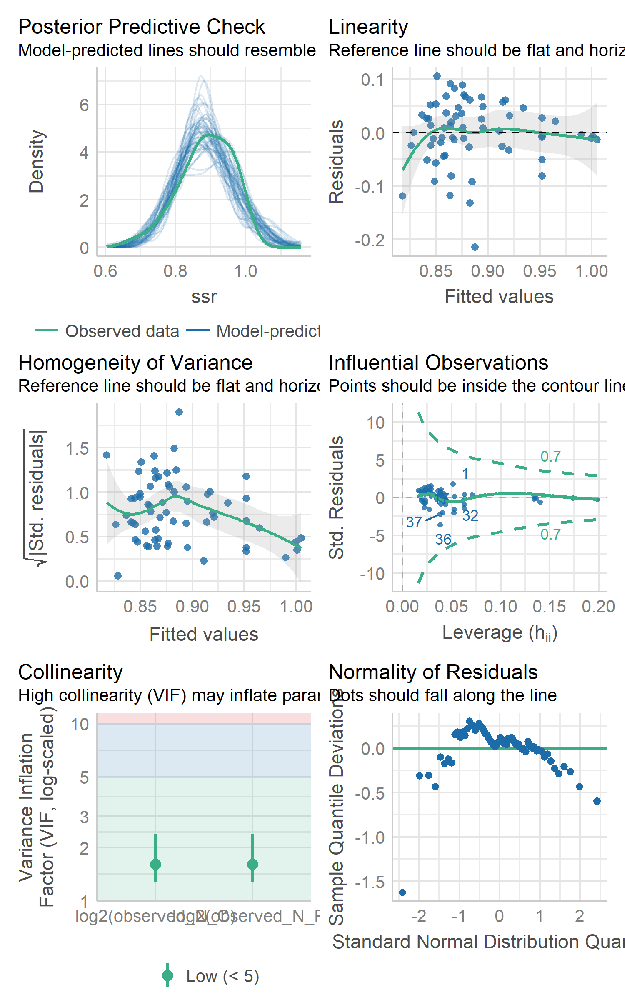<!-- -->

#### Regression results (Table 4)

<table class="table table-striped" style="width: auto !important; margin-left: auto; margin-right: auto;">
<thead>
<tr>
<th style="empty-cells: hide;border-bottom:hidden;" colspan="1">
</th>
<th style="border-bottom:hidden;padding-bottom:0; padding-left:3px;padding-right:3px;text-align: center; " colspan="2">

SHR

</th>
<th style="border-bottom:hidden;padding-bottom:0; padding-left:3px;padding-right:3px;text-align: center; " colspan="2">

SSR

</th>
</tr>
<tr>
<th style="text-align:left;">
Characteristic
</th>
<th style="text-align:right;">
beta
</th>
<th style="text-align:left;">
p
</th>
<th style="text-align:right;">
beta
</th>
<th style="text-align:left;">
p
</th>
</tr>
</thead>
<tbody>
<tr>
<td style="text-align:left;">
(Intercept)
</td>
<td style="text-align:right;">
NA
</td>
<td style="text-align:left;">
\<0.001\*\*\*
</td>
<td style="text-align:right;">
NA
</td>
<td style="text-align:left;">
\<0.001\*\*\*
</td>
</tr>
<tr>
<td style="text-align:left;">
observed_N_A
</td>
<td style="text-align:right;">
0.13
</td>
<td style="text-align:left;">
.819
</td>
<td style="text-align:right;">
-0.34
</td>
<td style="text-align:left;">
.533
</td>
</tr>
<tr>
<td style="text-align:left;">
observed_N_C
</td>
<td style="text-align:right;">
0.10
</td>
<td style="text-align:left;">
.859
</td>
<td style="text-align:right;">
0.58
</td>
<td style="text-align:left;">
.286
</td>
</tr>
<tr>
<td style="text-align:left;">
N_CR
</td>
<td style="text-align:right;">
0.29
</td>
<td style="text-align:left;">
.028\*
</td>
<td style="text-align:right;">
0.38
</td>
<td style="text-align:left;">
.003\*\*
</td>
</tr>
</tbody>
</table>

LaTeX table

    ## \begin{table}
    ## \centering
    ## \begin{tabular}{lrlrl}
    ## \toprule
    ## \multicolumn{1}{c}{ } & \multicolumn{2}{c}{SHR} & \multicolumn{2}{c}{SSR} \\
    ## \cmidrule(l{3pt}r{3pt}){2-3} \cmidrule(l{3pt}r{3pt}){4-5}
    ## Characteristic & beta & p & beta & p\\
    ## \midrule
    ## (Intercept) & NA & <0.001*** & NA & <0.001***\\
    ## observed\_N\_A & 0.13 & .819 & -0.34 & .533\\
    ## observed\_N\_C & 0.10 & .859 & 0.58 & .286\\
    ## N\_CR & 0.29 & .028* & 0.38 & .003**\\
    ## \bottomrule
    ## \end{tabular}
    ## \end{table}

TODO: logs?

Another approach would be to consider log-transformed versions of the
three characteristics:

    ## 
    ## Call:
    ## lm(formula = ssr ~ log_N_A + log_N_C + log_N_R + log_N_CR + log_N_CA, 
    ##     data = .)
    ## 
    ## Residuals:
    ##       Min        1Q    Median        3Q       Max 
    ## -0.180607 -0.021683  0.003992  0.034082  0.124242 
    ## 
    ## Coefficients:
    ##             Estimate Std. Error t value Pr(>|t|)    
    ## (Intercept)  0.94131    0.13431   7.009 2.83e-09 ***
    ## log_N_A      0.45328    0.28666   1.581  0.11926    
    ## log_N_C     -1.55295    0.78861  -1.969  0.05371 .  
    ## log_N_R      0.41931    0.19318   2.171  0.03407 *  
    ## log_N_CR     0.17868    0.05980   2.988  0.00411 ** 
    ## log_N_CA     0.14391    0.08344   1.725  0.08991 .  
    ## ---
    ## Signif. codes:  0 '***' 0.001 '**' 0.01 '*' 0.05 '.' 0.1 ' ' 1
    ## 
    ## Residual standard error: 0.0591 on 58 degrees of freedom
    ## Multiple R-squared:  0.427,  Adjusted R-squared:  0.3777 
    ## F-statistic: 8.646 on 5 and 58 DF,  p-value: 3.609e-06

And with interactions:

    ## 
    ## Call:
    ## lm(formula = ssr ~ log_N_A * log_N_C * log_N_R, data = .)
    ## 
    ## Residuals:
    ##      Min       1Q   Median       3Q      Max 
    ## -0.15225 -0.03506  0.01282  0.03299  0.08749 
    ## 
    ## Coefficients:
    ##                         Estimate Std. Error t value Pr(>|t|)    
    ## (Intercept)               0.5631     0.1061   5.305 1.99e-06 ***
    ## log_N_A                  -0.4181     0.3385  -1.235 0.221877    
    ## log_N_C                   0.8764     0.2795   3.135 0.002732 ** 
    ## log_N_R                  -0.6463     0.3324  -1.945 0.056857 .  
    ## log_N_A:log_N_C           0.1941     0.8044   0.241 0.810246    
    ## log_N_A:log_N_R           4.1455     1.1066   3.746 0.000426 ***
    ## log_N_C:log_N_R           0.2894     0.7212   0.401 0.689698    
    ## log_N_A:log_N_C:log_N_R  -4.9372     2.1295  -2.319 0.024096 *  
    ## ---
    ## Signif. codes:  0 '***' 0.001 '**' 0.01 '*' 0.05 '.' 0.1 ' ' 1
    ## 
    ## Residual standard error: 0.05363 on 56 degrees of freedom
    ## Multiple R-squared:  0.5444, Adjusted R-squared:  0.4875 
    ## F-statistic: 9.561 on 7 and 56 DF,  p-value: 9.387e-08

    ## Start:  AIC=-367.03
    ## ssr ~ log_N_A * log_N_C * log_N_R
    ## 
    ##                           Df Sum of Sq     RSS     AIC
    ## <none>                                 0.16106 -367.03
    ## - log_N_A:log_N_C:log_N_R  1  0.015461 0.17652 -363.16

    ## 
    ## Call:
    ## lm(formula = ssr ~ log_N_A * log_N_C * log_N_R, data = .)
    ## 
    ## Coefficients:
    ##             (Intercept)                  log_N_A                  log_N_C  
    ##                  0.5631                  -0.4181                   0.8764  
    ##                 log_N_R          log_N_A:log_N_C          log_N_A:log_N_R  
    ##                 -0.6463                   0.1941                   4.1455  
    ##         log_N_C:log_N_R  log_N_A:log_N_C:log_N_R  
    ##                  0.2894                  -4.9372

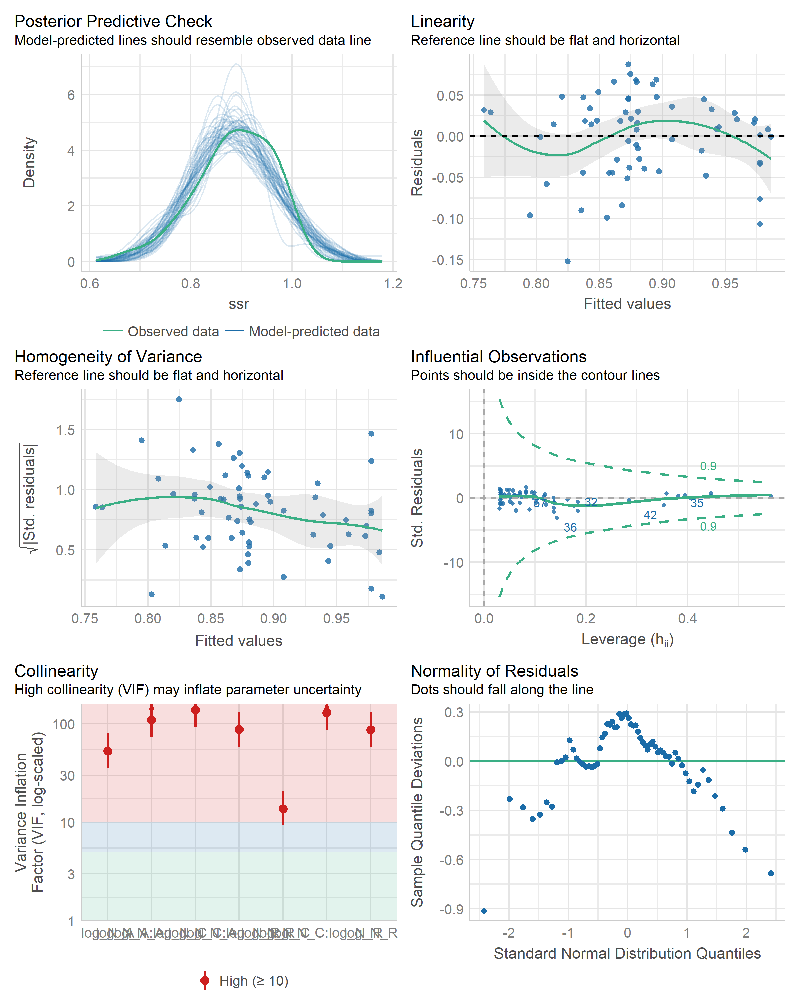<!-- -->

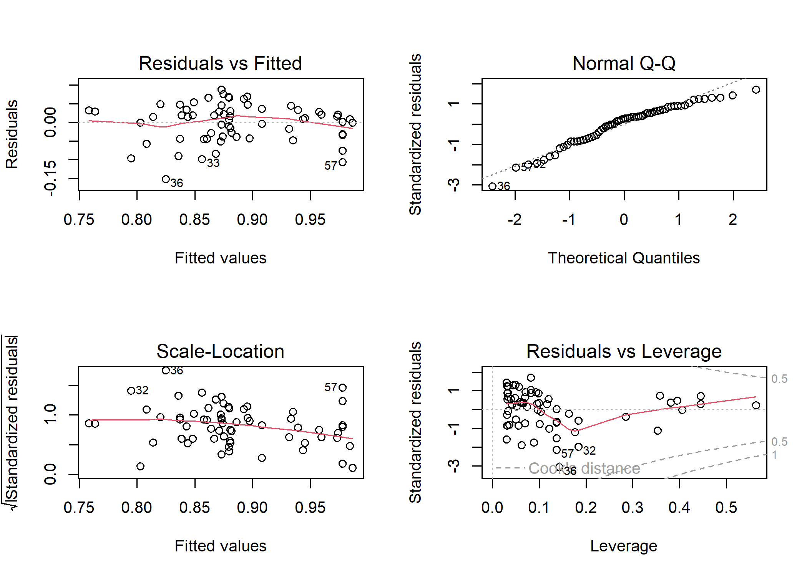<!-- -->

## Comparisons per representation

What about the suggested thesholds of N_CR\>=20 and NC_R\>=37?

Let’s compare SSR and SHR for these thresholds

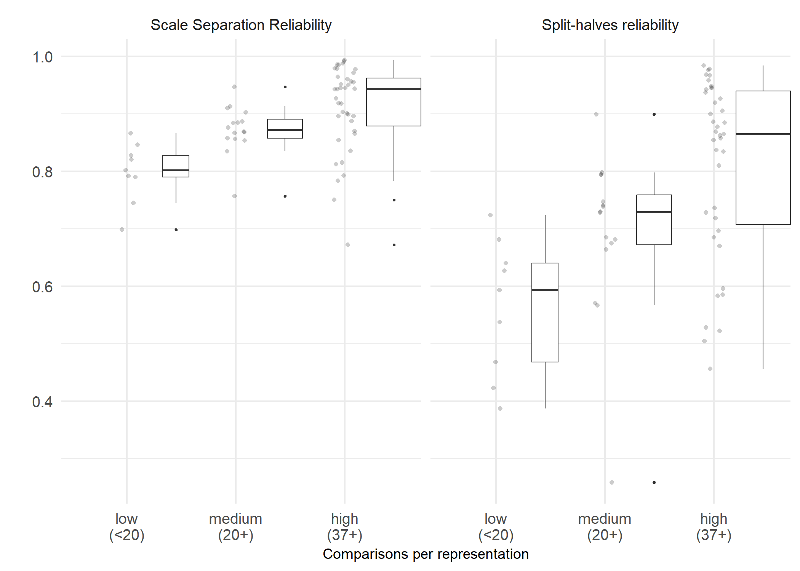<!-- -->

For the case of SSR

<table class="table table-striped" style="width: auto !important; margin-left: auto; margin-right: auto;">
<thead>
<tr>
<th style="text-align:left;">
ncr_level
</th>
<th style="text-align:right;">
count
</th>
<th style="text-align:right;">
median
</th>
<th style="text-align:right;">
min
</th>
<th style="text-align:right;">
max
</th>
</tr>
</thead>
<tbody>
<tr>
<td style="text-align:left;">

0.  low
    </td>
    <td style="text-align:right;">
    9
    </td>
    <td style="text-align:right;">
    0.8021354
    </td>
    <td style="text-align:right;">
    0.6985923
    </td>
    <td style="text-align:right;">
    0.8667137
    </td>
    </tr>
    <tr>
    <td style="text-align:left;">

    1.  medium
        </td>
        <td style="text-align:right;">
        16
        </td>
        <td style="text-align:right;">
        0.8727270
        </td>
        <td style="text-align:right;">
        0.7571373
        </td>
        <td style="text-align:right;">
        0.9473133
        </td>
        </tr>
        <tr>
        <td style="text-align:left;">

        2.  high
            </td>
            <td style="text-align:right;">
            39
            </td>
            <td style="text-align:right;">
            0.9431696
            </td>
            <td style="text-align:right;">
            0.6724809
            </td>
            <td style="text-align:right;">
            0.9938654
            </td>
            </tr>
            </tbody>
            </table>

<table class="table table-striped" style="width: auto !important; margin-left: auto; margin-right: auto;">
<thead>
<tr>
<th style="text-align:left;">
.y.
</th>
<th style="text-align:right;">
n
</th>
<th style="text-align:right;">
statistic
</th>
<th style="text-align:right;">
df
</th>
<th style="text-align:right;">
p
</th>
<th style="text-align:left;">
method
</th>
</tr>
</thead>
<tbody>
<tr>
<td style="text-align:left;">
ssr
</td>
<td style="text-align:right;">
64
</td>
<td style="text-align:right;">
19.22894
</td>
<td style="text-align:right;">
2
</td>
<td style="text-align:right;">
6.68e-05
</td>
<td style="text-align:left;">
Kruskal-Wallis
</td>
</tr>
</tbody>
</table>
<table class="table table-striped" style="width: auto !important; margin-left: auto; margin-right: auto;">
<thead>
<tr>
<th style="text-align:left;">
.y.
</th>
<th style="text-align:left;">
group1
</th>
<th style="text-align:left;">
group2
</th>
<th style="text-align:right;">
n1
</th>
<th style="text-align:right;">
n2
</th>
<th style="text-align:right;">
statistic
</th>
<th style="text-align:right;">
p
</th>
<th style="text-align:right;">
p.adj
</th>
<th style="text-align:left;">
p.adj.signif
</th>
</tr>
</thead>
<tbody>
<tr>
<td style="text-align:left;">
ssr
</td>
<td style="text-align:left;">

0.  low
    </td>
    <td style="text-align:left;">

    1.  medium
        </td>
        <td style="text-align:right;">
        9
        </td>
        <td style="text-align:right;">
        16
        </td>
        <td style="text-align:right;">
        2.131337
        </td>
        <td style="text-align:right;">
        0.0330614
        </td>
        <td style="text-align:right;">
        0.0514532
        </td>
        <td style="text-align:left;">
        ns
        </td>
        </tr>
        <tr>
        <td style="text-align:left;">
        ssr
        </td>
        <td style="text-align:left;">

        0.  low
            </td>
            <td style="text-align:left;">

            2.  high
                </td>
                <td style="text-align:right;">
                9
                </td>
                <td style="text-align:right;">
                39
                </td>
                <td style="text-align:right;">
                4.192008
                </td>
                <td style="text-align:right;">
                0.0000276
                </td>
                <td style="text-align:right;">
                0.0000829
                </td>
                <td style="text-align:left;">
                \*\*\*\*
                </td>
                </tr>
                <tr>
                <td style="text-align:left;">
                ssr
                </td>
                <td style="text-align:left;">

                1.  medium
                    </td>
                    <td style="text-align:left;">

                    2.  high
                        </td>
                        <td style="text-align:right;">
                        16
                        </td>
                        <td style="text-align:right;">
                        39
                        </td>
                        <td style="text-align:right;">
                        2.230314
                        </td>
                        <td style="text-align:right;">
                        0.0257266
                        </td>
                        <td style="text-align:right;">
                        0.0514532
                        </td>
                        <td style="text-align:left;">
                        ns
                        </td>
                        </tr>
                        </tbody>
                        </table>

For the case of SHR

<table class="table table-striped" style="width: auto !important; margin-left: auto; margin-right: auto;">
<thead>
<tr>
<th style="text-align:left;">
ncr_level
</th>
<th style="text-align:right;">
count
</th>
<th style="text-align:right;">
median
</th>
<th style="text-align:right;">
min
</th>
<th style="text-align:right;">
max
</th>
</tr>
</thead>
<tbody>
<tr>
<td style="text-align:left;">

0.  low
    </td>
    <td style="text-align:right;">
    9
    </td>
    <td style="text-align:right;">
    0.5934963
    </td>
    <td style="text-align:right;">
    0.3874069
    </td>
    <td style="text-align:right;">
    0.7242134
    </td>
    </tr>
    <tr>
    <td style="text-align:left;">

    1.  medium
        </td>
        <td style="text-align:right;">
        16
        </td>
        <td style="text-align:right;">
        0.7295652
        </td>
        <td style="text-align:right;">
        0.2589035
        </td>
        <td style="text-align:right;">
        0.8995312
        </td>
        </tr>
        <tr>
        <td style="text-align:left;">

        2.  high
            </td>
            <td style="text-align:right;">
            39
            </td>
            <td style="text-align:right;">
            0.8650461
            </td>
            <td style="text-align:right;">
            0.4563501
            </td>
            <td style="text-align:right;">
            0.9847176
            </td>
            </tr>
            </tbody>
            </table>

<table class="table table-striped" style="width: auto !important; margin-left: auto; margin-right: auto;">
<thead>
<tr>
<th style="text-align:left;">
.y.
</th>
<th style="text-align:right;">
n
</th>
<th style="text-align:right;">
statistic
</th>
<th style="text-align:right;">
df
</th>
<th style="text-align:right;">
p
</th>
<th style="text-align:left;">
method
</th>
</tr>
</thead>
<tbody>
<tr>
<td style="text-align:left;">
median_split_corr
</td>
<td style="text-align:right;">
64
</td>
<td style="text-align:right;">
17.67413
</td>
<td style="text-align:right;">
2
</td>
<td style="text-align:right;">
0.000145
</td>
<td style="text-align:left;">
Kruskal-Wallis
</td>
</tr>
</tbody>
</table>
<table class="table table-striped" style="width: auto !important; margin-left: auto; margin-right: auto;">
<thead>
<tr>
<th style="text-align:left;">
.y.
</th>
<th style="text-align:left;">
group1
</th>
<th style="text-align:left;">
group2
</th>
<th style="text-align:right;">
n1
</th>
<th style="text-align:right;">
n2
</th>
<th style="text-align:right;">
statistic
</th>
<th style="text-align:right;">
p
</th>
<th style="text-align:right;">
p.adj
</th>
<th style="text-align:left;">
p.adj.signif
</th>
</tr>
</thead>
<tbody>
<tr>
<td style="text-align:left;">
median_split_corr
</td>
<td style="text-align:left;">

0.  low
    </td>
    <td style="text-align:left;">

    1.  medium
        </td>
        <td style="text-align:right;">
        9
        </td>
        <td style="text-align:right;">
        16
        </td>
        <td style="text-align:right;">
        1.728522
        </td>
        <td style="text-align:right;">
        0.0838946
        </td>
        <td style="text-align:right;">
        0.0838946
        </td>
        <td style="text-align:left;">
        ns
        </td>
        </tr>
        <tr>
        <td style="text-align:left;">
        median_split_corr
        </td>
        <td style="text-align:left;">

        0.  low
            </td>
            <td style="text-align:left;">

            2.  high
                </td>
                <td style="text-align:right;">
                9
                </td>
                <td style="text-align:right;">
                39
                </td>
                <td style="text-align:right;">
                3.901534
                </td>
                <td style="text-align:right;">
                0.0000956
                </td>
                <td style="text-align:right;">
                0.0002868
                </td>
                <td style="text-align:left;">
                \*\*\*
                </td>
                </tr>
                <tr>
                <td style="text-align:left;">
                median_split_corr
                </td>
                <td style="text-align:left;">

                1.  medium
                    </td>
                    <td style="text-align:left;">

                    2.  high
                        </td>
                        <td style="text-align:right;">
                        16
                        </td>
                        <td style="text-align:right;">
                        39
                        </td>
                        <td style="text-align:right;">
                        2.433834
                        </td>
                        <td style="text-align:right;">
                        0.0149398
                        </td>
                        <td style="text-align:right;">
                        0.0298797
                        </td>
                        <td style="text-align:left;">

                        - </td>
                          </tr>
                          </tbody>
                          </table>

# RQ3: How does SSR function as a measure of inter-rater reliability?

## Comparing SSR with SHR

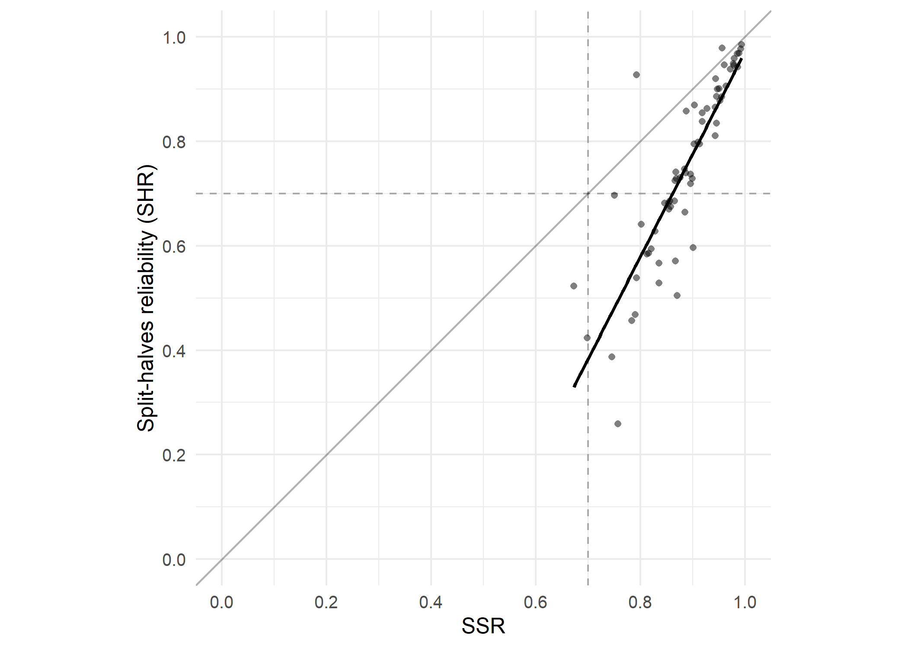<!-- -->

    ## 
    ##  Pearson's product-moment correlation
    ## 
    ## data:  median_split_corr and ssr
    ## t = 13.216, df = 62, p-value < 2.2e-16
    ## alternative hypothesis: true correlation is not equal to 0
    ## 95 percent confidence interval:
    ##  0.7774385 0.9122476
    ## sample estimates:
    ##       cor 
    ## 0.8590768

    ## 
    ## Call:
    ## lm(formula = median_split_corr ~ ssr, data = ssr_vs_shr_data)
    ## 
    ## Residuals:
    ##      Min       1Q   Median       3Q      Max 
    ## -0.23620 -0.02650  0.00257  0.02624  0.36198 
    ## 
    ## Coefficients:
    ##             Estimate Std. Error t value Pr(>|t|)    
    ## (Intercept)  -0.9902     0.1319  -7.505 2.86e-10 ***
    ## ssr           1.9617     0.1484  13.216  < 2e-16 ***
    ## ---
    ## Signif. codes:  0 '***' 0.001 '**' 0.01 '*' 0.05 '.' 0.1 ' ' 1
    ## 
    ## Residual standard error: 0.08826 on 62 degrees of freedom
    ## Multiple R-squared:  0.738,  Adjusted R-squared:  0.7338 
    ## F-statistic: 174.7 on 1 and 62 DF,  p-value: < 2.2e-16

Outlier:

    ## # A tibble: 1 × 6
    ##   judging_session             observed_N_A observed_N_R observed_N_C   SHR   ssr
    ##   <chr>                              <dbl>        <dbl>        <dbl> <dbl> <dbl>
    ## 1 Kinnear2021_students-withs…            9           20          331 0.259 0.757

### Spearman-Brown correction (Figure 8(a))

We apply the Spearman-Brown correction to the SHR value:

$$\text{SHR}_\text{SB}=\frac{2\times\text{SHR}}{1+\text{SHR}}$$

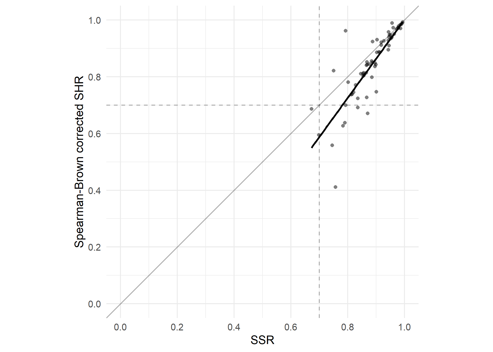<!-- -->

## SSR as an estimate of inter-group correlation

### Introducing SSR_HALF

The split-halves reliability comes from the median of 100 random
iterations of the split-halves correlation coefficient.

For each iteration, the judges are split randomly into two groups, and
Bradley-Terry is run for each half of the data separately.

Thus, we can consider the SSR of either of those halves.

When running all the split-half computations, we recorded for each
split: the value of the correlation (`split_corr`) and the value of the
SSR of one of the halves (`ssr_x`):

    ## # A tibble: 6 × 4
    ##   judging_session iteration split_corr ssr_x
    ##   <chr>               <dbl>      <dbl> <dbl>
    ## 1 AlMaimani2017           1      0.978 0.906
    ## 2 AlMaimani2017           2      0.956 0.916
    ## 3 AlMaimani2017           3      0.997 0.892
    ## 4 AlMaimani2017           4      0.996 0.911
    ## 5 AlMaimani2017           5      0.956 0.916
    ## 6 AlMaimani2017           6      0.996 0.890

Now the question is: how do `ssr_x` and `split_corr` relate? (That would
give some information towards the situation where you have an SSR value
for some judging data, and would like to know the likely correlation you
would get between the scores generated from that data, and the scores
from another similar group of judges.)

From each judging session, we have 100 data points to address that
question, but they are not really independent since they are built on
the same judgement data. So we summarise each judging session by the
*median* of `ssr_x` and `split_corr` across the 100 different splits. We
could have used the *mean* but it doesn’t actually make much difference
as an estimate of the expected value; both averages are very similar in
practice, as shown in this plot of the raw values and their averages
(mean in red, median in green) in the first 16 sets of judging data:

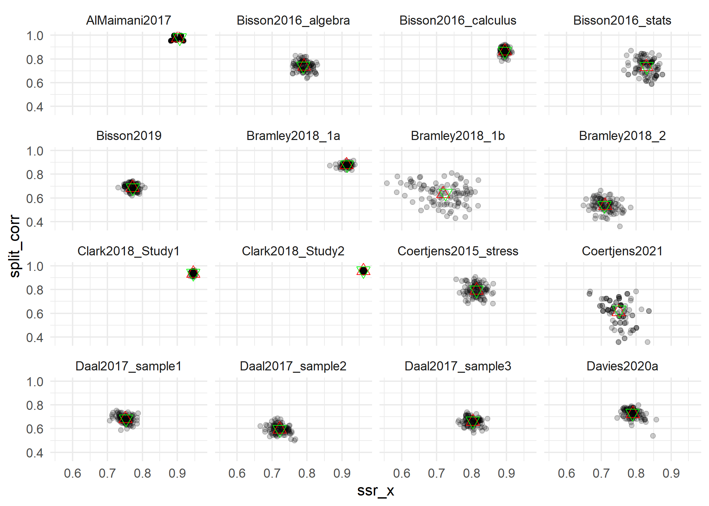<!-- -->

#### Why 100 replicates?

Partly this is down to computational efficiency - generating replicates
for some of the larger datasets is computationally intensive.

But we also found that 100 replicates was sufficient to get a reasonably
precise estimate of the mean `ssr_x` and `split_corr` values. This shows
the distribution of the SEM for each measure, across all the judging
sessions:

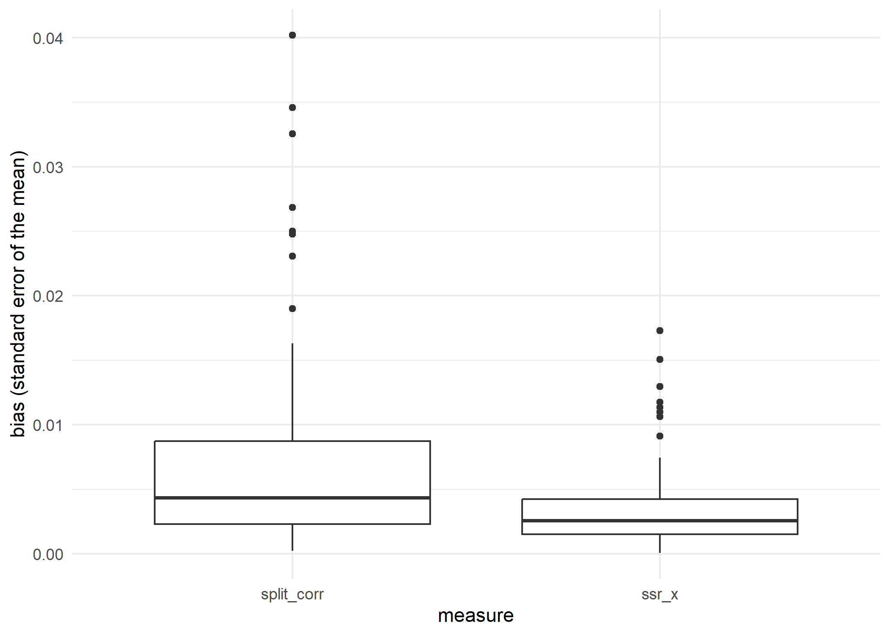<!-- -->

    ## # A tibble: 2 × 3
    ##   name       bias_max bias_median
    ##   <chr>         <dbl>       <dbl>
    ## 1 split_corr   0.0402     0.00435
    ## 2 ssr_x        0.0173     0.00257

### SSR_HALF versus SSR (Figure)

So using the medians, we have the following picture:

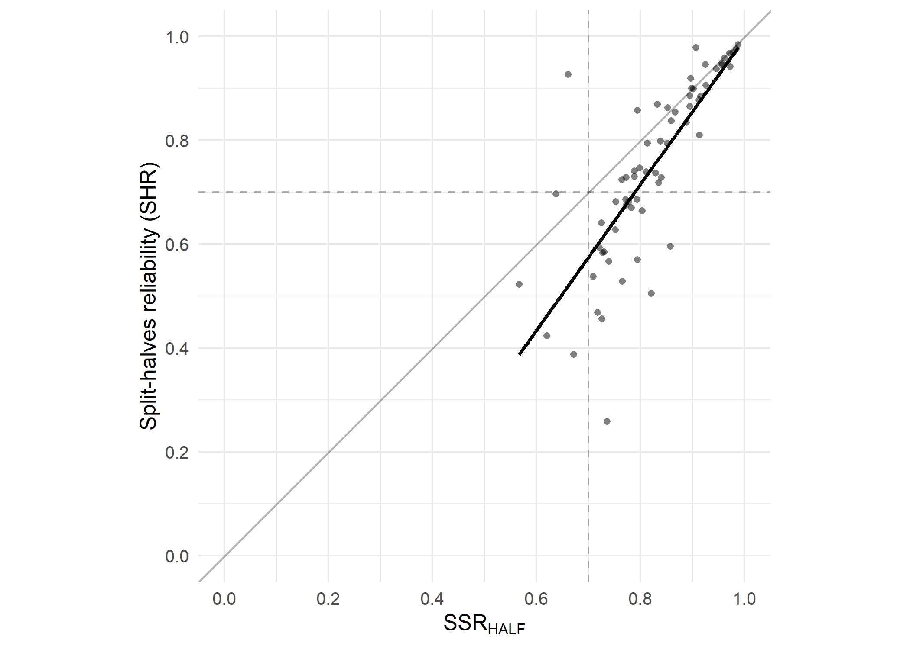<!-- -->

There is a strong linear relationship here:

    ## 
    ## Call:
    ## lm(formula = median_split_corr ~ median_ssr_x, data = ssr_vs_shr_data)
    ## 
    ## Residuals:
    ##      Min       1Q   Median       3Q      Max 
    ## -0.36634 -0.03026  0.00819  0.04000  0.40715 
    ## 
    ## Coefficients:
    ##              Estimate Std. Error t value Pr(>|t|)    
    ## (Intercept)   -0.4089     0.1118  -3.657 0.000527 ***
    ## median_ssr_x   1.4051     0.1349  10.413 3.06e-15 ***
    ## ---
    ## Signif. codes:  0 '***' 0.001 '**' 0.01 '*' 0.05 '.' 0.1 ' ' 1
    ## 
    ## Residual standard error: 0.104 on 62 degrees of freedom
    ## Multiple R-squared:  0.6362, Adjusted R-squared:  0.6303 
    ## F-statistic: 108.4 on 1 and 62 DF,  p-value: 3.056e-15

We can add a 95% prediction interval from the linear regression:

    ## Warning: Removed 15 rows containing missing values (`geom_line()`).

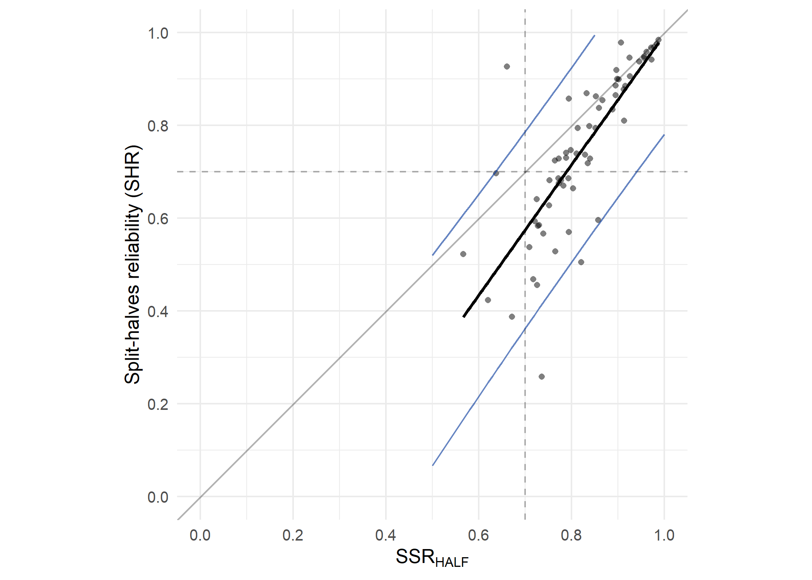<!-- -->

So for instance, with an SSR of 0.8 we might then read off the blue
prediction interval and expect to get a correlation of anywhere between
0.5 and 0.9 with scores generated by a similar group of judges.

### Comparing SSR and SHR thresholds

If we use a particular SSR threshold in our study, what sort of
correlation might we expect with the scores we’d get if we gathered the
same number of judgements again?

The above analysis does a sort of simulation of this situation, by
splitting the data from each of the studies in the meta-analysis into
two halves (which you could think of as the original and replication),
and computing:

- SSR_HALF - the SSR of the “original” half dataset,
- SHR - the correlation between the scores from the “original” and
  “replication” datasets

(where in fact each of these is the median over 100 iterations of
splitting the data into random halves).

We can then look at what a given SSR threshold should imply for the SHR.

Here we look at how likely a given SSR threshold is to produce an SHR of
.7 or higher:

<table class="table table-striped" style="width: auto !important; margin-left: auto; margin-right: auto;">
<thead>
<tr>
<th style="text-align:right;">
ssr_threshold
</th>
<th style="text-align:right;">
n
</th>
<th style="text-align:right;">
n_with_shr_above_pt7
</th>
<th style="text-align:left;">
pct
</th>
</tr>
</thead>
<tbody>
<tr>
<td style="text-align:right;">
0.70
</td>
<td style="text-align:right;">
59
</td>
<td style="text-align:right;">
38
</td>
<td style="text-align:left;">
64%
</td>
</tr>
<tr>
<td style="text-align:right;">
0.75
</td>
<td style="text-align:right;">
50
</td>
<td style="text-align:right;">
38
</td>
<td style="text-align:left;">
76%
</td>
</tr>
<tr>
<td style="text-align:right;">
0.80
</td>
<td style="text-align:right;">
35
</td>
<td style="text-align:right;">
32
</td>
<td style="text-align:left;">
91%
</td>
</tr>
<tr>
<td style="text-align:right;">
0.85
</td>
<td style="text-align:right;">
26
</td>
<td style="text-align:right;">
25
</td>
<td style="text-align:left;">
96%
</td>
</tr>
<tr>
<td style="text-align:right;">
0.90
</td>
<td style="text-align:right;">
16
</td>
<td style="text-align:right;">
16
</td>
<td style="text-align:left;">
100%
</td>
</tr>
</tbody>
</table>

Here we look at other SHR thresholds too:

<table class="table table-striped" style="width: auto !important; margin-left: auto; margin-right: auto;">
<thead>
<tr>
<th style="empty-cells: hide;border-bottom:hidden;" colspan="2">
</th>
<th style="border-bottom:hidden;padding-bottom:0; padding-left:3px;padding-right:3px;text-align: center; " colspan="3">

SHR Threshold

</th>
</tr>
<tr>
<th style="text-align:right;">
SSR Threshold
</th>
<th style="text-align:right;">
Number of studies
</th>
<th style="text-align:left;">
.7
</th>
<th style="text-align:left;">
.8
</th>
<th style="text-align:left;">
.9
</th>
</tr>
</thead>
<tbody>
<tr>
<td style="text-align:right;">
0.70
</td>
<td style="text-align:right;">
59
</td>
<td style="text-align:left;">
38 (64%)
</td>
<td style="text-align:left;">
26 (44%)
</td>
<td style="text-align:left;">
14 (24%)
</td>
</tr>
<tr>
<td style="text-align:right;">
0.75
</td>
<td style="text-align:right;">
50
</td>
<td style="text-align:left;">
38 (76%)
</td>
<td style="text-align:left;">
26 (52%)
</td>
<td style="text-align:left;">
14 (28%)
</td>
</tr>
<tr>
<td style="text-align:right;">
0.80
</td>
<td style="text-align:right;">
35
</td>
<td style="text-align:left;">
32 (91%)
</td>
<td style="text-align:left;">
25 (71%)
</td>
<td style="text-align:left;">
14 (40%)
</td>
</tr>
<tr>
<td style="text-align:right;">
0.85
</td>
<td style="text-align:right;">
26
</td>
<td style="text-align:left;">
25 (96%)
</td>
<td style="text-align:left;">
24 (92%)
</td>
<td style="text-align:left;">
14 (54%)
</td>
</tr>
<tr>
<td style="text-align:right;">
0.90
</td>
<td style="text-align:right;">
16
</td>
<td style="text-align:left;">
16 (100%)
</td>
<td style="text-align:left;">
16 (100%)
</td>
<td style="text-align:left;">
12 (75%)
</td>
</tr>
</tbody>
</table>
