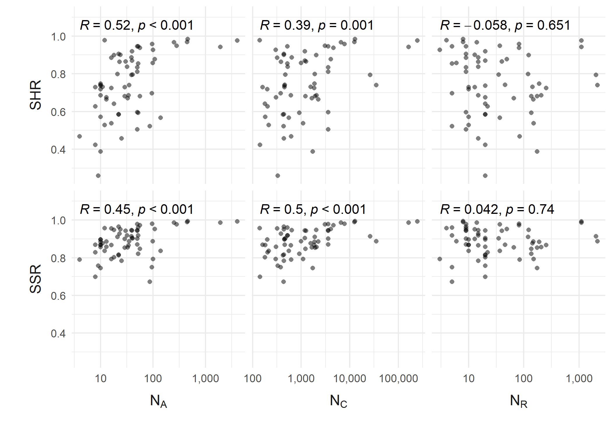

CJ meta-analysis
================
George Kinnear
2025-04-10

# About the sample

    ## # A tibble: 1 × 1
    ##   n_datatsets
    ##         <int>
    ## 1         101

## SSR correction

The `ssr` column stores the `mle.rel` value from `sirt::btm` which is
incorrect; here, we replace the `ssr` values with the correct ones,
computed from `sepG`:

# RQ1: How do study characteristics and reliability measures vary across CJ studies?

## Study characteristics

<!-- -->

<table class="table table-striped" style="width: auto !important; margin-left: auto; margin-right: auto;">
<thead>
<tr>
<th style="text-align:left;">
N_A
</th>
<th style="text-align:right;">
expert
</th>
<th style="text-align:right;">
layperson
</th>
<th style="text-align:right;">
novice
</th>
<th style="text-align:right;">
peer
</th>
</tr>
</thead>
<tbody>
<tr>
<td style="text-align:left;">
\<= 10
</td>
<td style="text-align:right;">
16
</td>
<td style="text-align:right;">
2
</td>
<td style="text-align:right;">
3
</td>
<td style="text-align:right;">
0
</td>
</tr>
<tr>
<td style="text-align:left;">
\<= 100
</td>
<td style="text-align:right;">
40
</td>
<td style="text-align:right;">
16
</td>
<td style="text-align:right;">
10
</td>
<td style="text-align:right;">
4
</td>
</tr>
<tr>
<td style="text-align:left;">
\<= 1000
</td>
<td style="text-align:right;">
3
</td>
<td style="text-align:right;">
3
</td>
<td style="text-align:right;">
0
</td>
<td style="text-align:right;">
2
</td>
</tr>
<tr>
<td style="text-align:left;">
1000+
</td>
<td style="text-align:right;">
0
</td>
<td style="text-align:right;">
2
</td>
<td style="text-align:right;">
0
</td>
<td style="text-align:right;">
0
</td>
</tr>
</tbody>
</table>

## Relationships between study characteristics

<!-- -->

Top 3:

<table class="table table-striped" style="width: auto !important; margin-left: auto; margin-right: auto;">
<thead>
<tr>
<th style="text-align:left;">
judging_session
</th>
<th style="text-align:left;">
feature
</th>
<th style="text-align:right;">
count
</th>
</tr>
</thead>
<tbody>
<tr>
<td style="text-align:left;">
Ofqual2015
</td>
<td style="text-align:left;">
Comparisons per assessor
</td>
<td style="text-align:right;">
1000.00000
</td>
</tr>
<tr>
<td style="text-align:left;">
Hunter2018
</td>
<td style="text-align:left;">
Comparisons per assessor
</td>
<td style="text-align:right;">
676.00000
</td>
</tr>
<tr>
<td style="text-align:left;">
McMahon2014_teachers
</td>
<td style="text-align:left;">
Comparisons per assessor
</td>
<td style="text-align:right;">
310.00000
</td>
</tr>
<tr>
<td style="text-align:left;">
Esen2019
</td>
<td style="text-align:left;">
Comparisons per representation
</td>
<td style="text-align:right;">
3213.00000
</td>
</tr>
<tr>
<td style="text-align:left;">
Isnac2020
</td>
<td style="text-align:left;">
Comparisons per representation
</td>
<td style="text-align:right;">
3108.00000
</td>
</tr>
<tr>
<td style="text-align:left;">
Vatavu2020
</td>
<td style="text-align:left;">
Comparisons per representation
</td>
<td style="text-align:right;">
942.14286
</td>
</tr>
<tr>
<td style="text-align:left;">
Ofqual2015
</td>
<td style="text-align:left;">
Representations per assessor
</td>
<td style="text-align:right;">
61.42857
</td>
</tr>
<tr>
<td style="text-align:left;">
Hunter2018
</td>
<td style="text-align:left;">
Representations per assessor
</td>
<td style="text-align:right;">
52.17949
</td>
</tr>
<tr>
<td style="text-align:left;">
Jones2015a_all-scripts
</td>
<td style="text-align:left;">
Representations per assessor
</td>
<td style="text-align:right;">
50.00000
</td>
</tr>
<tr>
<td style="text-align:left;">
Jones2015a_subset-of-scripts
</td>
<td style="text-align:left;">
Representations per assessor
</td>
<td style="text-align:right;">
50.00000
</td>
</tr>
</tbody>
</table>

Bottom 3:

<table class="table table-striped" style="width: auto !important; margin-left: auto; margin-right: auto;">
<thead>
<tr>
<th style="text-align:left;">
judging_session
</th>
<th style="text-align:left;">
feature
</th>
<th style="text-align:right;">
count
</th>
</tr>
</thead>
<tbody>
<tr>
<td style="text-align:left;">
Luckett2018_coldbrew
</td>
<td style="text-align:left;">
Comparisons per assessor
</td>
<td style="text-align:right;">
3.0000000
</td>
</tr>
<tr>
<td style="text-align:left;">
Luckett2018_pizza
</td>
<td style="text-align:left;">
Comparisons per assessor
</td>
<td style="text-align:right;">
4.0000000
</td>
</tr>
<tr>
<td style="text-align:left;">
Zucco2019_legislators
</td>
<td style="text-align:left;">
Comparisons per assessor
</td>
<td style="text-align:right;">
4.0000000
</td>
</tr>
<tr>
<td style="text-align:left;">
Jones2015a_all-scripts
</td>
<td style="text-align:left;">
Comparisons per representation
</td>
<td style="text-align:right;">
9.6186667
</td>
</tr>
<tr>
<td style="text-align:left;">
Jones2015a_subset-of-scripts
</td>
<td style="text-align:left;">
Comparisons per representation
</td>
<td style="text-align:right;">
10.0000000
</td>
</tr>
<tr>
<td style="text-align:left;">
PollittX_business
</td>
<td style="text-align:left;">
Comparisons per representation
</td>
<td style="text-align:right;">
10.0000000
</td>
</tr>
<tr>
<td style="text-align:left;">
Esen2019
</td>
<td style="text-align:left;">
Representations per assessor
</td>
<td style="text-align:right;">
0.0174292
</td>
</tr>
<tr>
<td style="text-align:left;">
Isnac2020
</td>
<td style="text-align:left;">
Representations per assessor
</td>
<td style="text-align:right;">
0.0180180
</td>
</tr>
<tr>
<td style="text-align:left;">
Luckett2018_coldbrew
</td>
<td style="text-align:left;">
Representations per assessor
</td>
<td style="text-align:right;">
0.0300000
</td>
</tr>
</tbody>
</table>

Proportion below certain levels:

<table class="table table-striped" style="width: auto !important; margin-left: auto; margin-right: auto;">
<thead>
<tr>
<th style="text-align:left;">
feature
</th>
<th style="text-align:left;">
prop_below_10
</th>
<th style="text-align:left;">
prop_below_100
</th>
</tr>
</thead>
<tbody>
<tr>
<td style="text-align:left;">
Representations per assessor
</td>
<td style="text-align:left;">
74.3%
</td>
<td style="text-align:left;">
100.0%
</td>
</tr>
<tr>
<td style="text-align:left;">
Comparisons per representation
</td>
<td style="text-align:left;">
3.0%
</td>
<td style="text-align:left;">
77.2%
</td>
</tr>
<tr>
<td style="text-align:left;">
Comparisons per assessor
</td>
<td style="text-align:left;">
8.9%
</td>
<td style="text-align:left;">
76.2%
</td>
</tr>
</tbody>
</table>
<table class="table table-striped" style="width: auto !important; margin-left: auto; margin-right: auto;">
<thead>
<tr>
<th style="text-align:left;">
feature
</th>
<th style="text-align:left;">
prop_above_10
</th>
<th style="text-align:left;">
prop_above_20
</th>
<th style="text-align:left;">
prop_above_37
</th>
</tr>
</thead>
<tbody>
<tr>
<td style="text-align:left;">
Comparisons per representation
</td>
<td style="text-align:left;">
99.0%
</td>
<td style="text-align:left;">
63.4%
</td>
<td style="text-align:left;">
43.6%
</td>
</tr>
</tbody>
</table>

Representations per assessor:

    ## # A tibble: 1 × 1
    ##   median_N_RA
    ##         <dbl>
    ## 1        1.68

    ## # A tibble: 45 × 5
    ##    judging_session        Assessors Representations Comparisons   N_RA
    ##    <chr>                      <dbl>           <dbl>       <dbl>  <dbl>
    ##  1 Esen2019                     459               8       12852 0.0174
    ##  2 Isnac2020                    444               8       12432 0.0180
    ##  3 Luckett2018_coldbrew         100               3         300 0.03  
    ##  4 Luckett2018_pizza             95               5         380 0.0526
    ##  5 Vatavu2020                   251              14        6595 0.0558
    ##  6 Luckett2018_icecream          87               5         435 0.0575
    ##  7 Luckett2018_cola              99               6         990 0.0606
    ##  8 LuckettX_odor-familiar        52               5         520 0.0962
    ##  9 LuckettX_odor-pleasant        52               5         520 0.0962
    ## 10 Zucco2019_experts            283              37        3101 0.131 
    ## # ℹ 35 more rows

    ## # A tibble: 11 × 5
    ##    judging_session                   Assessors Representations Comparisons  N_RA
    ##    <chr>                                 <dbl>           <dbl>       <dbl> <dbl>
    ##  1 Kinnear2021_experts-withsolutions        13              20         302  1.54
    ##  2 Jones2014_Bowland070211data              11              18         143  1.64
    ##  3 Jones2014_GCSE070211data                 11              18         150  1.64
    ##  4 Jones2013a_peer1                        100             168        1200  1.68
    ##  5 Jones2013a_peer2                         93             168        1210  1.81
    ##  6 Bisson2016_stats                         10              20         453  2   
    ##  7 Holmes2017                               33              66        1650  2   
    ##  8 Kinnear2021_students-withsolutio…         9              20         331  2.22
    ##  9 Jones2016b_perfect                       17              38         810  2.24
    ## 10 Daal2017_sample1                         56             136        1229  2.43
    ## 11 Kinnear2021_students-withsolutio…         8              20         142  2.5

    ## # A tibble: 101 × 3
    ##    judging_session     feature                       count
    ##    <chr>               <chr>                         <dbl>
    ##  1 AlMaimani2017       Representations per assessor  0.333
    ##  2 Bisson2016_algebra  Representations per assessor  4.6  
    ##  3 Bisson2016_calculus Representations per assessor  1.33 
    ##  4 Bisson2016_stats    Representations per assessor  2    
    ##  5 Bisson2019          Representations per assessor 20.6  
    ##  6 Bramley2018_1a      Representations per assessor  8.33 
    ##  7 Bramley2018_1b      Representations per assessor  1.11 
    ##  8 Bramley2018_2       Representations per assessor  9.38 
    ##  9 Clark2018_Study1    Representations per assessor  1.46 
    ## 10 Clark2018_Study2    Representations per assessor  0.854
    ## # ℹ 91 more rows

## Reliability measures

- Scale Separation Reliability (SSR) is the value of SSR computed from
  the item scores and standard errors using all of the available
  judgement data,
- Split-halves reliability comes from computing the Pearson correlation
  coefficient of the scores produced by fitting the Bradley-Terry model
  separately on two randomly-selected partitions of the judges, and
  taking the median of 100 such random splits,

<!-- -->

# RQ2: How do study characteristics influence reliability?

## Investigating the influence of adaptivity

Verhavert et al. (2019) analysed data from 49 different CJ sessions. We
load their data and combine it with ours to produce an updated version
of their Figure 4.

<!-- -->

The studies with low N_CR yet high SSR are all either adaptive or
“unknown” (but come from Pollitt who likely did use adaptivity).

<table class="table table-striped" style="width: auto !important; margin-left: auto; margin-right: auto;">
<thead>
<tr>
<th style="text-align:left;">
judging_session
</th>
<th style="text-align:left;">
adaptivity
</th>
<th style="text-align:right;">
N_CR
</th>
<th style="text-align:right;">
SSR
</th>
</tr>
</thead>
<tbody>
<tr>
<td style="text-align:left;">
Bramley2018_1a
</td>
<td style="text-align:left;">
TRUE
</td>
<td style="text-align:right;">
14.386667
</td>
<td style="text-align:right;">
0.9685921
</td>
</tr>
<tr>
<td style="text-align:left;">
Jones2013a_expert1
</td>
<td style="text-align:left;">
TRUE
</td>
<td style="text-align:right;">
14.488095
</td>
<td style="text-align:right;">
0.9058558
</td>
</tr>
<tr>
<td style="text-align:left;">
Jones2013a_novice
</td>
<td style="text-align:left;">
TRUE
</td>
<td style="text-align:right;">
14.488095
</td>
<td style="text-align:right;">
0.9827716
</td>
</tr>
<tr>
<td style="text-align:left;">
Jones2014_GCSE070211data
</td>
<td style="text-align:left;">
TRUE
</td>
<td style="text-align:right;">
16.666667
</td>
<td style="text-align:right;">
0.9113619
</td>
</tr>
<tr>
<td style="text-align:left;">
Jones2015a_all-scripts
</td>
<td style="text-align:left;">
TRUE
</td>
<td style="text-align:right;">
9.618667
</td>
<td style="text-align:right;">
0.9722026
</td>
</tr>
<tr>
<td style="text-align:left;">
Jones2015a_subset-of-scripts
</td>
<td style="text-align:left;">
TRUE
</td>
<td style="text-align:right;">
10.000000
</td>
<td style="text-align:right;">
0.9618014
</td>
</tr>
<tr>
<td style="text-align:left;">
Pollitt2012a
</td>
<td style="text-align:left;">
TRUE
</td>
<td style="text-align:right;">
12.478723
</td>
<td style="text-align:right;">
0.9784732
</td>
</tr>
<tr>
<td style="text-align:left;">
Pollitt2017_example4
</td>
<td style="text-align:left;">
TRUE
</td>
<td style="text-align:right;">
16.338338
</td>
<td style="text-align:right;">
0.9510762
</td>
</tr>
<tr>
<td style="text-align:left;">
PollittX_art1
</td>
<td style="text-align:left;">
unknown
</td>
<td style="text-align:right;">
13.226667
</td>
<td style="text-align:right;">
0.9205022
</td>
</tr>
<tr>
<td style="text-align:left;">
PollittX_art2
</td>
<td style="text-align:left;">
unknown
</td>
<td style="text-align:right;">
13.253333
</td>
<td style="text-align:right;">
0.9207349
</td>
</tr>
<tr>
<td style="text-align:left;">
PollittX_college
</td>
<td style="text-align:left;">
unknown
</td>
<td style="text-align:right;">
11.416667
</td>
<td style="text-align:right;">
0.9377198
</td>
</tr>
<tr>
<td style="text-align:left;">
PollittX_design
</td>
<td style="text-align:left;">
unknown
</td>
<td style="text-align:right;">
13.886487
</td>
<td style="text-align:right;">
0.9792182
</td>
</tr>
<tr>
<td style="text-align:left;">
PollittX_efl-oracy
</td>
<td style="text-align:left;">
unknown
</td>
<td style="text-align:right;">
13.910448
</td>
<td style="text-align:right;">
0.9716803
</td>
</tr>
<tr>
<td style="text-align:left;">
PollittX_ielts-writing
</td>
<td style="text-align:left;">
unknown
</td>
<td style="text-align:right;">
14.200000
</td>
<td style="text-align:right;">
0.9623624
</td>
</tr>
<tr>
<td style="text-align:left;">
PollittX_music
</td>
<td style="text-align:left;">
unknown
</td>
<td style="text-align:right;">
10.318408
</td>
<td style="text-align:right;">
0.9646965
</td>
</tr>
<tr>
<td style="text-align:left;">
PollittX_peer-assessment
</td>
<td style="text-align:left;">
unknown
</td>
<td style="text-align:right;">
19.875000
</td>
<td style="text-align:right;">
0.9127419
</td>
</tr>
<tr>
<td style="text-align:left;">
PollittX_philosophy1
</td>
<td style="text-align:left;">
unknown
</td>
<td style="text-align:right;">
12.674286
</td>
<td style="text-align:right;">
0.9741318
</td>
</tr>
<tr>
<td style="text-align:left;">
PollittX_philosophy2a
</td>
<td style="text-align:left;">
unknown
</td>
<td style="text-align:right;">
10.062500
</td>
<td style="text-align:right;">
0.9538946
</td>
</tr>
<tr>
<td style="text-align:left;">
PollittX_philosophy2b
</td>
<td style="text-align:left;">
unknown
</td>
<td style="text-align:right;">
10.131250
</td>
<td style="text-align:right;">
0.9526881
</td>
</tr>
<tr>
<td style="text-align:left;">
PollittX_philosophy2c
</td>
<td style="text-align:left;">
unknown
</td>
<td style="text-align:right;">
10.193750
</td>
<td style="text-align:right;">
0.9641178
</td>
</tr>
</tbody>
</table>

The adaptivity seems to produce separate clusters in our sample:

<!-- --><!-- -->

    ## Omitted 14 judging sessions, all with SSR > 0.871:

<table class="table table-striped" style="width: auto !important; margin-left: auto; margin-right: auto;">
<caption>
Omitted studies
</caption>
<thead>
<tr>
<th style="text-align:left;">
study
</th>
<th style="text-align:left;">
judging_session
</th>
<th style="text-align:right;">
N_CR
</th>
<th style="text-align:right;">
SSR
</th>
<th style="text-align:left;">
adaptivity
</th>
<th style="text-align:right;">
n_sessions
</th>
</tr>
</thead>
<tbody>
<tr>
<td style="text-align:left;">
non-adaptive
</td>
<td style="text-align:left;">
Spehar2016_expt2-Plain
</td>
<td style="text-align:right;">
800.0000
</td>
<td style="text-align:right;">
0.8707116
</td>
<td style="text-align:left;">
FALSE
</td>
<td style="text-align:right;">
64
</td>
</tr>
<tr>
<td style="text-align:left;">
non-adaptive
</td>
<td style="text-align:left;">
Luckett2018_cola
</td>
<td style="text-align:right;">
330.0000
</td>
<td style="text-align:right;">
0.8875400
</td>
<td style="text-align:left;">
FALSE
</td>
<td style="text-align:right;">
64
</td>
</tr>
<tr>
<td style="text-align:left;">
non-adaptive
</td>
<td style="text-align:left;">
Spehar2016_expt2-Edges
</td>
<td style="text-align:right;">
800.0000
</td>
<td style="text-align:right;">
0.9012437
</td>
<td style="text-align:left;">
FALSE
</td>
<td style="text-align:right;">
64
</td>
</tr>
<tr>
<td style="text-align:left;">
non-adaptive
</td>
<td style="text-align:left;">
LuckettX_odor-familiar
</td>
<td style="text-align:right;">
208.0000
</td>
<td style="text-align:right;">
0.9188574
</td>
<td style="text-align:left;">
FALSE
</td>
<td style="text-align:right;">
64
</td>
</tr>
<tr>
<td style="text-align:left;">
non-adaptive
</td>
<td style="text-align:left;">
Spehar2016_expt2-Thr
</td>
<td style="text-align:right;">
800.0000
</td>
<td style="text-align:right;">
0.9435376
</td>
<td style="text-align:left;">
FALSE
</td>
<td style="text-align:right;">
64
</td>
</tr>
<tr>
<td style="text-align:left;">
non-adaptive
</td>
<td style="text-align:left;">
Spehar2016_expt2-Mountain
</td>
<td style="text-align:right;">
800.0000
</td>
<td style="text-align:right;">
0.9454278
</td>
<td style="text-align:left;">
FALSE
</td>
<td style="text-align:right;">
64
</td>
</tr>
<tr>
<td style="text-align:left;">
non-adaptive
</td>
<td style="text-align:left;">
LuckettX_odor-pleasant
</td>
<td style="text-align:right;">
208.0000
</td>
<td style="text-align:right;">
0.9604810
</td>
<td style="text-align:left;">
FALSE
</td>
<td style="text-align:right;">
64
</td>
</tr>
<tr>
<td style="text-align:left;">
non-adaptive
</td>
<td style="text-align:left;">
Spehar2016_expt2-Fracts
</td>
<td style="text-align:right;">
800.0000
</td>
<td style="text-align:right;">
0.9791406
</td>
<td style="text-align:left;">
FALSE
</td>
<td style="text-align:right;">
64
</td>
</tr>
<tr>
<td style="text-align:left;">
non-adaptive
</td>
<td style="text-align:left;">
Vatavu2020
</td>
<td style="text-align:right;">
942.1429
</td>
<td style="text-align:right;">
0.9855553
</td>
<td style="text-align:left;">
FALSE
</td>
<td style="text-align:right;">
64
</td>
</tr>
<tr>
<td style="text-align:left;">
non-adaptive
</td>
<td style="text-align:left;">
Jones2020_brightness-equalised
</td>
<td style="text-align:right;">
293.7840
</td>
<td style="text-align:right;">
0.9858682
</td>
<td style="text-align:left;">
FALSE
</td>
<td style="text-align:right;">
64
</td>
</tr>
<tr>
<td style="text-align:left;">
non-adaptive
</td>
<td style="text-align:left;">
Isnac2020
</td>
<td style="text-align:right;">
3108.0000
</td>
<td style="text-align:right;">
0.9886882
</td>
<td style="text-align:left;">
FALSE
</td>
<td style="text-align:right;">
64
</td>
</tr>
<tr>
<td style="text-align:left;">
non-adaptive
</td>
<td style="text-align:left;">
Jones2020_main-study
</td>
<td style="text-align:right;">
444.0900
</td>
<td style="text-align:right;">
0.9920209
</td>
<td style="text-align:left;">
FALSE
</td>
<td style="text-align:right;">
64
</td>
</tr>
<tr>
<td style="text-align:left;">
Verhavert et al. 
</td>
<td style="text-align:left;">
Number Estimation Novices (Group 2)
</td>
<td style="text-align:right;">
296.9000
</td>
<td style="text-align:right;">
0.9932329
</td>
<td style="text-align:left;">
NA
</td>
<td style="text-align:right;">
48
</td>
</tr>
<tr>
<td style="text-align:left;">
non-adaptive
</td>
<td style="text-align:left;">
Esen2019
</td>
<td style="text-align:right;">
3213.0000
</td>
<td style="text-align:right;">
0.9938654
</td>
<td style="text-align:left;">
FALSE
</td>
<td style="text-align:right;">
64
</td>
</tr>
</tbody>
</table>

    ## # A tibble: 2 × 4
    ##   study        mean_SSR sd_SSR     n
    ##   <chr>           <dbl>  <dbl> <int>
    ## 1 non-adaptive    0.850 0.0545    32
    ## 2 adaptive        0.917 0.0478    19

## Identifying characteristics that influence reliability

Look at how representations, assessors, comparisons and their
derivatives relate to SSR and SHR.

Note that here we restrict to only the *non-adaptive* CJ sessions.

### Regression

There are three characteristics of interest: N_A, N_C and N_R. We will
use these as predictors of SSR and of SHR, in separate regression
models.

#### Log-transforming the predictors

First, we log-transform the predictor variables, since our earlier
exploration of their distributions showed that they are best presented
on a logarithmic scale.

Here we see how each of the log-transformed variables individually
correlate with the two reliability measures:

<!-- -->

#### Forced regression

What do we get if we put all three predictors into a linear model?

    ## 
    ## Call:
    ## lm(formula = ssr ~ log_N_A + log_N_C + log_N_R, data = reliability_predictors)
    ## 
    ## Residuals:
    ##       Min        1Q    Median        3Q       Max 
    ## -0.207754 -0.019514  0.004951  0.036300  0.103931 
    ## 
    ## Coefficients:
    ##             Estimate Std. Error t value Pr(>|t|)    
    ## (Intercept)  0.69355    0.03666  18.917  < 2e-16 ***
    ## log_N_A     -0.01786    0.02383  -0.749 0.456587    
    ## log_N_C      0.09882    0.02452   4.030 0.000159 ***
    ## log_N_R     -0.05637    0.01810  -3.115 0.002823 ** 
    ## ---
    ## Signif. codes:  0 '***' 0.001 '**' 0.01 '*' 0.05 '.' 0.1 ' ' 1
    ## 
    ## Residual standard error: 0.06086 on 60 degrees of freedom
    ## Multiple R-squared:  0.3714, Adjusted R-squared:  0.3399 
    ## F-statistic: 11.82 on 3 and 60 DF,  p-value: 3.503e-06

    ## 
    ## Call:
    ## lm(formula = shr ~ log_N_A + log_N_C + log_N_R, data = reliability_predictors)
    ## 
    ## Residuals:
    ##      Min       1Q   Median       3Q      Max 
    ## -0.39902 -0.06812  0.01420  0.09713  0.28832 
    ## 
    ## Coefficients:
    ##             Estimate Std. Error t value Pr(>|t|)    
    ## (Intercept)  0.42966    0.08692   4.943 6.51e-06 ***
    ## log_N_A      0.08018    0.05650   1.419   0.1611    
    ## log_N_C      0.10570    0.05813   1.819   0.0740 .  
    ## log_N_R     -0.08809    0.04291  -2.053   0.0445 *  
    ## ---
    ## Signif. codes:  0 '***' 0.001 '**' 0.01 '*' 0.05 '.' 0.1 ' ' 1
    ## 
    ## Residual standard error: 0.1443 on 60 degrees of freedom
    ## Multiple R-squared:  0.3225, Adjusted R-squared:  0.2886 
    ## F-statistic: 9.518 on 3 and 60 DF,  p-value: 3.111e-05

In each case, log_N_A is the least significant predictor. Removing it,
we get only very slight reductions in R^2 (37% to 36.6% for SSR; 32% to
30% for SHR) and both log_N_C and log_N_R are significant predictors in
the models:

    ## 
    ## Call:
    ## lm(formula = ssr ~ log_N_C + log_N_R, data = reliability_predictors)
    ## 
    ## Residuals:
    ##       Min        1Q    Median        3Q       Max 
    ## -0.214910 -0.024555  0.005735  0.039012  0.105553 
    ## 
    ## Coefficients:
    ##             Estimate Std. Error t value Pr(>|t|)    
    ## (Intercept)  0.69992    0.03553  19.697  < 2e-16 ***
    ## log_N_C      0.08386    0.01418   5.913 1.64e-07 ***
    ## log_N_R     -0.04833    0.01453  -3.327  0.00149 ** 
    ## ---
    ## Signif. codes:  0 '***' 0.001 '**' 0.01 '*' 0.05 '.' 0.1 ' ' 1
    ## 
    ## Residual standard error: 0.06064 on 61 degrees of freedom
    ## Multiple R-squared:  0.3655, Adjusted R-squared:  0.3447 
    ## F-statistic: 17.57 on 2 and 61 DF,  p-value: 9.427e-07

    ## 
    ## Call:
    ## lm(formula = shr ~ log_N_C + log_N_R, data = reliability_predictors)
    ## 
    ## Residuals:
    ##      Min       1Q   Median       3Q      Max 
    ## -0.41620 -0.06305  0.01999  0.10114  0.28104 
    ## 
    ## Coefficients:
    ##             Estimate Std. Error t value Pr(>|t|)    
    ## (Intercept)  0.40105    0.08525   4.705 1.50e-05 ***
    ## log_N_C      0.17287    0.03402   5.081 3.81e-06 ***
    ## log_N_R     -0.12416    0.03485  -3.563 0.000719 ***
    ## ---
    ## Signif. codes:  0 '***' 0.001 '**' 0.01 '*' 0.05 '.' 0.1 ' ' 1
    ## 
    ## Residual standard error: 0.1455 on 61 degrees of freedom
    ## Multiple R-squared:  0.2997, Adjusted R-squared:  0.2768 
    ## F-statistic: 13.05 on 2 and 61 DF,  p-value: 1.91e-05

In fact, replacing these with just log10(N_CR) as a predictor
(effectively constraining the coefficients of N_C and N_R to be in a
2-to-1 ratio), we get that it is a significant predictor that still
explains a substantial chunk of the variance (28% for SSR and 27% for
SHR).

    ## 
    ## Call:
    ## lm(formula = ssr ~ log10(N_CR), data = reliability_predictors)
    ## 
    ## Residuals:
    ##      Min       1Q   Median       3Q      Max 
    ## -0.23729 -0.02564  0.00939  0.04597  0.08549 
    ## 
    ## Coefficients:
    ##             Estimate Std. Error t value Pr(>|t|)    
    ## (Intercept)  0.75917    0.02684  28.281  < 2e-16 ***
    ## log10(N_CR)  0.06721    0.01361   4.937  6.3e-06 ***
    ## ---
    ## Signif. codes:  0 '***' 0.001 '**' 0.01 '*' 0.05 '.' 0.1 ' ' 1
    ## 
    ## Residual standard error: 0.06398 on 62 degrees of freedom
    ## Multiple R-squared:  0.2822, Adjusted R-squared:  0.2706 
    ## F-statistic: 24.37 on 1 and 62 DF,  p-value: 6.299e-06

    ## 
    ## Call:
    ## lm(formula = shr ~ log10(N_CR), data = reliability_predictors)
    ## 
    ## Residuals:
    ##      Min       1Q   Median       3Q      Max 
    ## -0.43400 -0.07202  0.02697  0.11457  0.23662 
    ## 
    ## Coefficients:
    ##             Estimate Std. Error t value Pr(>|t|)    
    ## (Intercept)  0.46486    0.06183   7.518 2.71e-10 ***
    ## log10(N_CR)  0.15005    0.03136   4.785 1.10e-05 ***
    ## ---
    ## Signif. codes:  0 '***' 0.001 '**' 0.01 '*' 0.05 '.' 0.1 ' ' 1
    ## 
    ## Residual standard error: 0.1474 on 62 degrees of freedom
    ## Multiple R-squared:  0.2697, Adjusted R-squared:  0.2579 
    ## F-statistic: 22.89 on 1 and 62 DF,  p-value: 1.098e-05

<table class="table table-striped" style="width: auto !important; margin-left: auto; margin-right: auto;">
<thead>
<tr>
<th style="empty-cells: hide;border-bottom:hidden;" colspan="1">
</th>
<th style="border-bottom:hidden;padding-bottom:0; padding-left:3px;padding-right:3px;text-align: center; " colspan="2">

Model fit

</th>
<th style="border-bottom:hidden;padding-bottom:0; padding-left:3px;padding-right:3px;text-align: center; " colspan="5">

Coefficients

</th>
</tr>
<tr>
<th style="text-align:left;">
Model
</th>
<th style="text-align:right;">
R^2
</th>
<th style="text-align:left;">
p
</th>
<th style="text-align:left;">
Term
</th>
<th style="text-align:right;">
Estimate
</th>
<th style="text-align:right;">
SE
</th>
<th style="text-align:right;">
t
</th>
<th style="text-align:left;">
p
</th>
</tr>
</thead>
<tbody>
<tr>
<td style="text-align:left;">
SSR
</td>
<td style="text-align:right;">
0.371
</td>
<td style="text-align:left;">
\<0.001
</td>
<td style="text-align:left;">
Intercept
</td>
<td style="text-align:right;">
0.694
</td>
<td style="text-align:right;">
0.037
</td>
<td style="text-align:right;">
18.917
</td>
<td style="text-align:left;">
\<0.001
</td>
</tr>
<tr>
<td style="text-align:left;">
</td>
<td style="text-align:right;">
</td>
<td style="text-align:left;">
</td>
<td style="text-align:left;">
log(N_A)
</td>
<td style="text-align:right;">
-0.018
</td>
<td style="text-align:right;">
0.024
</td>
<td style="text-align:right;">
-0.749
</td>
<td style="text-align:left;">
.457
</td>
</tr>
<tr>
<td style="text-align:left;">
</td>
<td style="text-align:right;">
</td>
<td style="text-align:left;">
</td>
<td style="text-align:left;">
log(N_C)
</td>
<td style="text-align:right;">
0.099
</td>
<td style="text-align:right;">
0.025
</td>
<td style="text-align:right;">
4.030
</td>
<td style="text-align:left;">
\<0.001
</td>
</tr>
<tr>
<td style="text-align:left;">
</td>
<td style="text-align:right;">
</td>
<td style="text-align:left;">
</td>
<td style="text-align:left;">
log(N_R)
</td>
<td style="text-align:right;">
-0.056
</td>
<td style="text-align:right;">
0.018
</td>
<td style="text-align:right;">
-3.115
</td>
<td style="text-align:left;">
.003
</td>
</tr>
<tr>
<td style="text-align:left;">
SHR
</td>
<td style="text-align:right;">
0.322
</td>
<td style="text-align:left;">
\<0.001
</td>
<td style="text-align:left;">
Intercept
</td>
<td style="text-align:right;">
0.430
</td>
<td style="text-align:right;">
0.087
</td>
<td style="text-align:right;">
4.943
</td>
<td style="text-align:left;">
\<0.001
</td>
</tr>
<tr>
<td style="text-align:left;">
</td>
<td style="text-align:right;">
</td>
<td style="text-align:left;">
</td>
<td style="text-align:left;">
log(N_A)
</td>
<td style="text-align:right;">
0.080
</td>
<td style="text-align:right;">
0.057
</td>
<td style="text-align:right;">
1.419
</td>
<td style="text-align:left;">
.161
</td>
</tr>
<tr>
<td style="text-align:left;">
</td>
<td style="text-align:right;">
</td>
<td style="text-align:left;">
</td>
<td style="text-align:left;">
log(N_C)
</td>
<td style="text-align:right;">
0.106
</td>
<td style="text-align:right;">
0.058
</td>
<td style="text-align:right;">
1.819
</td>
<td style="text-align:left;">
.074
</td>
</tr>
<tr>
<td style="text-align:left;">
</td>
<td style="text-align:right;">
</td>
<td style="text-align:left;">
</td>
<td style="text-align:left;">
log(N_R)
</td>
<td style="text-align:right;">
-0.088
</td>
<td style="text-align:right;">
0.043
</td>
<td style="text-align:right;">
-2.053
</td>
<td style="text-align:left;">
.044
</td>
</tr>
<tr>
<td style="text-align:left;">
SSR
</td>
<td style="text-align:right;">
0.365
</td>
<td style="text-align:left;">
\<0.001
</td>
<td style="text-align:left;">
Intercept
</td>
<td style="text-align:right;">
0.700
</td>
<td style="text-align:right;">
0.036
</td>
<td style="text-align:right;">
19.697
</td>
<td style="text-align:left;">
\<0.001
</td>
</tr>
<tr>
<td style="text-align:left;">
</td>
<td style="text-align:right;">
</td>
<td style="text-align:left;">
</td>
<td style="text-align:left;">
log(N_C)
</td>
<td style="text-align:right;">
0.084
</td>
<td style="text-align:right;">
0.014
</td>
<td style="text-align:right;">
5.913
</td>
<td style="text-align:left;">
\<0.001
</td>
</tr>
<tr>
<td style="text-align:left;">
</td>
<td style="text-align:right;">
</td>
<td style="text-align:left;">
</td>
<td style="text-align:left;">
log(N_R)
</td>
<td style="text-align:right;">
-0.048
</td>
<td style="text-align:right;">
0.015
</td>
<td style="text-align:right;">
-3.327
</td>
<td style="text-align:left;">
.001
</td>
</tr>
<tr>
<td style="text-align:left;">
SHR
</td>
<td style="text-align:right;">
0.300
</td>
<td style="text-align:left;">
\<0.001
</td>
<td style="text-align:left;">
Intercept
</td>
<td style="text-align:right;">
0.401
</td>
<td style="text-align:right;">
0.085
</td>
<td style="text-align:right;">
4.705
</td>
<td style="text-align:left;">
\<0.001
</td>
</tr>
<tr>
<td style="text-align:left;">
</td>
<td style="text-align:right;">
</td>
<td style="text-align:left;">
</td>
<td style="text-align:left;">
log(N_C)
</td>
<td style="text-align:right;">
0.173
</td>
<td style="text-align:right;">
0.034
</td>
<td style="text-align:right;">
5.081
</td>
<td style="text-align:left;">
\<0.001
</td>
</tr>
<tr>
<td style="text-align:left;">
</td>
<td style="text-align:right;">
</td>
<td style="text-align:left;">
</td>
<td style="text-align:left;">
log(N_R)
</td>
<td style="text-align:right;">
-0.124
</td>
<td style="text-align:right;">
0.035
</td>
<td style="text-align:right;">
-3.563
</td>
<td style="text-align:left;">
\<0.001
</td>
</tr>
<tr>
<td style="text-align:left;">
SSR
</td>
<td style="text-align:right;">
0.282
</td>
<td style="text-align:left;">
\<0.001
</td>
<td style="text-align:left;">
Intercept
</td>
<td style="text-align:right;">
0.759
</td>
<td style="text-align:right;">
0.027
</td>
<td style="text-align:right;">
28.281
</td>
<td style="text-align:left;">
\<0.001
</td>
</tr>
<tr>
<td style="text-align:left;">
</td>
<td style="text-align:right;">
</td>
<td style="text-align:left;">
</td>
<td style="text-align:left;">
log10(N_CR))
</td>
<td style="text-align:right;">
0.067
</td>
<td style="text-align:right;">
0.014
</td>
<td style="text-align:right;">
4.937
</td>
<td style="text-align:left;">
\<0.001
</td>
</tr>
<tr>
<td style="text-align:left;">
SHR
</td>
<td style="text-align:right;">
0.270
</td>
<td style="text-align:left;">
\<0.001
</td>
<td style="text-align:left;">
Intercept
</td>
<td style="text-align:right;">
0.465
</td>
<td style="text-align:right;">
0.062
</td>
<td style="text-align:right;">
7.518
</td>
<td style="text-align:left;">
\<0.001
</td>
</tr>
<tr>
<td style="text-align:left;">
</td>
<td style="text-align:right;">
</td>
<td style="text-align:left;">
</td>
<td style="text-align:left;">
log10(N_CR))
</td>
<td style="text-align:right;">
0.150
</td>
<td style="text-align:right;">
0.031
</td>
<td style="text-align:right;">
4.785
</td>
<td style="text-align:left;">
\<0.001
</td>
</tr>
</tbody>
</table>

LaTeX table

    ## \begin{table}
    ## \centering
    ## \begin{tabular}{lrllrrrl}
    ## \toprule
    ## \multicolumn{1}{c}{ } & \multicolumn{2}{c}{Model fit} & \multicolumn{5}{c}{Coefficients} \\
    ## \cmidrule(l{3pt}r{3pt}){2-3} \cmidrule(l{3pt}r{3pt}){4-8}
    ## Model & R\textasciicircum{}2 & p & Term & Estimate & SE & t & p\\
    ## \midrule
    ## SSR & 0.37 & <0.001 & Intercept & 0.69 & 0.04 & 18.92 & <0.001\\
    ##  &  &  & \(\log(N_A)\) & -0.02 & 0.02 & -0.75 & .457\\
    ##  &  &  & \(\log(N_C)\) & 0.10 & 0.02 & 4.03 & <0.001\\
    ##  &  &  & \(\log(N_R)\) & -0.06 & 0.02 & -3.11 & .003\\
    ## SHR & 0.32 & <0.001 & Intercept & 0.43 & 0.09 & 4.94 & <0.001\\
    ## \addlinespace
    ##  &  &  & \(\log(N_A)\) & 0.08 & 0.06 & 1.42 & .161\\
    ##  &  &  & \(\log(N_C)\) & 0.11 & 0.06 & 1.82 & .074\\
    ##  &  &  & \(\log(N_R)\) & -0.09 & 0.04 & -2.05 & .044\\
    ## SSR & 0.37 & <0.001 & Intercept & 0.70 & 0.04 & 19.70 & <0.001\\
    ##  &  &  & \(\log(N_C)\) & 0.08 & 0.01 & 5.91 & <0.001\\
    ## \addlinespace
    ##  &  &  & \(\log(N_R)\) & -0.05 & 0.01 & -3.33 & .001\\
    ## SHR & 0.30 & <0.001 & Intercept & 0.40 & 0.09 & 4.70 & <0.001\\
    ##  &  &  & \(\log(N_C)\) & 0.17 & 0.03 & 5.08 & <0.001\\
    ##  &  &  & \(\log(N_R)\) & -0.12 & 0.03 & -3.56 & <0.001\\
    ## SSR & 0.28 & <0.001 & Intercept & 0.76 & 0.03 & 28.28 & <0.001\\
    ## \addlinespace
    ##  &  &  & log10(N\_CR)) & 0.07 & 0.01 & 4.94 & <0.001\\
    ## SHR & 0.27 & <0.001 & Intercept & 0.46 & 0.06 & 7.52 & <0.001\\
    ##  &  &  & log10(N\_CR)) & 0.15 & 0.03 & 4.78 & <0.001\\
    ## \bottomrule
    ## \end{tabular}
    ## \end{table}

## Comparisons per representation

What about the suggested thesholds of N_CR\>=20 and NC_R\>=37?

Let’s compare SSR and SHR for these thresholds

<!-- -->

For the case of SSR

<table class="table table-striped" style="width: auto !important; margin-left: auto; margin-right: auto;">
<thead>
<tr>
<th style="text-align:left;">
ncr_level
</th>
<th style="text-align:right;">
count
</th>
<th style="text-align:right;">
median
</th>
<th style="text-align:right;">
min
</th>
<th style="text-align:right;">
max
</th>
</tr>
</thead>
<tbody>
<tr>
<td style="text-align:left;">

0.  low
    </td>
    <td style="text-align:right;">
    9
    </td>
    <td style="text-align:right;">
    0.8021354
    </td>
    <td style="text-align:right;">
    0.6985923
    </td>
    <td style="text-align:right;">
    0.8667137
    </td>
    </tr>
    <tr>
    <td style="text-align:left;">

    1.  medium
        </td>
        <td style="text-align:right;">
        16
        </td>
        <td style="text-align:right;">
        0.8727270
        </td>
        <td style="text-align:right;">
        0.7571373
        </td>
        <td style="text-align:right;">
        0.9473133
        </td>
        </tr>
        <tr>
        <td style="text-align:left;">

        2.  high
            </td>
            <td style="text-align:right;">
            39
            </td>
            <td style="text-align:right;">
            0.9431696
            </td>
            <td style="text-align:right;">
            0.6724809
            </td>
            <td style="text-align:right;">
            0.9938654
            </td>
            </tr>
            </tbody>
            </table>

<table class="table table-striped" style="width: auto !important; margin-left: auto; margin-right: auto;">
<thead>
<tr>
<th style="text-align:left;">
.y.
</th>
<th style="text-align:right;">
n
</th>
<th style="text-align:right;">
statistic
</th>
<th style="text-align:right;">
df
</th>
<th style="text-align:right;">
p
</th>
<th style="text-align:left;">
method
</th>
</tr>
</thead>
<tbody>
<tr>
<td style="text-align:left;">
ssr
</td>
<td style="text-align:right;">
64
</td>
<td style="text-align:right;">
19.22894
</td>
<td style="text-align:right;">
2
</td>
<td style="text-align:right;">
6.68e-05
</td>
<td style="text-align:left;">
Kruskal-Wallis
</td>
</tr>
</tbody>
</table>
<table class="table table-striped" style="width: auto !important; margin-left: auto; margin-right: auto;">
<thead>
<tr>
<th style="text-align:left;">
.y.
</th>
<th style="text-align:left;">
group1
</th>
<th style="text-align:left;">
group2
</th>
<th style="text-align:right;">
n1
</th>
<th style="text-align:right;">
n2
</th>
<th style="text-align:right;">
statistic
</th>
<th style="text-align:right;">
p
</th>
<th style="text-align:right;">
p.adj
</th>
<th style="text-align:left;">
p.adj.signif
</th>
</tr>
</thead>
<tbody>
<tr>
<td style="text-align:left;">
ssr
</td>
<td style="text-align:left;">

0.  low
    </td>
    <td style="text-align:left;">

    1.  medium
        </td>
        <td style="text-align:right;">
        9
        </td>
        <td style="text-align:right;">
        16
        </td>
        <td style="text-align:right;">
        2.131337
        </td>
        <td style="text-align:right;">
        0.0330614
        </td>
        <td style="text-align:right;">
        0.0514532
        </td>
        <td style="text-align:left;">
        ns
        </td>
        </tr>
        <tr>
        <td style="text-align:left;">
        ssr
        </td>
        <td style="text-align:left;">

        0.  low
            </td>
            <td style="text-align:left;">

            2.  high
                </td>
                <td style="text-align:right;">
                9
                </td>
                <td style="text-align:right;">
                39
                </td>
                <td style="text-align:right;">
                4.192008
                </td>
                <td style="text-align:right;">
                0.0000276
                </td>
                <td style="text-align:right;">
                0.0000829
                </td>
                <td style="text-align:left;">
                \*\*\*\*
                </td>
                </tr>
                <tr>
                <td style="text-align:left;">
                ssr
                </td>
                <td style="text-align:left;">

                1.  medium
                    </td>
                    <td style="text-align:left;">

                    2.  high
                        </td>
                        <td style="text-align:right;">
                        16
                        </td>
                        <td style="text-align:right;">
                        39
                        </td>
                        <td style="text-align:right;">
                        2.230314
                        </td>
                        <td style="text-align:right;">
                        0.0257266
                        </td>
                        <td style="text-align:right;">
                        0.0514532
                        </td>
                        <td style="text-align:left;">
                        ns
                        </td>
                        </tr>
                        </tbody>
                        </table>

For the case of SHR

<table class="table table-striped" style="width: auto !important; margin-left: auto; margin-right: auto;">
<thead>
<tr>
<th style="text-align:left;">
ncr_level
</th>
<th style="text-align:right;">
count
</th>
<th style="text-align:right;">
median
</th>
<th style="text-align:right;">
min
</th>
<th style="text-align:right;">
max
</th>
</tr>
</thead>
<tbody>
<tr>
<td style="text-align:left;">

0.  low
    </td>
    <td style="text-align:right;">
    9
    </td>
    <td style="text-align:right;">
    0.5934963
    </td>
    <td style="text-align:right;">
    0.3874069
    </td>
    <td style="text-align:right;">
    0.7242134
    </td>
    </tr>
    <tr>
    <td style="text-align:left;">

    1.  medium
        </td>
        <td style="text-align:right;">
        16
        </td>
        <td style="text-align:right;">
        0.7295652
        </td>
        <td style="text-align:right;">
        0.2589035
        </td>
        <td style="text-align:right;">
        0.8995312
        </td>
        </tr>
        <tr>
        <td style="text-align:left;">

        2.  high
            </td>
            <td style="text-align:right;">
            39
            </td>
            <td style="text-align:right;">
            0.8650461
            </td>
            <td style="text-align:right;">
            0.4563501
            </td>
            <td style="text-align:right;">
            0.9847176
            </td>
            </tr>
            </tbody>
            </table>

<table class="table table-striped" style="width: auto !important; margin-left: auto; margin-right: auto;">
<thead>
<tr>
<th style="text-align:left;">
.y.
</th>
<th style="text-align:right;">
n
</th>
<th style="text-align:right;">
statistic
</th>
<th style="text-align:right;">
df
</th>
<th style="text-align:right;">
p
</th>
<th style="text-align:left;">
method
</th>
</tr>
</thead>
<tbody>
<tr>
<td style="text-align:left;">
median_split_corr
</td>
<td style="text-align:right;">
64
</td>
<td style="text-align:right;">
17.67413
</td>
<td style="text-align:right;">
2
</td>
<td style="text-align:right;">
0.000145
</td>
<td style="text-align:left;">
Kruskal-Wallis
</td>
</tr>
</tbody>
</table>
<table class="table table-striped" style="width: auto !important; margin-left: auto; margin-right: auto;">
<thead>
<tr>
<th style="text-align:left;">
.y.
</th>
<th style="text-align:left;">
group1
</th>
<th style="text-align:left;">
group2
</th>
<th style="text-align:right;">
n1
</th>
<th style="text-align:right;">
n2
</th>
<th style="text-align:right;">
statistic
</th>
<th style="text-align:right;">
p
</th>
<th style="text-align:right;">
p.adj
</th>
<th style="text-align:left;">
p.adj.signif
</th>
</tr>
</thead>
<tbody>
<tr>
<td style="text-align:left;">
median_split_corr
</td>
<td style="text-align:left;">

0.  low
    </td>
    <td style="text-align:left;">

    1.  medium
        </td>
        <td style="text-align:right;">
        9
        </td>
        <td style="text-align:right;">
        16
        </td>
        <td style="text-align:right;">
        1.728522
        </td>
        <td style="text-align:right;">
        0.0838946
        </td>
        <td style="text-align:right;">
        0.0838946
        </td>
        <td style="text-align:left;">
        ns
        </td>
        </tr>
        <tr>
        <td style="text-align:left;">
        median_split_corr
        </td>
        <td style="text-align:left;">

        0.  low
            </td>
            <td style="text-align:left;">

            2.  high
                </td>
                <td style="text-align:right;">
                9
                </td>
                <td style="text-align:right;">
                39
                </td>
                <td style="text-align:right;">
                3.901534
                </td>
                <td style="text-align:right;">
                0.0000956
                </td>
                <td style="text-align:right;">
                0.0002868
                </td>
                <td style="text-align:left;">
                \*\*\*
                </td>
                </tr>
                <tr>
                <td style="text-align:left;">
                median_split_corr
                </td>
                <td style="text-align:left;">

                1.  medium
                    </td>
                    <td style="text-align:left;">

                    2.  high
                        </td>
                        <td style="text-align:right;">
                        16
                        </td>
                        <td style="text-align:right;">
                        39
                        </td>
                        <td style="text-align:right;">
                        2.433834
                        </td>
                        <td style="text-align:right;">
                        0.0149398
                        </td>
                        <td style="text-align:right;">
                        0.0298797
                        </td>
                        <td style="text-align:left;">

                        - </td>
                          </tr>
                          </tbody>
                          </table>

# RQ3: How does SSR function as a measure of inter-rater reliability?

## Comparing SSR with SHR

<!-- -->

    ## 
    ##  Pearson's product-moment correlation
    ## 
    ## data:  median_split_corr and ssr
    ## t = 13.216, df = 62, p-value < 2.2e-16
    ## alternative hypothesis: true correlation is not equal to 0
    ## 95 percent confidence interval:
    ##  0.7774385 0.9122476
    ## sample estimates:
    ##       cor 
    ## 0.8590768

    ## 
    ## Call:
    ## lm(formula = median_split_corr ~ ssr, data = ssr_vs_shr_data)
    ## 
    ## Residuals:
    ##      Min       1Q   Median       3Q      Max 
    ## -0.23620 -0.02650  0.00257  0.02624  0.36198 
    ## 
    ## Coefficients:
    ##             Estimate Std. Error t value Pr(>|t|)    
    ## (Intercept)  -0.9902     0.1319  -7.505 2.86e-10 ***
    ## ssr           1.9617     0.1484  13.216  < 2e-16 ***
    ## ---
    ## Signif. codes:  0 '***' 0.001 '**' 0.01 '*' 0.05 '.' 0.1 ' ' 1
    ## 
    ## Residual standard error: 0.08826 on 62 degrees of freedom
    ## Multiple R-squared:  0.738,  Adjusted R-squared:  0.7338 
    ## F-statistic: 174.7 on 1 and 62 DF,  p-value: < 2.2e-16

Outlier:

    ## # A tibble: 1 × 6
    ##   judging_session             observed_N_A observed_N_R observed_N_C   SHR   ssr
    ##   <chr>                              <dbl>        <dbl>        <dbl> <dbl> <dbl>
    ## 1 Kinnear2021_students-withs…            9           20          331 0.259 0.757

### Spearman-Brown correction (Figure 8(a))

We apply the Spearman-Brown correction to the SHR value:

$$\text{SHR}_\text{SB}=\frac{2\times\text{SHR}}{1+\text{SHR}}$$

<!-- -->

## SSR as an estimate of inter-group correlation

### Introducing SSR_HALF

The split-halves reliability comes from the median of 100 random
iterations of the split-halves correlation coefficient.

For each iteration, the judges are split randomly into two groups, and
Bradley-Terry is run for each half of the data separately.

Thus, we can consider the SSR of either of those halves.

When running all the split-half computations, we recorded for each
split: the value of the correlation (`split_corr`) and the value of the
SSR of one of the halves (`ssr_x`):

    ## # A tibble: 6 × 4
    ##   judging_session iteration split_corr ssr_x
    ##   <chr>               <dbl>      <dbl> <dbl>
    ## 1 AlMaimani2017           1      0.978 0.906
    ## 2 AlMaimani2017           2      0.956 0.916
    ## 3 AlMaimani2017           3      0.997 0.892
    ## 4 AlMaimani2017           4      0.996 0.911
    ## 5 AlMaimani2017           5      0.956 0.916
    ## 6 AlMaimani2017           6      0.996 0.890

Now the question is: how do `ssr_x` and `split_corr` relate? (That would
give some information towards the situation where you have an SSR value
for some judging data, and would like to know the likely correlation you
would get between the scores generated from that data, and the scores
from another similar group of judges.)

From each judging session, we have 100 data points to address that
question, but they are not really independent since they are built on
the same judgement data. So we summarise each judging session by the
*median* of `ssr_x` and `split_corr` across the 100 different splits. We
could have used the *mean* but it doesn’t actually make much difference
as an estimate of the expected value; both averages are very similar in
practice, as shown in this plot of the raw values and their averages
(mean in red, median in green) in the first 16 sets of judging data:

<!-- -->

#### Why 100 replicates?

Partly this is down to computational efficiency - generating replicates
for some of the larger datasets is computationally intensive.

But we also found that 100 replicates was sufficient to get a reasonably
precise estimate of the mean `ssr_x` and `split_corr` values. This shows
the distribution of the SEM for each measure, across all the judging
sessions:

<!-- -->

    ## # A tibble: 2 × 3
    ##   name       bias_max bias_median
    ##   <chr>         <dbl>       <dbl>
    ## 1 split_corr   0.0402     0.00435
    ## 2 ssr_x        0.0173     0.00257

### SSR_HALF versus SSR (Figure)

So using the medians, we have the following picture:

<!-- -->

There is a strong linear relationship here:

    ## 
    ## Call:
    ## lm(formula = median_split_corr ~ median_ssr_x, data = ssr_vs_shr_data)
    ## 
    ## Residuals:
    ##      Min       1Q   Median       3Q      Max 
    ## -0.36634 -0.03026  0.00819  0.04000  0.40715 
    ## 
    ## Coefficients:
    ##              Estimate Std. Error t value Pr(>|t|)    
    ## (Intercept)   -0.4089     0.1118  -3.657 0.000527 ***
    ## median_ssr_x   1.4051     0.1349  10.413 3.06e-15 ***
    ## ---
    ## Signif. codes:  0 '***' 0.001 '**' 0.01 '*' 0.05 '.' 0.1 ' ' 1
    ## 
    ## Residual standard error: 0.104 on 62 degrees of freedom
    ## Multiple R-squared:  0.6362, Adjusted R-squared:  0.6303 
    ## F-statistic: 108.4 on 1 and 62 DF,  p-value: 3.056e-15

We can add a 95% prediction interval from the linear regression:

    ## Warning: Removed 15 rows containing missing values (`geom_line()`).

<!-- -->

So for instance, with an SSR of 0.8 we might then read off the blue
prediction interval and expect to get a correlation of anywhere between
0.5 and 0.9 with scores generated by a similar group of judges.

### Comparing SSR and SHR thresholds

If we use a particular SSR threshold in our study, what sort of
correlation might we expect with the scores we’d get if we gathered the
same number of judgements again?

The above analysis does a sort of simulation of this situation, by
splitting the data from each of the studies in the meta-analysis into
two halves (which you could think of as the original and replication),
and computing:

- SSR_HALF - the SSR of the “original” half dataset,
- SHR - the correlation between the scores from the “original” and
  “replication” datasets

(where in fact each of these is the median over 100 iterations of
splitting the data into random halves).

We can then look at what a given SSR threshold should imply for the SHR.

Here we look at how likely a given SSR threshold is to produce an SHR of
.7 or higher:

<table class="table table-striped" style="width: auto !important; margin-left: auto; margin-right: auto;">
<thead>
<tr>
<th style="text-align:right;">
ssr_threshold
</th>
<th style="text-align:right;">
n
</th>
<th style="text-align:right;">
n_with_shr_above_pt7
</th>
<th style="text-align:left;">
pct
</th>
</tr>
</thead>
<tbody>
<tr>
<td style="text-align:right;">
0.70
</td>
<td style="text-align:right;">
59
</td>
<td style="text-align:right;">
38
</td>
<td style="text-align:left;">
64%
</td>
</tr>
<tr>
<td style="text-align:right;">
0.75
</td>
<td style="text-align:right;">
50
</td>
<td style="text-align:right;">
38
</td>
<td style="text-align:left;">
76%
</td>
</tr>
<tr>
<td style="text-align:right;">
0.80
</td>
<td style="text-align:right;">
35
</td>
<td style="text-align:right;">
32
</td>
<td style="text-align:left;">
91%
</td>
</tr>
<tr>
<td style="text-align:right;">
0.85
</td>
<td style="text-align:right;">
26
</td>
<td style="text-align:right;">
25
</td>
<td style="text-align:left;">
96%
</td>
</tr>
<tr>
<td style="text-align:right;">
0.90
</td>
<td style="text-align:right;">
16
</td>
<td style="text-align:right;">
16
</td>
<td style="text-align:left;">
100%
</td>
</tr>
</tbody>
</table>

Here we look at other SHR thresholds too:

<table class="table table-striped" style="width: auto !important; margin-left: auto; margin-right: auto;">
<thead>
<tr>
<th style="empty-cells: hide;border-bottom:hidden;" colspan="2">
</th>
<th style="border-bottom:hidden;padding-bottom:0; padding-left:3px;padding-right:3px;text-align: center; " colspan="3">

SHR Threshold

</th>
</tr>
<tr>
<th style="text-align:right;">
SSR Threshold
</th>
<th style="text-align:right;">
Number of studies
</th>
<th style="text-align:left;">
.7
</th>
<th style="text-align:left;">
.8
</th>
<th style="text-align:left;">
.9
</th>
</tr>
</thead>
<tbody>
<tr>
<td style="text-align:right;">
0.70
</td>
<td style="text-align:right;">
59
</td>
<td style="text-align:left;">
38 (64%)
</td>
<td style="text-align:left;">
26 (44%)
</td>
<td style="text-align:left;">
14 (24%)
</td>
</tr>
<tr>
<td style="text-align:right;">
0.75
</td>
<td style="text-align:right;">
50
</td>
<td style="text-align:left;">
38 (76%)
</td>
<td style="text-align:left;">
26 (52%)
</td>
<td style="text-align:left;">
14 (28%)
</td>
</tr>
<tr>
<td style="text-align:right;">
0.80
</td>
<td style="text-align:right;">
35
</td>
<td style="text-align:left;">
32 (91%)
</td>
<td style="text-align:left;">
25 (71%)
</td>
<td style="text-align:left;">
14 (40%)
</td>
</tr>
<tr>
<td style="text-align:right;">
0.85
</td>
<td style="text-align:right;">
26
</td>
<td style="text-align:left;">
25 (96%)
</td>
<td style="text-align:left;">
24 (92%)
</td>
<td style="text-align:left;">
14 (54%)
</td>
</tr>
<tr>
<td style="text-align:right;">
0.90
</td>
<td style="text-align:right;">
16
</td>
<td style="text-align:left;">
16 (100%)
</td>
<td style="text-align:left;">
16 (100%)
</td>
<td style="text-align:left;">
12 (75%)
</td>
</tr>
</tbody>
</table>
