CJ meta-analysis: reliability measures
================
George Kinnear
2022-08-22

# About the sample

<table class="table table-striped" style="width: auto !important; margin-left: auto; margin-right: auto;">
<thead>
<tr>
<th style="text-align:left;">
source
</th>
<th style="text-align:right;">
n
</th>
<th style="text-align:left;">
percent
</th>
</tr>
</thead>
<tbody>
<tr>
<td style="text-align:left;">
literature search
</td>
<td style="text-align:right;">
63
</td>
<td style="text-align:left;">
62%
</td>
</tr>
<tr>
<td style="text-align:left;">
snowballing
</td>
<td style="text-align:right;">
38
</td>
<td style="text-align:left;">
38%
</td>
</tr>
</tbody>
</table>
<table class="table table-striped" style="width: auto !important; margin-left: auto; margin-right: auto;">
<thead>
<tr>
<th style="text-align:left;">
adaptivity
</th>
<th style="text-align:right;">
n
</th>
<th style="text-align:left;">
percent
</th>
</tr>
</thead>
<tbody>
<tr>
<td style="text-align:left;">
FALSE
</td>
<td style="text-align:right;">
64
</td>
<td style="text-align:left;">
63%
</td>
</tr>
<tr>
<td style="text-align:left;">
TRUE
</td>
<td style="text-align:right;">
17
</td>
<td style="text-align:left;">
17%
</td>
</tr>
<tr>
<td style="text-align:left;">
unknown
</td>
<td style="text-align:right;">
20
</td>
<td style="text-align:left;">
20%
</td>
</tr>
</tbody>
</table>

# SSR computation

There seems to be a problem with the way `sirt::btm` computes the SSR:

> `mle.rel <- 1 - v2 / v0`
> <https://github.com/alexanderrobitzsch/sirt/blame/d0afec2822740805476055add1ba6b8bd2f04a37/R/btm.R#L265>

The SSR should be nonnegative, but in some cases this formula can give
negative results. It tends to be in close agreement with the true SSR
for higher values, but can diverge when there is limited judgement data.

Here we see how the values compare in our sample - the `ssr` column is
the faulty value from `sirt::btm`, while `ssr_alt` comes from computing
the correct value as G^2 / (1+G^2).

<table class="table table-striped" style="width: auto !important; margin-left: auto; margin-right: auto;">
<thead>
<tr>
<th style="text-align:left;">
judging_session
</th>
<th style="text-align:right;">
ssr
</th>
<th style="text-align:right;">
sepG
</th>
<th style="text-align:right;">
ssr_alt
</th>
<th style="text-align:right;">
ssr_diff
</th>
</tr>
</thead>
<tbody>
<tr>
<td style="text-align:left;">
Luckett2018_icecream
</td>
<td style="text-align:right;">
0.5129689
</td>
<td style="text-align:right;">
1.432919
</td>
<td style="text-align:right;">
0.6724809
</td>
<td style="text-align:right;">
0.1595120
</td>
</tr>
<tr>
<td style="text-align:left;">
Kinnear2021_students-withsolutions1
</td>
<td style="text-align:right;">
0.5685500
</td>
<td style="text-align:right;">
1.522421
</td>
<td style="text-align:right;">
0.6985923
</td>
<td style="text-align:right;">
0.1300423
</td>
</tr>
<tr>
<td style="text-align:left;">
Davies2021_novice
</td>
<td style="text-align:right;">
0.6583007
</td>
<td style="text-align:right;">
1.710716
</td>
<td style="text-align:right;">
0.7453235
</td>
<td style="text-align:right;">
0.0870228
</td>
</tr>
<tr>
<td style="text-align:left;">
Luckett2018_pizza
</td>
<td style="text-align:right;">
0.6671128
</td>
<td style="text-align:right;">
1.733211
</td>
<td style="text-align:right;">
0.7502510
</td>
<td style="text-align:right;">
0.0831382
</td>
</tr>
<tr>
<td style="text-align:left;">
Kinnear2021_students-withsolutions2
</td>
<td style="text-align:right;">
0.6792356
</td>
<td style="text-align:right;">
1.765659
</td>
<td style="text-align:right;">
0.7571373
</td>
<td style="text-align:right;">
0.0779017
</td>
</tr>
<tr>
<td style="text-align:left;">
Sangwin2021_study2-insight
</td>
<td style="text-align:right;">
0.7241967
</td>
<td style="text-align:right;">
1.904146
</td>
<td style="text-align:right;">
0.7838199
</td>
<td style="text-align:right;">
0.0596232
</td>
</tr>
<tr>
<td style="text-align:left;">
Settembri2018
</td>
<td style="text-align:right;">
0.7343324
</td>
<td style="text-align:right;">
1.940130
</td>
<td style="text-align:right;">
0.7900969
</td>
<td style="text-align:right;">
0.0557645
</td>
</tr>
<tr>
<td style="text-align:left;">
Bramley2018_2
</td>
<td style="text-align:right;">
0.7382254
</td>
<td style="text-align:right;">
1.954503
</td>
<td style="text-align:right;">
0.7925346
</td>
<td style="text-align:right;">
0.0543092
</td>
</tr>
<tr>
<td style="text-align:left;">
Luckett2018_coldbrew
</td>
<td style="text-align:right;">
0.7385786
</td>
<td style="text-align:right;">
1.955823
</td>
<td style="text-align:right;">
0.7927565
</td>
<td style="text-align:right;">
0.0541779
</td>
</tr>
<tr>
<td style="text-align:left;">
Bramley2018_1b
</td>
<td style="text-align:right;">
0.7533276
</td>
<td style="text-align:right;">
2.013445
</td>
<td style="text-align:right;">
0.8021354
</td>
<td style="text-align:right;">
0.0488077
</td>
</tr>
<tr>
<td style="text-align:left;">
Kinnear2021_students-withsolutions
</td>
<td style="text-align:right;">
0.7698357
</td>
<td style="text-align:right;">
2.084400
</td>
<td style="text-align:right;">
0.8128995
</td>
<td style="text-align:right;">
0.0430639
</td>
</tr>
<tr>
<td style="text-align:left;">
Kinnear2021_students-withoutsolutions
</td>
<td style="text-align:right;">
0.7740943
</td>
<td style="text-align:right;">
2.103955
</td>
<td style="text-align:right;">
0.8157235
</td>
<td style="text-align:right;">
0.0416291
</td>
</tr>
<tr>
<td style="text-align:left;">
Jones2014_GCSE030211data
</td>
<td style="text-align:right;">
0.7763695
</td>
<td style="text-align:right;">
2.114631
</td>
<td style="text-align:right;">
0.8172402
</td>
<td style="text-align:right;">
0.0408707
</td>
</tr>
<tr>
<td style="text-align:left;">
Daal2017_sample2
</td>
<td style="text-align:right;">
0.7819930
</td>
<td style="text-align:right;">
2.141730
</td>
<td style="text-align:right;">
0.8210134
</td>
<td style="text-align:right;">
0.0390203
</td>
</tr>
<tr>
<td style="text-align:left;">
Coertjens2021
</td>
<td style="text-align:right;">
0.7924991
</td>
<td style="text-align:right;">
2.195280
</td>
<td style="text-align:right;">
0.8281567
</td>
<td style="text-align:right;">
0.0356576
</td>
</tr>
<tr>
<td style="text-align:left;">
Zucco2019_legislators
</td>
<td style="text-align:right;">
0.8032555
</td>
<td style="text-align:right;">
2.254492
</td>
<td style="text-align:right;">
0.8356002
</td>
<td style="text-align:right;">
0.0323447
</td>
</tr>
<tr>
<td style="text-align:left;">
Kinnear2021_students-odd
</td>
<td style="text-align:right;">
0.8035167
</td>
<td style="text-align:right;">
2.255990
</td>
<td style="text-align:right;">
0.8357827
</td>
<td style="text-align:right;">
0.0322660
</td>
</tr>
<tr>
<td style="text-align:left;">
Daal2017_sample1
</td>
<td style="text-align:right;">
0.8186803
</td>
<td style="text-align:right;">
2.348429
</td>
<td style="text-align:right;">
0.8465109
</td>
<td style="text-align:right;">
0.0278306
</td>
</tr>
<tr>
<td style="text-align:left;">
Jones2013a_peer1
</td>
<td style="text-align:right;">
0.8203009
</td>
<td style="text-align:right;">
2.358995
</td>
<td style="text-align:right;">
0.8476738
</td>
<td style="text-align:right;">
0.0273729
</td>
</tr>
<tr>
<td style="text-align:left;">
Jones2016b_realscripts
</td>
<td style="text-align:right;">
0.8264817
</td>
<td style="text-align:right;">
2.400641
</td>
<td style="text-align:right;">
0.8521384
</td>
<td style="text-align:right;">
0.0256567
</td>
</tr>
<tr>
<td style="text-align:left;">
Davies2021_expert
</td>
<td style="text-align:right;">
0.8287322
</td>
<td style="text-align:right;">
2.416363
</td>
<td style="text-align:right;">
0.8537757
</td>
<td style="text-align:right;">
0.0250435
</td>
</tr>
<tr>
<td style="text-align:left;">
Holmes2017
</td>
<td style="text-align:right;">
0.8298705
</td>
<td style="text-align:right;">
2.424433
</td>
<td style="text-align:right;">
0.8546063
</td>
<td style="text-align:right;">
0.0247358
</td>
</tr>
<tr>
<td style="text-align:left;">
Bisson2019
</td>
<td style="text-align:right;">
0.8329306
</td>
<td style="text-align:right;">
2.446535
</td>
<td style="text-align:right;">
0.8568471
</td>
<td style="text-align:right;">
0.0239165
</td>
</tr>
<tr>
<td style="text-align:left;">
Kinnear2021_experts-withsolutions
</td>
<td style="text-align:right;">
0.8345351
</td>
<td style="text-align:right;">
2.458369
</td>
<td style="text-align:right;">
0.8580267
</td>
<td style="text-align:right;">
0.0234916
</td>
</tr>
<tr>
<td style="text-align:left;">
Jones2013a_peer2
</td>
<td style="text-align:right;">
0.8410015
</td>
<td style="text-align:right;">
2.507861
</td>
<td style="text-align:right;">
0.8628139
</td>
<td style="text-align:right;">
0.0218124
</td>
</tr>
<tr>
<td style="text-align:left;">
Sangwin2021_study2-understanding
</td>
<td style="text-align:right;">
0.8449519
</td>
<td style="text-align:right;">
2.539609
</td>
<td style="text-align:right;">
0.8657648
</td>
<td style="text-align:right;">
0.0208129
</td>
</tr>
<tr>
<td style="text-align:left;">
Marshall2020_written
</td>
<td style="text-align:right;">
0.8462165
</td>
<td style="text-align:right;">
2.550029
</td>
<td style="text-align:right;">
0.8667137
</td>
<td style="text-align:right;">
0.0204972
</td>
</tr>
<tr>
<td style="text-align:left;">
Kinnear2021_experts-odd
</td>
<td style="text-align:right;">
0.8468858
</td>
<td style="text-align:right;">
2.555597
</td>
<td style="text-align:right;">
0.8672168
</td>
<td style="text-align:right;">
0.0203310
</td>
</tr>
<tr>
<td style="text-align:left;">
Bisson2016_algebra
</td>
<td style="text-align:right;">
0.8484215
</td>
<td style="text-align:right;">
2.568510
</td>
<td style="text-align:right;">
0.8683733
</td>
<td style="text-align:right;">
0.0199518
</td>
</tr>
<tr>
<td style="text-align:left;">
Kinnear2021_experts-even
</td>
<td style="text-align:right;">
0.8491136
</td>
<td style="text-align:right;">
2.574393
</td>
<td style="text-align:right;">
0.8688955
</td>
<td style="text-align:right;">
0.0197819
</td>
</tr>
<tr>
<td style="text-align:left;">
Spehar2016_expt2-Plain
</td>
<td style="text-align:right;">
0.8515141
</td>
<td style="text-align:right;">
2.595120
</td>
<td style="text-align:right;">
0.8707116
</td>
<td style="text-align:right;">
0.0191975
</td>
</tr>
<tr>
<td style="text-align:left;">
Jones2014_Bowland030211data
</td>
<td style="text-align:right;">
0.8534615
</td>
<td style="text-align:right;">
2.612307
</td>
<td style="text-align:right;">
0.8721905
</td>
<td style="text-align:right;">
0.0187290
</td>
</tr>
<tr>
<td style="text-align:left;">
Davies2020a
</td>
<td style="text-align:right;">
0.8591749
</td>
<td style="text-align:right;">
2.664771
</td>
<td style="text-align:right;">
0.8765585
</td>
<td style="text-align:right;">
0.0173837
</td>
</tr>
<tr>
<td style="text-align:left;">
Jones2019
</td>
<td style="text-align:right;">
0.8689817
</td>
<td style="text-align:right;">
2.762701
</td>
<td style="text-align:right;">
0.8841590
</td>
<td style="text-align:right;">
0.0151773
</td>
</tr>
<tr>
<td style="text-align:left;">
Jones2014_Bowland070211data
</td>
<td style="text-align:right;">
0.8702686
</td>
<td style="text-align:right;">
2.776371
</td>
<td style="text-align:right;">
0.8851662
</td>
<td style="text-align:right;">
0.0148976
</td>
</tr>
<tr>
<td style="text-align:left;">
Daal2017_sample3
</td>
<td style="text-align:right;">
0.8702782
</td>
<td style="text-align:right;">
2.776474
</td>
<td style="text-align:right;">
0.8851737
</td>
<td style="text-align:right;">
0.0148955
</td>
</tr>
<tr>
<td style="text-align:left;">
Ofqual2015
</td>
<td style="text-align:right;">
0.8724317
</td>
<td style="text-align:right;">
2.799810
</td>
<td style="text-align:right;">
0.8868642
</td>
<td style="text-align:right;">
0.0144325
</td>
</tr>
<tr>
<td style="text-align:left;">
Luckett2018_cola
</td>
<td style="text-align:right;">
0.8732902
</td>
<td style="text-align:right;">
2.809279
</td>
<td style="text-align:right;">
0.8875400
</td>
<td style="text-align:right;">
0.0142498
</td>
</tr>
<tr>
<td style="text-align:left;">
PollittX_business
</td>
<td style="text-align:right;">
0.8733316
</td>
<td style="text-align:right;">
2.809738
</td>
<td style="text-align:right;">
0.8875726
</td>
<td style="text-align:right;">
0.0142410
</td>
</tr>
<tr>
<td style="text-align:left;">
Jones2013a_expert2
</td>
<td style="text-align:right;">
0.8775004
</td>
<td style="text-align:right;">
2.857147
</td>
<td style="text-align:right;">
0.8908689
</td>
<td style="text-align:right;">
0.0133685
</td>
</tr>
<tr>
<td style="text-align:left;">
Jones2016b_perfect
</td>
<td style="text-align:right;">
0.8792309
</td>
<td style="text-align:right;">
2.877545
</td>
<td style="text-align:right;">
0.8922444
</td>
<td style="text-align:right;">
0.0130135
</td>
</tr>
<tr>
<td style="text-align:left;">
McMahon2014_teachers
</td>
<td style="text-align:right;">
0.8843942
</td>
<td style="text-align:right;">
2.941103
</td>
<td style="text-align:right;">
0.8963740
</td>
<td style="text-align:right;">
0.0119798
</td>
</tr>
<tr>
<td style="text-align:left;">
Kinnear2021_students-even
</td>
<td style="text-align:right;">
0.8844710
</td>
<td style="text-align:right;">
2.942080
</td>
<td style="text-align:right;">
0.8964357
</td>
<td style="text-align:right;">
0.0119647
</td>
</tr>
<tr>
<td style="text-align:left;">
Bisson2016_stats
</td>
<td style="text-align:right;">
0.8845189
</td>
<td style="text-align:right;">
2.942690
</td>
<td style="text-align:right;">
0.8964742
</td>
<td style="text-align:right;">
0.0119553
</td>
</tr>
<tr>
<td style="text-align:left;">
Sangwin2021_study1-insight
</td>
<td style="text-align:right;">
0.8885065
</td>
<td style="text-align:right;">
2.994851
</td>
<td style="text-align:right;">
0.8996904
</td>
<td style="text-align:right;">
0.0111839
</td>
</tr>
<tr>
<td style="text-align:left;">
Spehar2016_expt2-Edges
</td>
<td style="text-align:right;">
0.8904222
</td>
<td style="text-align:right;">
3.020917
</td>
<td style="text-align:right;">
0.9012437
</td>
<td style="text-align:right;">
0.0108215
</td>
</tr>
<tr>
<td style="text-align:left;">
Coertjens2015_stress
</td>
<td style="text-align:right;">
0.8924118
</td>
<td style="text-align:right;">
3.048720
</td>
<td style="text-align:right;">
0.9028626
</td>
<td style="text-align:right;">
0.0104508
</td>
</tr>
<tr>
<td style="text-align:left;">
StadthagenGonzalez2019_spa-to-eng
</td>
<td style="text-align:right;">
0.8935625
</td>
<td style="text-align:right;">
3.065156
</td>
<td style="text-align:right;">
0.9038016
</td>
<td style="text-align:right;">
0.0102391
</td>
</tr>
<tr>
<td style="text-align:left;">
Jones2013a_expert1
</td>
<td style="text-align:right;">
0.8960715
</td>
<td style="text-align:right;">
3.101935
</td>
<td style="text-align:right;">
0.9058558
</td>
<td style="text-align:right;">
0.0097843
</td>
</tr>
<tr>
<td style="text-align:left;">
Jones2017
</td>
<td style="text-align:right;">
0.8987049
</td>
<td style="text-align:right;">
3.141997
</td>
<td style="text-align:right;">
0.9080218
</td>
<td style="text-align:right;">
0.0093169
</td>
</tr>
<tr>
<td style="text-align:left;">
McMahon2014_peer
</td>
<td style="text-align:right;">
0.8991638
</td>
<td style="text-align:right;">
3.149138
</td>
<td style="text-align:right;">
0.9084003
</td>
<td style="text-align:right;">
0.0092366
</td>
</tr>
<tr>
<td style="text-align:left;">
Marshall2020_statistics
</td>
<td style="text-align:right;">
0.9015941
</td>
<td style="text-align:right;">
3.187787
</td>
<td style="text-align:right;">
0.9104102
</td>
<td style="text-align:right;">
0.0088162
</td>
</tr>
<tr>
<td style="text-align:left;">
Jones2014_GCSE070211data
</td>
<td style="text-align:right;">
0.9027410
</td>
<td style="text-align:right;">
3.206529
</td>
<td style="text-align:right;">
0.9113619
</td>
<td style="text-align:right;">
0.0086209
</td>
</tr>
<tr>
<td style="text-align:left;">
PollittX_peer-assessment
</td>
<td style="text-align:right;">
0.9044001
</td>
<td style="text-align:right;">
3.234232
</td>
<td style="text-align:right;">
0.9127419
</td>
<td style="text-align:right;">
0.0083419
</td>
</tr>
<tr>
<td style="text-align:left;">
Hunter2018
</td>
<td style="text-align:right;">
0.9054866
</td>
<td style="text-align:right;">
3.252769
</td>
<td style="text-align:right;">
0.9136480
</td>
<td style="text-align:right;">
0.0081614
</td>
</tr>
<tr>
<td style="text-align:left;">
Sangwin2021_study2-simple
</td>
<td style="text-align:right;">
0.9110555
</td>
<td style="text-align:right;">
3.353053
</td>
<td style="text-align:right;">
0.9183204
</td>
<td style="text-align:right;">
0.0072650
</td>
</tr>
<tr>
<td style="text-align:left;">
LuckettX_odor-familiar
</td>
<td style="text-align:right;">
0.9116918
</td>
<td style="text-align:right;">
3.365112
</td>
<td style="text-align:right;">
0.9188574
</td>
<td style="text-align:right;">
0.0071656
</td>
</tr>
<tr>
<td style="text-align:left;">
PollittX_art1
</td>
<td style="text-align:right;">
0.9136365
</td>
<td style="text-align:right;">
3.402789
</td>
<td style="text-align:right;">
0.9205022
</td>
<td style="text-align:right;">
0.0068657
</td>
</tr>
<tr>
<td style="text-align:left;">
PollittX_art2
</td>
<td style="text-align:right;">
0.9139111
</td>
<td style="text-align:right;">
3.408211
</td>
<td style="text-align:right;">
0.9207349
</td>
<td style="text-align:right;">
0.0068238
</td>
</tr>
<tr>
<td style="text-align:left;">
Sangwin2021_study2-marks
</td>
<td style="text-align:right;">
0.9221270
</td>
<td style="text-align:right;">
3.583493
</td>
<td style="text-align:right;">
0.9277531
</td>
<td style="text-align:right;">
0.0056261
</td>
</tr>
<tr>
<td style="text-align:left;">
Smith2020
</td>
<td style="text-align:right;">
0.9320296
</td>
<td style="text-align:right;">
3.835661
</td>
<td style="text-align:right;">
0.9363556
</td>
<td style="text-align:right;">
0.0043259
</td>
</tr>
<tr>
<td style="text-align:left;">
PollittX_college
</td>
<td style="text-align:right;">
0.9335833
</td>
<td style="text-align:right;">
3.880266
</td>
<td style="text-align:right;">
0.9377198
</td>
<td style="text-align:right;">
0.0041364
</td>
</tr>
<tr>
<td style="text-align:left;">
Bisson2016_calculus
</td>
<td style="text-align:right;">
0.9397453
</td>
<td style="text-align:right;">
4.073845
</td>
<td style="text-align:right;">
0.9431696
</td>
<td style="text-align:right;">
0.0034243
</td>
</tr>
<tr>
<td style="text-align:left;">
Spehar2016_expt2-Thr
</td>
<td style="text-align:right;">
0.9401588
</td>
<td style="text-align:right;">
4.087896
</td>
<td style="text-align:right;">
0.9435376
</td>
<td style="text-align:right;">
0.0033788
</td>
</tr>
<tr>
<td style="text-align:left;">
StadthagenGonzalez2019_eng-to-spa
</td>
<td style="text-align:right;">
0.9404675
</td>
<td style="text-align:right;">
4.098481
</td>
<td style="text-align:right;">
0.9438125
</td>
<td style="text-align:right;">
0.0033450
</td>
</tr>
<tr>
<td style="text-align:left;">
Sangwin2021_study2-rigour
</td>
<td style="text-align:right;">
0.9422135
</td>
<td style="text-align:right;">
4.159939
</td>
<td style="text-align:right;">
0.9453704
</td>
<td style="text-align:right;">
0.0031569
</td>
</tr>
<tr>
<td style="text-align:left;">
Spehar2016_expt2-Mountain
</td>
<td style="text-align:right;">
0.9422777
</td>
<td style="text-align:right;">
4.162251
</td>
<td style="text-align:right;">
0.9454278
</td>
<td style="text-align:right;">
0.0031500
</td>
</tr>
<tr>
<td style="text-align:left;">
Pollitt2017_example2
</td>
<td style="text-align:right;">
0.9443830
</td>
<td style="text-align:right;">
4.240296
</td>
<td style="text-align:right;">
0.9473133
</td>
<td style="text-align:right;">
0.0029303
</td>
</tr>
<tr>
<td style="text-align:left;">
Sangwin2021_study1-rigour
</td>
<td style="text-align:right;">
0.9477803
</td>
<td style="text-align:right;">
4.376056
</td>
<td style="text-align:right;">
0.9503719
</td>
<td style="text-align:right;">
0.0025916
</td>
</tr>
<tr>
<td style="text-align:left;">
Pollitt2017_example4
</td>
<td style="text-align:right;">
0.9485595
</td>
<td style="text-align:right;">
4.409076
</td>
<td style="text-align:right;">
0.9510762
</td>
<td style="text-align:right;">
0.0025167
</td>
</tr>
<tr>
<td style="text-align:left;">
Vatavu2019
</td>
<td style="text-align:right;">
0.9495352
</td>
<td style="text-align:right;">
4.451492
</td>
<td style="text-align:right;">
0.9519595
</td>
<td style="text-align:right;">
0.0024244
</td>
</tr>
<tr>
<td style="text-align:left;">
Jones2015b
</td>
<td style="text-align:right;">
0.9502261
</td>
<td style="text-align:right;">
4.482281
</td>
<td style="text-align:right;">
0.9525861
</td>
<td style="text-align:right;">
0.0023600
</td>
</tr>
<tr>
<td style="text-align:left;">
PollittX_philosophy2b
</td>
<td style="text-align:right;">
0.9503385
</td>
<td style="text-align:right;">
4.487350
</td>
<td style="text-align:right;">
0.9526881
</td>
<td style="text-align:right;">
0.0023496
</td>
</tr>
<tr>
<td style="text-align:left;">
PollittX_philosophy2a
</td>
<td style="text-align:right;">
0.9516662
</td>
<td style="text-align:right;">
4.548565
</td>
<td style="text-align:right;">
0.9538946
</td>
<td style="text-align:right;">
0.0022284
</td>
</tr>
<tr>
<td style="text-align:left;">
Ramos2021_Auckland
</td>
<td style="text-align:right;">
0.9534534
</td>
<td style="text-align:right;">
4.635068
</td>
<td style="text-align:right;">
0.9555236
</td>
<td style="text-align:right;">
0.0020702
</td>
</tr>
<tr>
<td style="text-align:left;">
AlMaimani2017
</td>
<td style="text-align:right;">
0.9543464
</td>
<td style="text-align:right;">
4.680177
</td>
<td style="text-align:right;">
0.9563396
</td>
<td style="text-align:right;">
0.0019933
</td>
</tr>
<tr>
<td style="text-align:left;">
Jones2013b
</td>
<td style="text-align:right;">
0.9561418
</td>
<td style="text-align:right;">
4.775014
</td>
<td style="text-align:right;">
0.9579845
</td>
<td style="text-align:right;">
0.0018427
</td>
</tr>
<tr>
<td style="text-align:left;">
LuckettX_odor-pleasant
</td>
<td style="text-align:right;">
0.9588550
</td>
<td style="text-align:right;">
4.929937
</td>
<td style="text-align:right;">
0.9604810
</td>
<td style="text-align:right;">
0.0016260
</td>
</tr>
<tr>
<td style="text-align:left;">
Jones2015a_subset-of-scripts
</td>
<td style="text-align:right;">
0.9602843
</td>
<td style="text-align:right;">
5.017865
</td>
<td style="text-align:right;">
0.9618014
</td>
<td style="text-align:right;">
0.0015171
</td>
</tr>
<tr>
<td style="text-align:left;">
PollittX_ielts-writing
</td>
<td style="text-align:right;">
0.9608904
</td>
<td style="text-align:right;">
5.056596
</td>
<td style="text-align:right;">
0.9623624
</td>
<td style="text-align:right;">
0.0014720
</td>
</tr>
<tr>
<td style="text-align:left;">
PollittX_philosophy2c
</td>
<td style="text-align:right;">
0.9627824
</td>
<td style="text-align:right;">
5.183529
</td>
<td style="text-align:right;">
0.9641178
</td>
<td style="text-align:right;">
0.0013355
</td>
</tr>
<tr>
<td style="text-align:left;">
Ramos2021_Rutgers
</td>
<td style="text-align:right;">
0.9628799
</td>
<td style="text-align:right;">
5.190335
</td>
<td style="text-align:right;">
0.9642085
</td>
<td style="text-align:right;">
0.0013286
</td>
</tr>
<tr>
<td style="text-align:left;">
PollittX_music
</td>
<td style="text-align:right;">
0.9634046
</td>
<td style="text-align:right;">
5.227410
</td>
<td style="text-align:right;">
0.9646965
</td>
<td style="text-align:right;">
0.0012919
</td>
</tr>
<tr>
<td style="text-align:left;">
Bramley2018_1a
</td>
<td style="text-align:right;">
0.9675736
</td>
<td style="text-align:right;">
5.553295
</td>
<td style="text-align:right;">
0.9685921
</td>
<td style="text-align:right;">
0.0010184
</td>
</tr>
<tr>
<td style="text-align:left;">
PollittX_efl-oracy
</td>
<td style="text-align:right;">
0.9708549
</td>
<td style="text-align:right;">
5.857566
</td>
<td style="text-align:right;">
0.9716803
</td>
<td style="text-align:right;">
0.0008254
</td>
</tr>
<tr>
<td style="text-align:left;">
Clark2018_Study1
</td>
<td style="text-align:right;">
0.9710256
</td>
<td style="text-align:right;">
5.874799
</td>
<td style="text-align:right;">
0.9718415
</td>
<td style="text-align:right;">
0.0008159
</td>
</tr>
<tr>
<td style="text-align:left;">
Jones2015a_all-scripts
</td>
<td style="text-align:right;">
0.9714079
</td>
<td style="text-align:right;">
5.913937
</td>
<td style="text-align:right;">
0.9722026
</td>
<td style="text-align:right;">
0.0007948
</td>
</tr>
<tr>
<td style="text-align:left;">
PollittX_philosophy1
</td>
<td style="text-align:right;">
0.9734448
</td>
<td style="text-align:right;">
6.136566
</td>
<td style="text-align:right;">
0.9741318
</td>
<td style="text-align:right;">
0.0006869
</td>
</tr>
<tr>
<td style="text-align:left;">
PollittX_efl-writing
</td>
<td style="text-align:right;">
0.9744106
</td>
<td style="text-align:right;">
6.251290
</td>
<td style="text-align:right;">
0.9750490
</td>
<td style="text-align:right;">
0.0006385
</td>
</tr>
<tr>
<td style="text-align:left;">
Zucco2019_experts
</td>
<td style="text-align:right;">
0.9771198
</td>
<td style="text-align:right;">
6.611039
</td>
<td style="text-align:right;">
0.9776316
</td>
<td style="text-align:right;">
0.0005118
</td>
</tr>
<tr>
<td style="text-align:left;">
Pollitt2012a
</td>
<td style="text-align:right;">
0.9779996
</td>
<td style="text-align:right;">
6.741941
</td>
<td style="text-align:right;">
0.9784732
</td>
<td style="text-align:right;">
0.0004736
</td>
</tr>
<tr>
<td style="text-align:left;">
Spehar2016_expt2-Fracts
</td>
<td style="text-align:right;">
0.9786962
</td>
<td style="text-align:right;">
6.851278
</td>
<td style="text-align:right;">
0.9791406
</td>
<td style="text-align:right;">
0.0004444
</td>
</tr>
<tr>
<td style="text-align:left;">
PollittX_design
</td>
<td style="text-align:right;">
0.9787771
</td>
<td style="text-align:right;">
6.864325
</td>
<td style="text-align:right;">
0.9792182
</td>
<td style="text-align:right;">
0.0004411
</td>
</tr>
<tr>
<td style="text-align:left;">
Clark2018_Study2
</td>
<td style="text-align:right;">
0.9795754
</td>
<td style="text-align:right;">
6.997183
</td>
<td style="text-align:right;">
0.9799842
</td>
<td style="text-align:right;">
0.0004088
</td>
</tr>
<tr>
<td style="text-align:left;">
PollittX_mcq-difficulty
</td>
<td style="text-align:right;">
0.9813463
</td>
<td style="text-align:right;">
7.321790
</td>
<td style="text-align:right;">
0.9816879
</td>
<td style="text-align:right;">
0.0003416
</td>
</tr>
<tr>
<td style="text-align:left;">
Jones2013a_novice
</td>
<td style="text-align:right;">
0.9824695
</td>
<td style="text-align:right;">
7.552719
</td>
<td style="text-align:right;">
0.9827716
</td>
<td style="text-align:right;">
0.0003020
</td>
</tr>
<tr>
<td style="text-align:left;">
Vatavu2020
</td>
<td style="text-align:right;">
0.9853436
</td>
<td style="text-align:right;">
8.260120
</td>
<td style="text-align:right;">
0.9855553
</td>
<td style="text-align:right;">
0.0002117
</td>
</tr>
<tr>
<td style="text-align:left;">
Jones2020_brightness-equalised
</td>
<td style="text-align:right;">
0.9856657
</td>
<td style="text-align:right;">
8.352400
</td>
<td style="text-align:right;">
0.9858682
</td>
<td style="text-align:right;">
0.0002026
</td>
</tr>
<tr>
<td style="text-align:left;">
Isnac2020
</td>
<td style="text-align:right;">
0.9885587
</td>
<td style="text-align:right;">
9.348959
</td>
<td style="text-align:right;">
0.9886882
</td>
<td style="text-align:right;">
0.0001294
</td>
</tr>
<tr>
<td style="text-align:left;">
Jones2020_main-study
</td>
<td style="text-align:right;">
0.9919567
</td>
<td style="text-align:right;">
11.150226
</td>
<td style="text-align:right;">
0.9920209
</td>
<td style="text-align:right;">
0.0000642
</td>
</tr>
<tr>
<td style="text-align:left;">
Esen2019
</td>
<td style="text-align:right;">
0.9938275
</td>
<td style="text-align:right;">
12.728298
</td>
<td style="text-align:right;">
0.9938654
</td>
<td style="text-align:right;">
0.0000379
</td>
</tr>
</tbody>
</table>

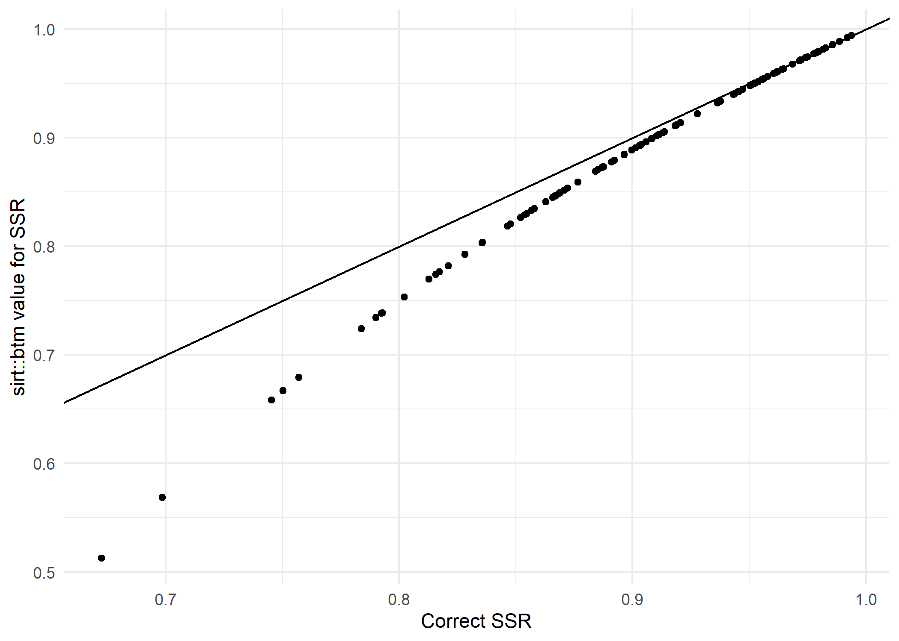<!-- -->

So for the following analyses, we use the correct value of the SSR
instead.

# SSR vs split-halves

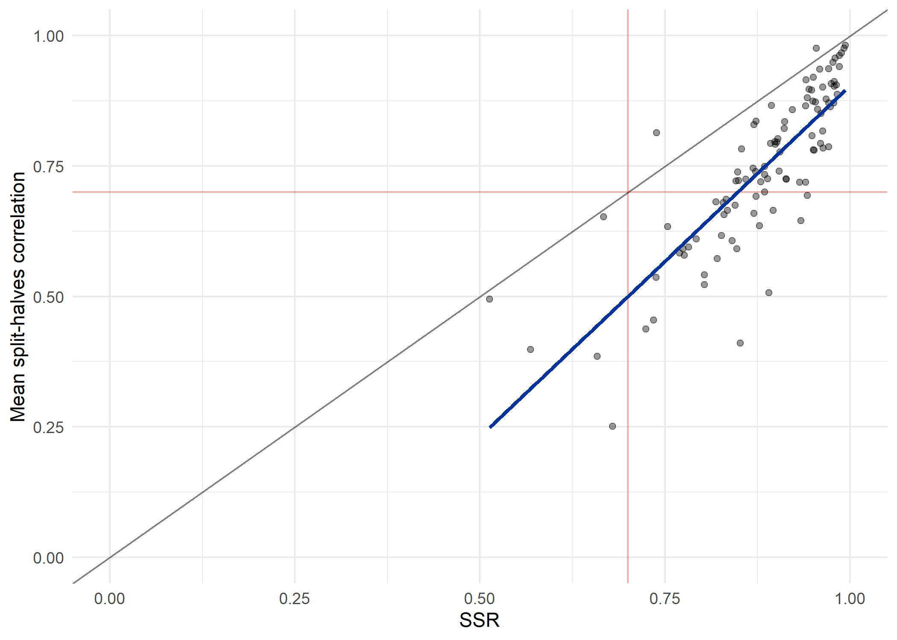<!-- -->

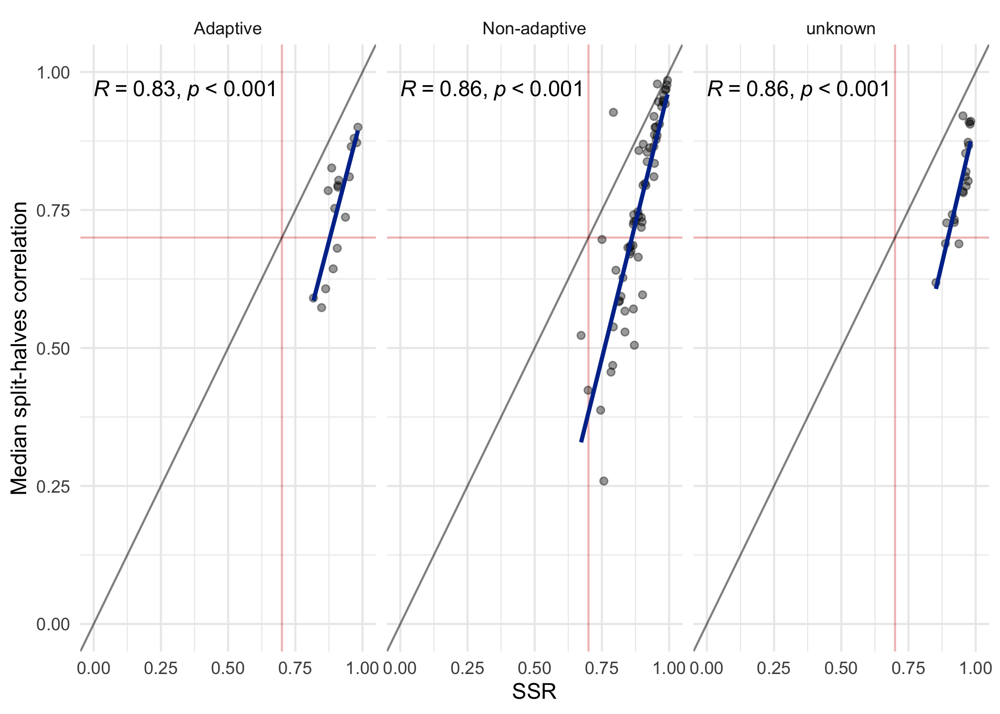<!-- -->

### SSR vs split-halves for `N_CR` \> 10

NMM recommends 5 judgements per item, i.e. N_CR \>= 9

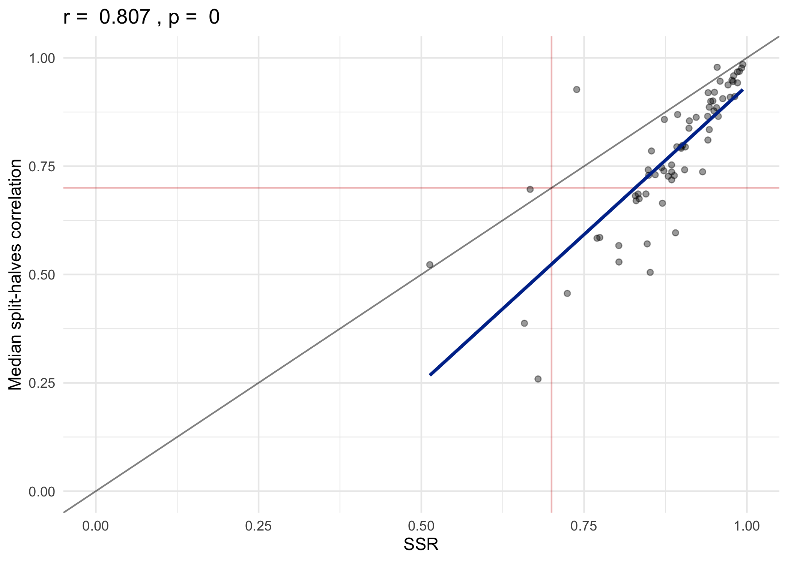<!-- -->

### SSR vs split-halves for `N_CR` \>= 20

Jones recommends 10 judgements per item, i.e. N_CR \>= 19

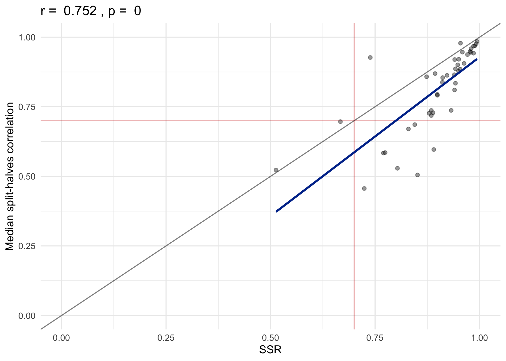<!-- -->

### SSR vs split-halves for `N_CR` \>= 34

Verhavert et al. 2019 recommend 17 judgements per item, i.e. N_CR \>= 34

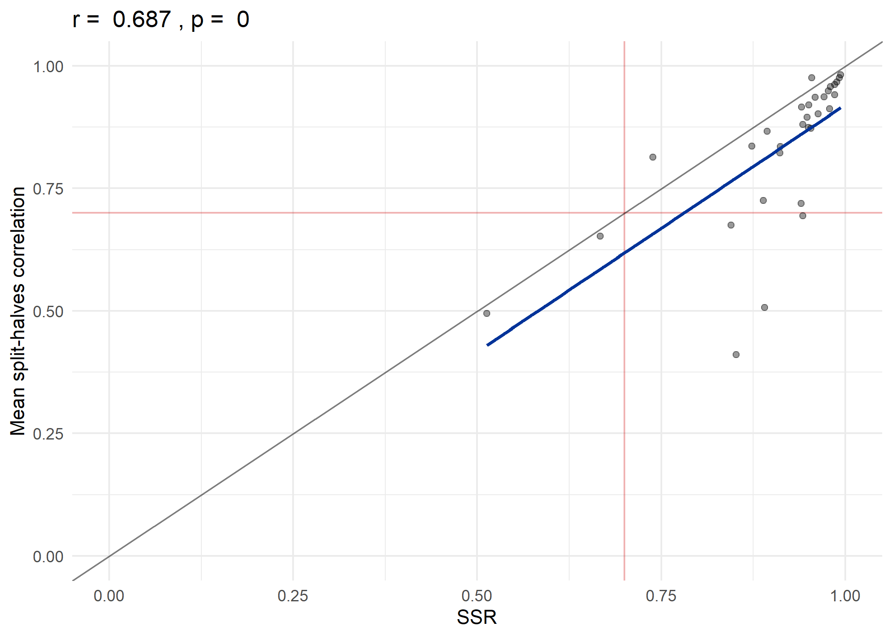<!-- -->

It is very rare for the split-halves measure to be higher than SSR:

<table class="table table-striped" style="width: auto !important; margin-left: auto; margin-right: auto;">
<thead>
<tr>
<th style="text-align:left;">
judging_session
</th>
<th style="text-align:right;">
observed_N\_A
</th>
<th style="text-align:right;">
observed_N\_R
</th>
<th style="text-align:right;">
observed_N\_C
</th>
<th style="text-align:right;">
mean_split_corr
</th>
<th style="text-align:right;">
ssr
</th>
</tr>
</thead>
<tbody>
<tr>
<td style="text-align:left;">
AlMaimani2017
</td>
<td style="text-align:right;">
12
</td>
<td style="text-align:right;">
4
</td>
<td style="text-align:right;">
140
</td>
<td style="text-align:right;">
0.976
</td>
<td style="text-align:right;">
0.956
</td>
</tr>
<tr>
<td style="text-align:left;">
Luckett2018_coldbrew
</td>
<td style="text-align:right;">
100
</td>
<td style="text-align:right;">
3
</td>
<td style="text-align:right;">
300
</td>
<td style="text-align:right;">
0.814
</td>
<td style="text-align:right;">
0.793
</td>
</tr>
</tbody>
</table>

## Low mean split-halves reliability

These sessions have split-halves reliability below 0.7.

The `N_CR` column shows the “number of comparisons per representation”,
i.e. `N_C/N_R`.

<table class="table table-striped" style="width: auto !important; margin-left: auto; margin-right: auto;">
<thead>
<tr>
<th style="text-align:left;">
judging_session
</th>
<th style="text-align:right;">
N_A
</th>
<th style="text-align:right;">
N_R
</th>
<th style="text-align:right;">
N_C
</th>
<th style="text-align:right;">
N_CR
</th>
<th style="text-align:right;">
mean_split_corr
</th>
<th style="text-align:right;">
ssr
</th>
</tr>
</thead>
<tbody>
<tr>
<td style="text-align:left;">
Kinnear2021_students-withsolutions2
</td>
<td style="text-align:right;">
9
</td>
<td style="text-align:right;">
20
</td>
<td style="text-align:right;">
331
</td>
<td style="text-align:right;">
16.550
</td>
<td style="text-align:right;">
0.251
</td>
<td style="text-align:right;">
0.757
</td>
</tr>
<tr>
<td style="text-align:left;">
Davies2021_novice
</td>
<td style="text-align:right;">
10
</td>
<td style="text-align:right;">
175
</td>
<td style="text-align:right;">
1740
</td>
<td style="text-align:right;">
9.943
</td>
<td style="text-align:right;">
0.385
</td>
<td style="text-align:right;">
0.745
</td>
</tr>
<tr>
<td style="text-align:left;">
Kinnear2021_students-withsolutions1
</td>
<td style="text-align:right;">
8
</td>
<td style="text-align:right;">
20
</td>
<td style="text-align:right;">
142
</td>
<td style="text-align:right;">
7.100
</td>
<td style="text-align:right;">
0.398
</td>
<td style="text-align:right;">
0.699
</td>
</tr>
<tr>
<td style="text-align:left;">
Spehar2016_expt2-Plain
</td>
<td style="text-align:right;">
50
</td>
<td style="text-align:right;">
9
</td>
<td style="text-align:right;">
3600
</td>
<td style="text-align:right;">
400.000
</td>
<td style="text-align:right;">
0.411
</td>
<td style="text-align:right;">
0.871
</td>
</tr>
<tr>
<td style="text-align:left;">
Sangwin2021_study2-insight
</td>
<td style="text-align:right;">
25
</td>
<td style="text-align:right;">
15
</td>
<td style="text-align:right;">
438
</td>
<td style="text-align:right;">
29.200
</td>
<td style="text-align:right;">
0.438
</td>
<td style="text-align:right;">
0.784
</td>
</tr>
<tr>
<td style="text-align:left;">
Settembri2018
</td>
<td style="text-align:right;">
4
</td>
<td style="text-align:right;">
84
</td>
<td style="text-align:right;">
622
</td>
<td style="text-align:right;">
7.405
</td>
<td style="text-align:right;">
0.455
</td>
<td style="text-align:right;">
0.790
</td>
</tr>
<tr>
<td style="text-align:left;">
Luckett2018_icecream
</td>
<td style="text-align:right;">
87
</td>
<td style="text-align:right;">
5
</td>
<td style="text-align:right;">
435
</td>
<td style="text-align:right;">
87.000
</td>
<td style="text-align:right;">
0.495
</td>
<td style="text-align:right;">
0.672
</td>
</tr>
<tr>
<td style="text-align:left;">
Spehar2016_expt2-Edges
</td>
<td style="text-align:right;">
50
</td>
<td style="text-align:right;">
9
</td>
<td style="text-align:right;">
3600
</td>
<td style="text-align:right;">
400.000
</td>
<td style="text-align:right;">
0.507
</td>
<td style="text-align:right;">
0.901
</td>
</tr>
<tr>
<td style="text-align:left;">
Kinnear2021_students-odd
</td>
<td style="text-align:right;">
12
</td>
<td style="text-align:right;">
10
</td>
<td style="text-align:right;">
215
</td>
<td style="text-align:right;">
21.500
</td>
<td style="text-align:right;">
0.522
</td>
<td style="text-align:right;">
0.836
</td>
</tr>
<tr>
<td style="text-align:left;">
Bramley2018_2
</td>
<td style="text-align:right;">
16
</td>
<td style="text-align:right;">
150
</td>
<td style="text-align:right;">
1097
</td>
<td style="text-align:right;">
7.313
</td>
<td style="text-align:right;">
0.537
</td>
<td style="text-align:right;">
0.793
</td>
</tr>
<tr>
<td style="text-align:left;">
Zucco2019_legislators
</td>
<td style="text-align:right;">
140
</td>
<td style="text-align:right;">
37
</td>
<td style="text-align:right;">
560
</td>
<td style="text-align:right;">
15.135
</td>
<td style="text-align:right;">
0.541
</td>
<td style="text-align:right;">
0.836
</td>
</tr>
<tr>
<td style="text-align:left;">
Jones2013a_peer1
</td>
<td style="text-align:right;">
100
</td>
<td style="text-align:right;">
168
</td>
<td style="text-align:right;">
1200
</td>
<td style="text-align:right;">
7.143
</td>
<td style="text-align:right;">
0.572
</td>
<td style="text-align:right;">
0.848
</td>
</tr>
<tr>
<td style="text-align:left;">
Jones2014_GCSE030211data
</td>
<td style="text-align:right;">
12
</td>
<td style="text-align:right;">
18
</td>
<td style="text-align:right;">
151
</td>
<td style="text-align:right;">
8.389
</td>
<td style="text-align:right;">
0.579
</td>
<td style="text-align:right;">
0.817
</td>
</tr>
<tr>
<td style="text-align:left;">
Kinnear2021_students-withsolutions
</td>
<td style="text-align:right;">
22
</td>
<td style="text-align:right;">
20
</td>
<td style="text-align:right;">
422
</td>
<td style="text-align:right;">
21.100
</td>
<td style="text-align:right;">
0.583
</td>
<td style="text-align:right;">
0.813
</td>
</tr>
<tr>
<td style="text-align:left;">
Kinnear2021_students-withoutsolutions
</td>
<td style="text-align:right;">
22
</td>
<td style="text-align:right;">
20
</td>
<td style="text-align:right;">
440
</td>
<td style="text-align:right;">
22.000
</td>
<td style="text-align:right;">
0.591
</td>
<td style="text-align:right;">
0.816
</td>
</tr>
<tr>
<td style="text-align:left;">
Kinnear2021_experts-odd
</td>
<td style="text-align:right;">
10
</td>
<td style="text-align:right;">
10
</td>
<td style="text-align:right;">
181
</td>
<td style="text-align:right;">
18.100
</td>
<td style="text-align:right;">
0.591
</td>
<td style="text-align:right;">
0.867
</td>
</tr>
<tr>
<td style="text-align:left;">
Daal2017_sample2
</td>
<td style="text-align:right;">
52
</td>
<td style="text-align:right;">
137
</td>
<td style="text-align:right;">
918
</td>
<td style="text-align:right;">
6.701
</td>
<td style="text-align:right;">
0.595
</td>
<td style="text-align:right;">
0.821
</td>
</tr>
<tr>
<td style="text-align:left;">
Jones2013a_peer2
</td>
<td style="text-align:right;">
93
</td>
<td style="text-align:right;">
168
</td>
<td style="text-align:right;">
1210
</td>
<td style="text-align:right;">
7.202
</td>
<td style="text-align:right;">
0.607
</td>
<td style="text-align:right;">
0.863
</td>
</tr>
<tr>
<td style="text-align:left;">
Coertjens2021
</td>
<td style="text-align:right;">
8
</td>
<td style="text-align:right;">
22
</td>
<td style="text-align:right;">
202
</td>
<td style="text-align:right;">
9.182
</td>
<td style="text-align:right;">
0.610
</td>
<td style="text-align:right;">
0.828
</td>
</tr>
<tr>
<td style="text-align:left;">
Jones2016b_realscripts
</td>
<td style="text-align:right;">
20
</td>
<td style="text-align:right;">
546
</td>
<td style="text-align:right;">
5000
</td>
<td style="text-align:right;">
9.158
</td>
<td style="text-align:right;">
0.617
</td>
<td style="text-align:right;">
0.852
</td>
</tr>
<tr>
<td style="text-align:left;">
Bramley2018_1b
</td>
<td style="text-align:right;">
18
</td>
<td style="text-align:right;">
20
</td>
<td style="text-align:right;">
180
</td>
<td style="text-align:right;">
9.000
</td>
<td style="text-align:right;">
0.634
</td>
<td style="text-align:right;">
0.802
</td>
</tr>
<tr>
<td style="text-align:left;">
Jones2013a_expert2
</td>
<td style="text-align:right;">
11
</td>
<td style="text-align:right;">
168
</td>
<td style="text-align:right;">
1217
</td>
<td style="text-align:right;">
7.244
</td>
<td style="text-align:right;">
0.636
</td>
<td style="text-align:right;">
0.891
</td>
</tr>
<tr>
<td style="text-align:left;">
PollittX_college
</td>
<td style="text-align:right;">
5
</td>
<td style="text-align:right;">
72
</td>
<td style="text-align:right;">
411
</td>
<td style="text-align:right;">
5.708
</td>
<td style="text-align:right;">
0.645
</td>
<td style="text-align:right;">
0.938
</td>
</tr>
<tr>
<td style="text-align:left;">
Luckett2018_pizza
</td>
<td style="text-align:right;">
95
</td>
<td style="text-align:right;">
5
</td>
<td style="text-align:right;">
380
</td>
<td style="text-align:right;">
76.000
</td>
<td style="text-align:right;">
0.653
</td>
<td style="text-align:right;">
0.750
</td>
</tr>
<tr>
<td style="text-align:left;">
Holmes2017
</td>
<td style="text-align:right;">
33
</td>
<td style="text-align:right;">
66
</td>
<td style="text-align:right;">
1650
</td>
<td style="text-align:right;">
25.000
</td>
<td style="text-align:right;">
0.657
</td>
<td style="text-align:right;">
0.855
</td>
</tr>
<tr>
<td style="text-align:left;">
Daal2017_sample3
</td>
<td style="text-align:right;">
13
</td>
<td style="text-align:right;">
149
</td>
<td style="text-align:right;">
2251
</td>
<td style="text-align:right;">
15.107
</td>
<td style="text-align:right;">
0.659
</td>
<td style="text-align:right;">
0.885
</td>
</tr>
<tr>
<td style="text-align:left;">
Kinnear2021_experts-withsolutions
</td>
<td style="text-align:right;">
13
</td>
<td style="text-align:right;">
20
</td>
<td style="text-align:right;">
302
</td>
<td style="text-align:right;">
15.100
</td>
<td style="text-align:right;">
0.665
</td>
<td style="text-align:right;">
0.858
</td>
</tr>
<tr>
<td style="text-align:left;">
Jones2013a_expert1
</td>
<td style="text-align:right;">
11
</td>
<td style="text-align:right;">
168
</td>
<td style="text-align:right;">
1217
</td>
<td style="text-align:right;">
7.244
</td>
<td style="text-align:right;">
0.665
</td>
<td style="text-align:right;">
0.906
</td>
</tr>
<tr>
<td style="text-align:left;">
Sangwin2021_study2-understanding
</td>
<td style="text-align:right;">
34
</td>
<td style="text-align:right;">
15
</td>
<td style="text-align:right;">
611
</td>
<td style="text-align:right;">
40.733
</td>
<td style="text-align:right;">
0.675
</td>
<td style="text-align:right;">
0.866
</td>
</tr>
<tr>
<td style="text-align:left;">
Davies2021_expert
</td>
<td style="text-align:right;">
29
</td>
<td style="text-align:right;">
175
</td>
<td style="text-align:right;">
1941
</td>
<td style="text-align:right;">
11.091
</td>
<td style="text-align:right;">
0.679
</td>
<td style="text-align:right;">
0.854
</td>
</tr>
<tr>
<td style="text-align:left;">
Daal2017_sample1
</td>
<td style="text-align:right;">
56
</td>
<td style="text-align:right;">
136
</td>
<td style="text-align:right;">
1229
</td>
<td style="text-align:right;">
9.037
</td>
<td style="text-align:right;">
0.681
</td>
<td style="text-align:right;">
0.847
</td>
</tr>
<tr>
<td style="text-align:left;">
Bisson2019
</td>
<td style="text-align:right;">
10
</td>
<td style="text-align:right;">
206
</td>
<td style="text-align:right;">
2060
</td>
<td style="text-align:right;">
10.000
</td>
<td style="text-align:right;">
0.686
</td>
<td style="text-align:right;">
0.857
</td>
</tr>
<tr>
<td style="text-align:left;">
PollittX_business
</td>
<td style="text-align:right;">
4
</td>
<td style="text-align:right;">
40
</td>
<td style="text-align:right;">
200
</td>
<td style="text-align:right;">
5.000
</td>
<td style="text-align:right;">
0.692
</td>
<td style="text-align:right;">
0.888
</td>
</tr>
<tr>
<td style="text-align:left;">
Spehar2016_expt2-Mountain
</td>
<td style="text-align:right;">
50
</td>
<td style="text-align:right;">
9
</td>
<td style="text-align:right;">
3600
</td>
<td style="text-align:right;">
400.000
</td>
<td style="text-align:right;">
0.694
</td>
<td style="text-align:right;">
0.945
</td>
</tr>
</tbody>
</table>

Omitting the three sessions with N_CR = 400:

    ## Warning: Removed 3 rows containing missing values (geom_point).

<!-- -->

# EloChoice

Here we look at how the EloChoice results compare with the Bradley-Terry
ones.

## Reliability

First of all, how does the measure of reliability in EloChoice compare
with SSR/split-halves?

There are two reliability measures proposed for EloChoice: see
discussion in
<https://cran.r-project.org/web/packages/EloChoice/vignettes/EloChoice-tutorial.html>

We use the weighted version,
,
computed based on 1000 iterations.

### SSR vs EloChoice

    ## Warning: ggrepel: 1 unlabeled data points (too many overlaps). Consider
    ## increasing max.overlaps

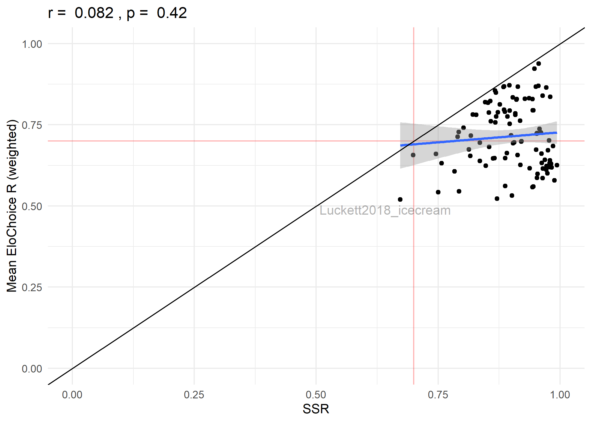<!-- -->

### Split-halves vs EloChoice

    ## Warning: ggrepel: 30 unlabeled data points (too many overlaps). Consider
    ## increasing max.overlaps

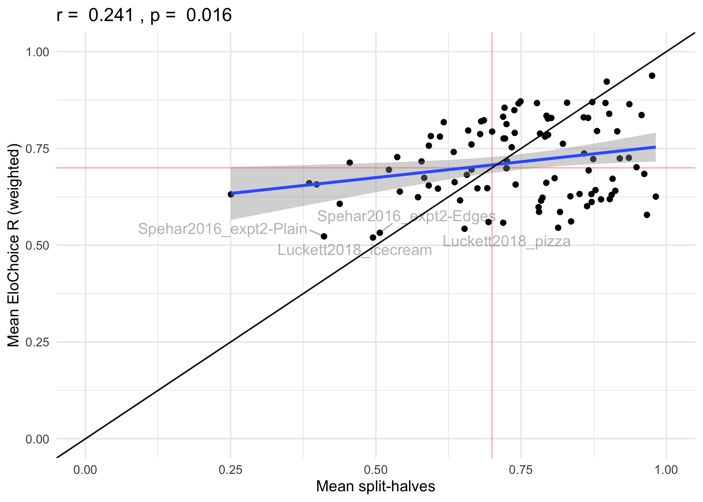<!-- -->

### Split-halves vs EloChoice `N_CR` \>= 10

    ## Warning: ggrepel: 6 unlabeled data points (too many overlaps). Consider
    ## increasing max.overlaps

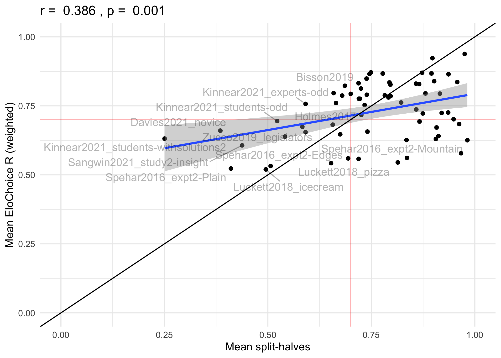<!-- -->

### Split-halves vs EloChoice `N_CR` \>= 20

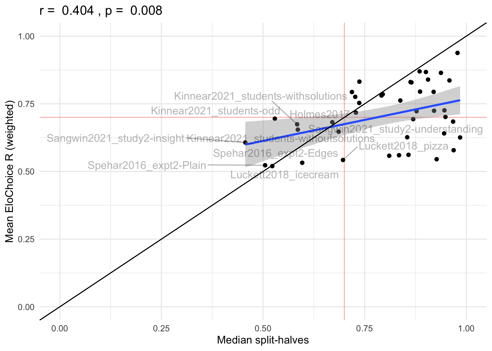<!-- -->

### Split-halves vs EloChoice `N_CR` \>= 34

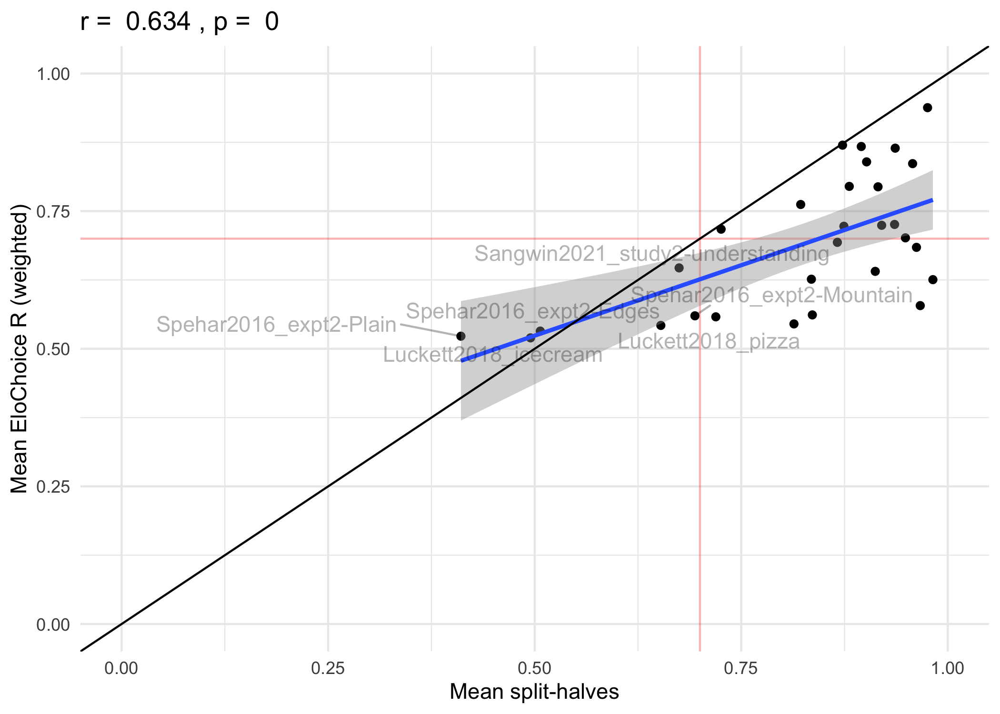<!-- -->

## Scores

How do the scores produced by EloChoice compare with those from
Bradley-Terry?

Previous work has found high agreement:

- 0.95 and 0.94 in Clark et al. (2018)
  <https://doi.org/10.1371/journal.pone.0190393>
- Kendall’s tau score of 0.96 for rank orders in Gray et al. (2022)
  <https://doi.org/10.48550/arXiv.2204.01805>

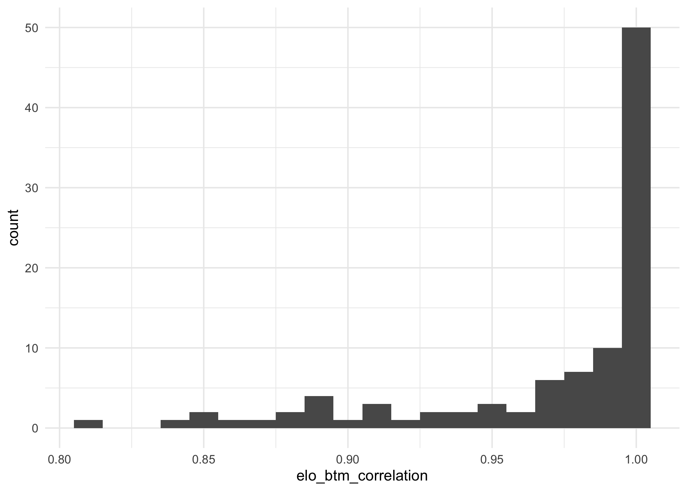<!-- -->

<table class="table table-striped" style="width: auto !important; margin-left: auto; margin-right: auto;">
<thead>
<tr>
<th style="text-align:right;">
elo_btm_correlation
</th>
<th style="text-align:left;">
judging_session
</th>
<th style="text-align:right;">
observed_N\_A
</th>
<th style="text-align:right;">
observed_N\_R
</th>
<th style="text-align:right;">
observed_N\_C
</th>
<th style="text-align:right;">
mean_eloR_weighted
</th>
<th style="text-align:right;">
mean_split_corr
</th>
<th style="text-align:right;">
ssr
</th>
</tr>
</thead>
<tbody>
<tr>
<td style="text-align:right;">
0.8961612
</td>
<td style="text-align:left;">
PollittX_efl-oracy
</td>
<td style="text-align:right;">
32
</td>
<td style="text-align:right;">
134
</td>
<td style="text-align:right;">
932
</td>
<td style="text-align:right;">
0.6115909
</td>
<td style="text-align:right;">
0.8714799
</td>
<td style="text-align:right;">
0.9716803
</td>
</tr>
<tr>
<td style="text-align:right;">
0.8943021
</td>
<td style="text-align:left;">
PollittX_college
</td>
<td style="text-align:right;">
5
</td>
<td style="text-align:right;">
72
</td>
<td style="text-align:right;">
411
</td>
<td style="text-align:right;">
0.6159040
</td>
<td style="text-align:right;">
0.6449471
</td>
<td style="text-align:right;">
0.9377198
</td>
</tr>
<tr>
<td style="text-align:right;">
0.8938290
</td>
<td style="text-align:left;">
PollittX_music
</td>
<td style="text-align:right;">
39
</td>
<td style="text-align:right;">
804
</td>
<td style="text-align:right;">
4148
</td>
<td style="text-align:right;">
0.6150865
</td>
<td style="text-align:right;">
0.7844205
</td>
<td style="text-align:right;">
0.9646965
</td>
</tr>
<tr>
<td style="text-align:right;">
0.8920074
</td>
<td style="text-align:left;">
PollittX_design
</td>
<td style="text-align:right;">
18
</td>
<td style="text-align:right;">
370
</td>
<td style="text-align:right;">
2569
</td>
<td style="text-align:right;">
0.6190804
</td>
<td style="text-align:right;">
0.9026506
</td>
<td style="text-align:right;">
0.9792182
</td>
</tr>
<tr>
<td style="text-align:right;">
0.8898494
</td>
<td style="text-align:left;">
Jones2015a_subset-of-scripts
</td>
<td style="text-align:right;">
5
</td>
<td style="text-align:right;">
250
</td>
<td style="text-align:right;">
1250
</td>
<td style="text-align:right;">
0.6612726
</td>
<td style="text-align:right;">
0.7933694
</td>
<td style="text-align:right;">
0.9618014
</td>
</tr>
<tr>
<td style="text-align:right;">
0.8801917
</td>
<td style="text-align:left;">
PollittX_ielts-writing
</td>
<td style="text-align:right;">
12
</td>
<td style="text-align:right;">
90
</td>
<td style="text-align:right;">
639
</td>
<td style="text-align:right;">
0.6322866
</td>
<td style="text-align:right;">
0.8506706
</td>
<td style="text-align:right;">
0.9623624
</td>
</tr>
<tr>
<td style="text-align:right;">
0.8793508
</td>
<td style="text-align:left;">
PollittX_philosophy1
</td>
<td style="text-align:right;">
29
</td>
<td style="text-align:right;">
700
</td>
<td style="text-align:right;">
4436
</td>
<td style="text-align:right;">
0.6008077
</td>
<td style="text-align:right;">
0.8635246
</td>
<td style="text-align:right;">
0.9741318
</td>
</tr>
<tr>
<td style="text-align:right;">
0.8679601
</td>
<td style="text-align:left;">
Jones2015a_all-scripts
</td>
<td style="text-align:right;">
15
</td>
<td style="text-align:right;">
750
</td>
<td style="text-align:right;">
3607
</td>
<td style="text-align:right;">
0.6227864
</td>
<td style="text-align:right;">
0.7868488
</td>
<td style="text-align:right;">
0.9722026
</td>
</tr>
<tr>
<td style="text-align:right;">
0.8587650
</td>
<td style="text-align:left;">
Zucco2019_legislators
</td>
<td style="text-align:right;">
140
</td>
<td style="text-align:right;">
37
</td>
<td style="text-align:right;">
560
</td>
<td style="text-align:right;">
0.6385285
</td>
<td style="text-align:right;">
0.5412221
</td>
<td style="text-align:right;">
0.8356002
</td>
</tr>
<tr>
<td style="text-align:right;">
0.8549149
</td>
<td style="text-align:left;">
PollittX_mcq-difficulty
</td>
<td style="text-align:right;">
7
</td>
<td style="text-align:right;">
200
</td>
<td style="text-align:right;">
2002
</td>
<td style="text-align:right;">
0.6299660
</td>
<td style="text-align:right;">
0.9058105
</td>
<td style="text-align:right;">
0.9816879
</td>
</tr>
<tr>
<td style="text-align:right;">
0.8521020
</td>
<td style="text-align:left;">
Pollitt2012a
</td>
<td style="text-align:right;">
23
</td>
<td style="text-align:right;">
564
</td>
<td style="text-align:right;">
3519
</td>
<td style="text-align:right;">
0.6319983
</td>
<td style="text-align:right;">
0.8710961
</td>
<td style="text-align:right;">
0.9784732
</td>
</tr>
<tr>
<td style="text-align:right;">
0.8421523
</td>
<td style="text-align:left;">
Jones2013a_novice
</td>
<td style="text-align:right;">
9
</td>
<td style="text-align:right;">
168
</td>
<td style="text-align:right;">
1217
</td>
<td style="text-align:right;">
0.6184804
</td>
<td style="text-align:right;">
0.8875759
</td>
<td style="text-align:right;">
0.9827716
</td>
</tr>
<tr>
<td style="text-align:right;">
0.8071584
</td>
<td style="text-align:left;">
Bramley2018_1a
</td>
<td style="text-align:right;">
18
</td>
<td style="text-align:right;">
150
</td>
<td style="text-align:right;">
1079
</td>
<td style="text-align:right;">
0.6423687
</td>
<td style="text-align:right;">
0.8780558
</td>
<td style="text-align:right;">
0.9685921
</td>
</tr>
</tbody>
</table>

The

measure is quite low for all of those.

Looking at the relationship of

with the Elo-BTM correlation:

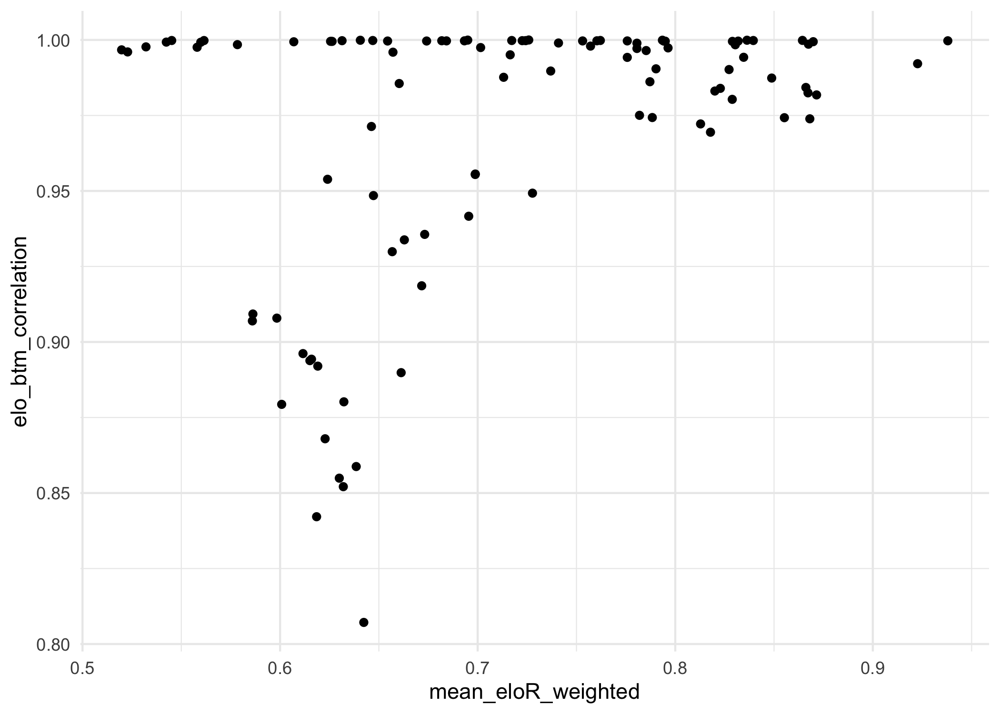<!-- -->

It’s odd that there are some judging sessions with low

but high correlation of Elo and BTM scores.

<table class="table table-striped" style="width: auto !important; margin-left: auto; margin-right: auto;">
<thead>
<tr>
<th style="text-align:right;">
elo_btm_correlation
</th>
<th style="text-align:left;">
judging_session
</th>
<th style="text-align:right;">
observed_N\_A
</th>
<th style="text-align:right;">
observed_N\_R
</th>
<th style="text-align:right;">
observed_N\_C
</th>
<th style="text-align:right;">
mean_eloR_weighted
</th>
<th style="text-align:right;">
mean_split_corr
</th>
<th style="text-align:right;">
ssr
</th>
</tr>
</thead>
<tbody>
<tr>
<td style="text-align:right;">
0.9998125
</td>
<td style="text-align:left;">
Luckett2018_coldbrew
</td>
<td style="text-align:right;">
100
</td>
<td style="text-align:right;">
3
</td>
<td style="text-align:right;">
300
</td>
<td style="text-align:right;">
0.5451398
</td>
<td style="text-align:right;">
0.8137861
</td>
<td style="text-align:right;">
0.7927565
</td>
</tr>
<tr>
<td style="text-align:right;">
0.9998007
</td>
<td style="text-align:left;">
Luckett2018_cola
</td>
<td style="text-align:right;">
99
</td>
<td style="text-align:right;">
6
</td>
<td style="text-align:right;">
990
</td>
<td style="text-align:right;">
0.5614909
</td>
<td style="text-align:right;">
0.8360254
</td>
<td style="text-align:right;">
0.8875400
</td>
</tr>
<tr>
<td style="text-align:right;">
0.9992841
</td>
<td style="text-align:left;">
Luckett2018_pizza
</td>
<td style="text-align:right;">
95
</td>
<td style="text-align:right;">
5
</td>
<td style="text-align:right;">
380
</td>
<td style="text-align:right;">
0.5424153
</td>
<td style="text-align:right;">
0.6526395
</td>
<td style="text-align:right;">
0.7502510
</td>
</tr>
<tr>
<td style="text-align:right;">
0.9992376
</td>
<td style="text-align:left;">
Spehar2016_expt2-Mountain
</td>
<td style="text-align:right;">
50
</td>
<td style="text-align:right;">
9
</td>
<td style="text-align:right;">
3600
</td>
<td style="text-align:right;">
0.5598559
</td>
<td style="text-align:right;">
0.6939253
</td>
<td style="text-align:right;">
0.9454278
</td>
</tr>
<tr>
<td style="text-align:right;">
0.9984449
</td>
<td style="text-align:left;">
Isnac2020
</td>
<td style="text-align:right;">
444
</td>
<td style="text-align:right;">
8
</td>
<td style="text-align:right;">
12432
</td>
<td style="text-align:right;">
0.5784039
</td>
<td style="text-align:right;">
0.9666396
</td>
<td style="text-align:right;">
0.9886882
</td>
</tr>
<tr>
<td style="text-align:right;">
0.9977033
</td>
<td style="text-align:left;">
Spehar2016_expt2-Edges
</td>
<td style="text-align:right;">
50
</td>
<td style="text-align:right;">
9
</td>
<td style="text-align:right;">
3600
</td>
<td style="text-align:right;">
0.5321237
</td>
<td style="text-align:right;">
0.5067319
</td>
<td style="text-align:right;">
0.9012437
</td>
</tr>
<tr>
<td style="text-align:right;">
0.9975754
</td>
<td style="text-align:left;">
Spehar2016_expt2-Thr
</td>
<td style="text-align:right;">
50
</td>
<td style="text-align:right;">
9
</td>
<td style="text-align:right;">
3600
</td>
<td style="text-align:right;">
0.5580069
</td>
<td style="text-align:right;">
0.7192029
</td>
<td style="text-align:right;">
0.9435376
</td>
</tr>
<tr>
<td style="text-align:right;">
0.9967139
</td>
<td style="text-align:left;">
Luckett2018_icecream
</td>
<td style="text-align:right;">
87
</td>
<td style="text-align:right;">
5
</td>
<td style="text-align:right;">
435
</td>
<td style="text-align:right;">
0.5197877
</td>
<td style="text-align:right;">
0.4949369
</td>
<td style="text-align:right;">
0.6724809
</td>
</tr>
<tr>
<td style="text-align:right;">
0.9960327
</td>
<td style="text-align:left;">
Spehar2016_expt2-Plain
</td>
<td style="text-align:right;">
50
</td>
<td style="text-align:right;">
9
</td>
<td style="text-align:right;">
3600
</td>
<td style="text-align:right;">
0.5228413
</td>
<td style="text-align:right;">
0.4106837
</td>
<td style="text-align:right;">
0.8707116
</td>
</tr>
</tbody>
</table>

Those ones all seem to have a small number of representations - so
perhaps the

measure is systematically underestimating reliability in those cases.

# Proportion of correct judgements

The proportion of judgements that are consistent with the final rank
order relate more strongly to SSR and Elo than to split-halves
reliability.

    ## 
    ## Call:
    ## lm(formula = prop_correct_judgements ~ ssr + mean_split_corr + 
    ##     mean_eloR, data = reliability_stats)
    ## 
    ## Residuals:
    ##       Min        1Q    Median        3Q       Max 
    ## -0.175619 -0.050941  0.004288  0.049643  0.186697 
    ## 
    ## Coefficients:
    ##                 Estimate Std. Error t value Pr(>|t|)    
    ## (Intercept)      0.09335    0.10872   0.859 0.392688    
    ## ssr              0.52218    0.14855   3.515 0.000675 ***
    ## mean_split_corr -0.16057    0.09420  -1.705 0.091541 .  
    ## mean_eloR        0.51453    0.10544   4.880 4.27e-06 ***
    ## ---
    ## Signif. codes:  0 '***' 0.001 '**' 0.01 '*' 0.05 '.' 0.1 ' ' 1
    ## 
    ## Residual standard error: 0.07728 on 95 degrees of freedom
    ##   (2 observations deleted due to missingness)
    ## Multiple R-squared:  0.3114, Adjusted R-squared:  0.2897 
    ## F-statistic: 14.32 on 3 and 95 DF,  p-value: 8.995e-08

## Proportion of correction judgements vs SSR

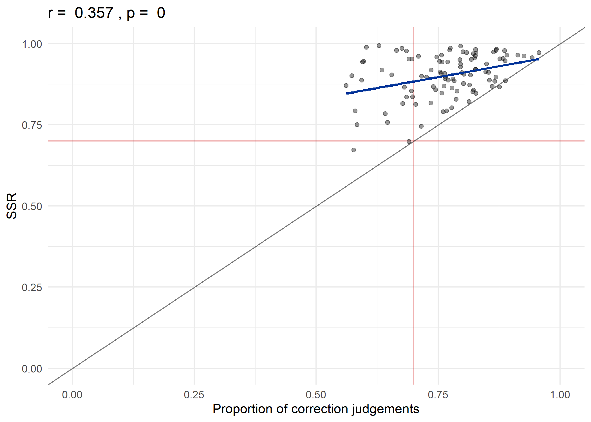<!-- -->

## Proportion of correction judgements vs Elo

    ## Warning: Removed 2 rows containing non-finite values (stat_smooth).

    ## Warning: Removed 2 rows containing missing values (geom_point).

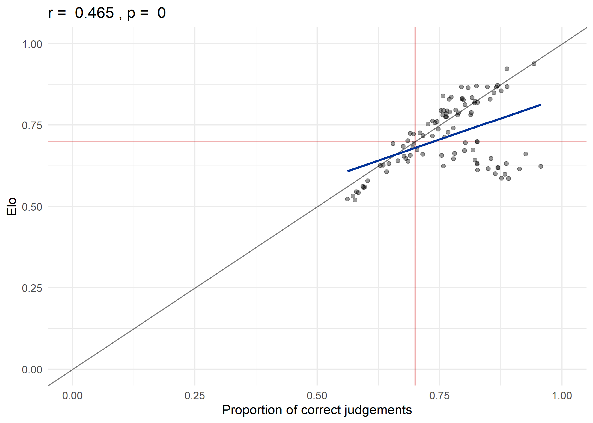<!-- -->

    ## Warning: Removed 2 rows containing non-finite values (stat_smooth).
    ## Removed 2 rows containing missing values (geom_point).

## Proportion of correction judgements vs split-halves

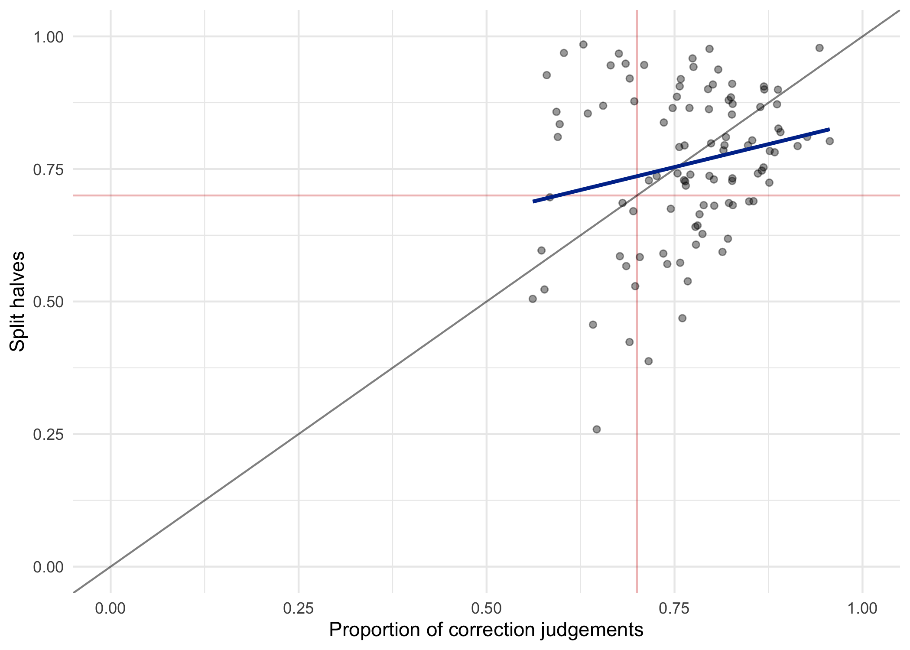<!-- -->

### Proportion of correction judgements vs split-halves for `N_CR` \>= 10

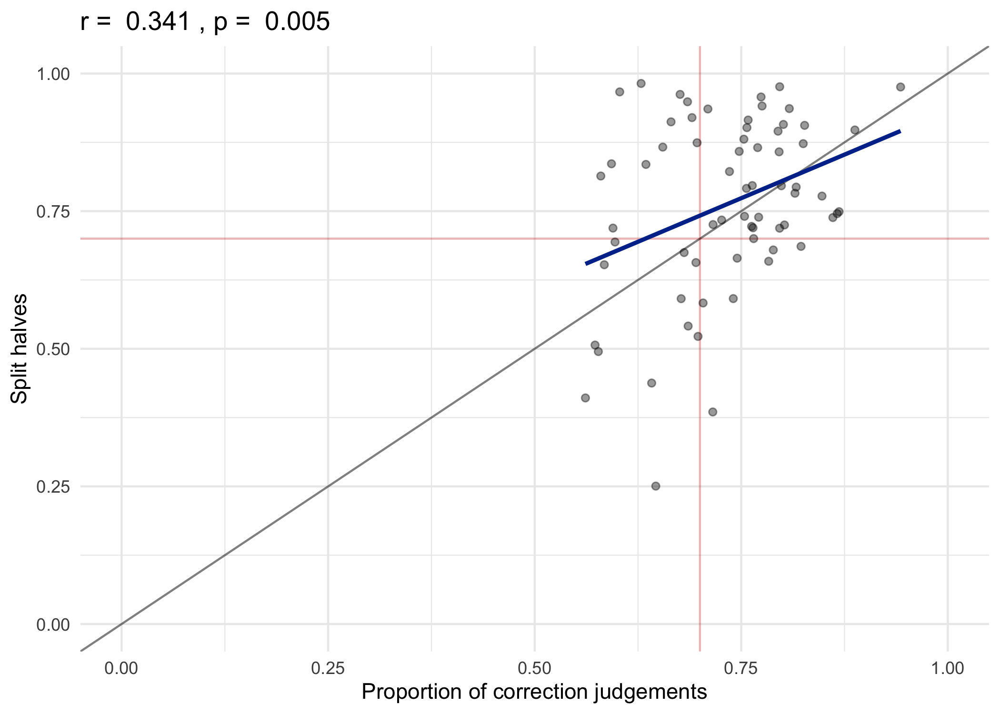<!-- -->

### Proportion of correction judgements vs split-halves for `N_CR` \>= 20

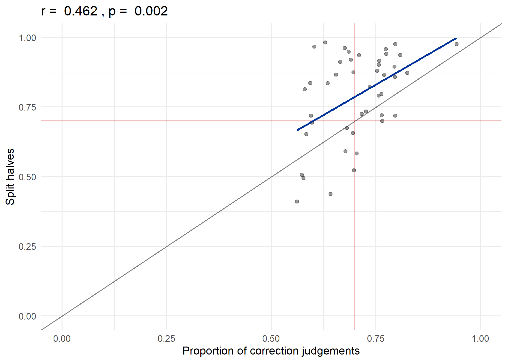<!-- -->

### Proportion of correction judgements vs split-halves for `N_CR` \>= 34

    ## Warning: Removed 18 rows containing missing values (geom_smooth).

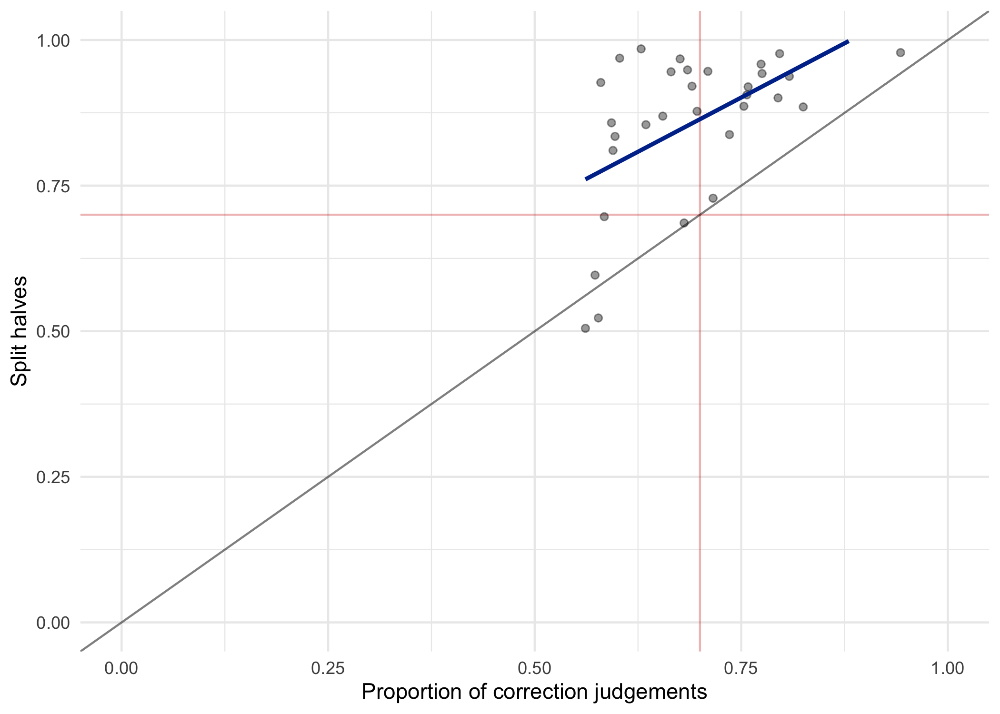<!-- -->

    ## Warning: Removed 18 rows containing missing values (geom_smooth).
