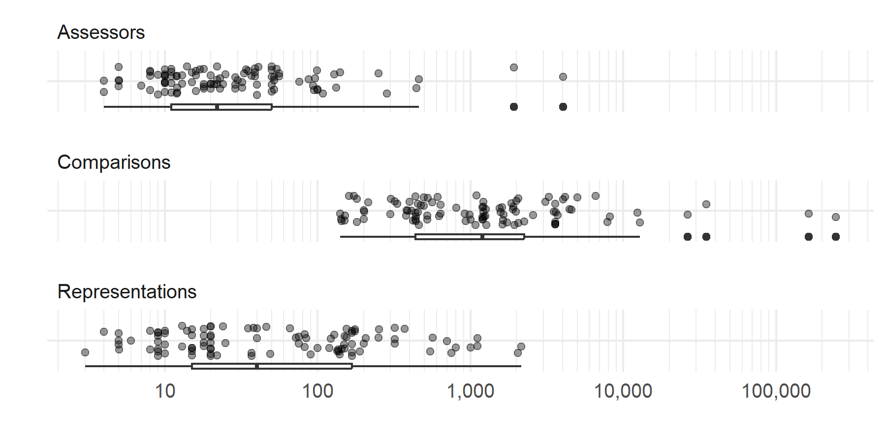
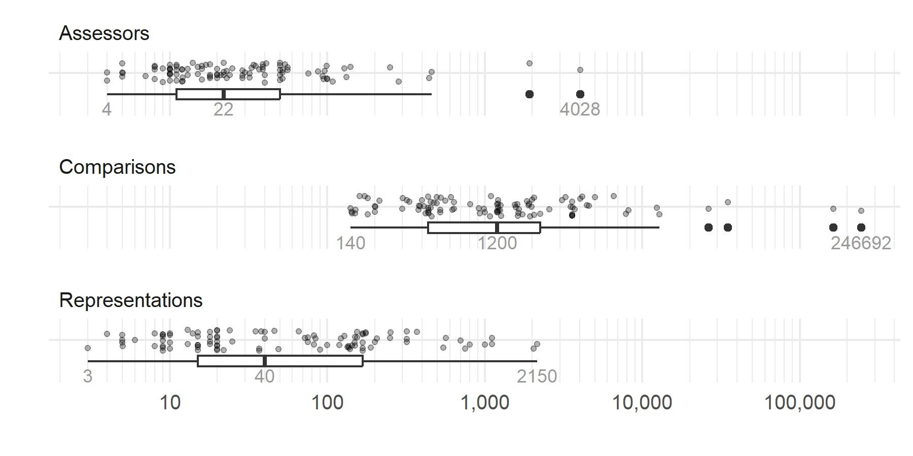
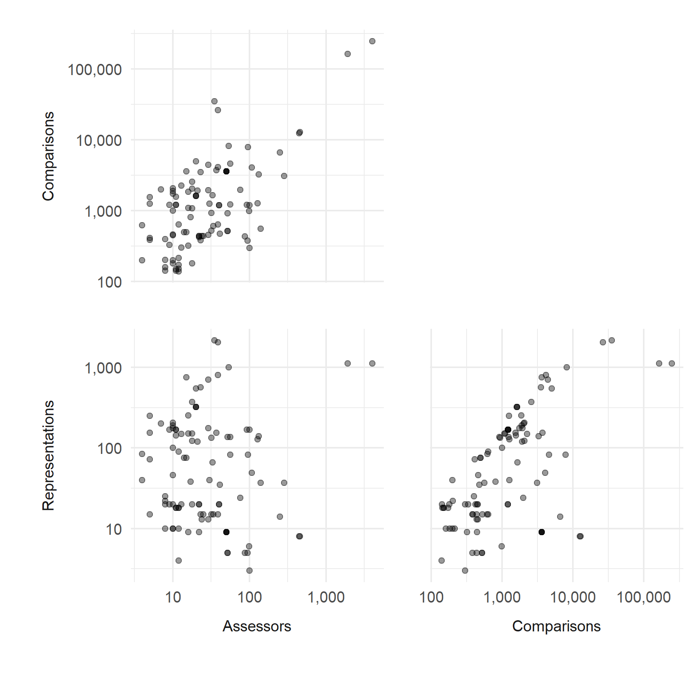
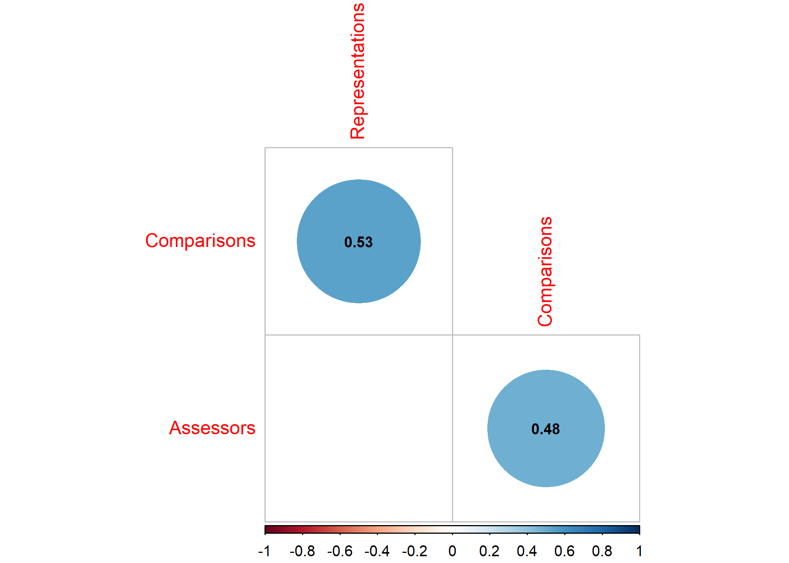
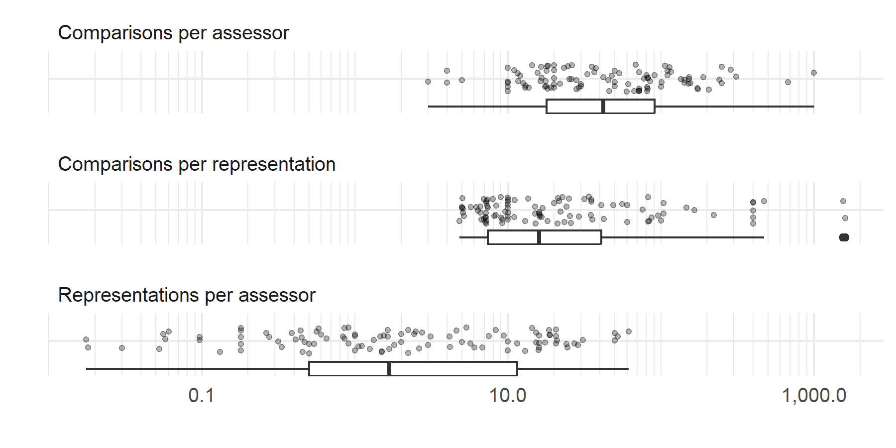
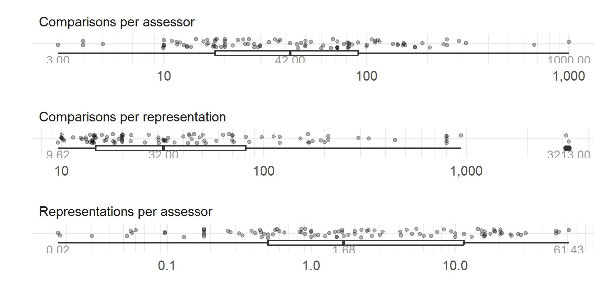

CJ meta-analysis: RQ1
================
George Kinnear
2023-08-15

# About the sample

    ## # A tibble: 1 × 1
    ##   n_datatsets
    ##         <int>
    ## 1         101

# Judging session characteristics

<!-- --><!-- -->

<table class="table table-striped" style="width: auto !important; margin-left: auto; margin-right: auto;">
<thead>
<tr>
<th style="text-align:left;">
N_A
</th>
<th style="text-align:right;">
expert
</th>
<th style="text-align:right;">
layperson
</th>
<th style="text-align:right;">
novice
</th>
<th style="text-align:right;">
peer
</th>
</tr>
</thead>
<tbody>
<tr>
<td style="text-align:left;">
\<= 10
</td>
<td style="text-align:right;">
16
</td>
<td style="text-align:right;">
2
</td>
<td style="text-align:right;">
3
</td>
<td style="text-align:right;">
0
</td>
</tr>
<tr>
<td style="text-align:left;">
\<= 100
</td>
<td style="text-align:right;">
40
</td>
<td style="text-align:right;">
16
</td>
<td style="text-align:right;">
10
</td>
<td style="text-align:right;">
4
</td>
</tr>
<tr>
<td style="text-align:left;">
\<= 1000
</td>
<td style="text-align:right;">
3
</td>
<td style="text-align:right;">
3
</td>
<td style="text-align:right;">
0
</td>
<td style="text-align:right;">
2
</td>
</tr>
<tr>
<td style="text-align:left;">
1000+
</td>
<td style="text-align:right;">
0
</td>
<td style="text-align:right;">
2
</td>
<td style="text-align:right;">
0
</td>
<td style="text-align:right;">
0
</td>
</tr>
</tbody>
</table>

# Relationship between characteristics

<!-- -->

Correlations (Spearman):

    ## Warning in cor.test.default(rq1_data_wide$Assessors,
    ## rq1_data_wide$Comparisons, : Cannot compute exact p-value with ties

    ## 
    ##  Spearman's rank correlation rho
    ## 
    ## data:  rq1_data_wide$Assessors and rq1_data_wide$Comparisons
    ## S = 89220, p-value = 3.701e-07
    ## alternative hypothesis: true rho is not equal to 0
    ## sample estimates:
    ##       rho 
    ## 0.4803719

    ## Warning in cor.test.default(rq1_data_wide$Assessors,
    ## rq1_data_wide$Representations, : Cannot compute exact p-value with ties

    ## 
    ##  Spearman's rank correlation rho
    ## 
    ## data:  rq1_data_wide$Assessors and rq1_data_wide$Representations
    ## S = 194163, p-value = 0.1922
    ## alternative hypothesis: true rho is not equal to 0
    ## sample estimates:
    ##        rho 
    ## -0.1308266

    ## Warning in cor.test.default(rq1_data_wide$Comparisons,
    ## rq1_data_wide$Representations, : Cannot compute exact p-value with ties

    ## 
    ##  Spearman's rank correlation rho
    ## 
    ## data:  rq1_data_wide$Comparisons and rq1_data_wide$Representations
    ## S = 79860, p-value = 8.309e-09
    ## alternative hypothesis: true rho is not equal to 0
    ## sample estimates:
    ##       rho 
    ## 0.5348872

Try some more elaborate methods for computing correlations:

    ## 
    ## Correlation method: 'spearman'
    ## Missing treated using: 'pairwise.complete.obs'

<table class="table table-striped" style="width: auto !important; margin-left: auto; margin-right: auto;">
<thead>
<tr>
<th style="text-align:left;">
term
</th>
<th style="text-align:right;">
Assessors
</th>
<th style="text-align:right;">
Representations
</th>
<th style="text-align:right;">
Comparisons
</th>
</tr>
</thead>
<tbody>
<tr>
<td style="text-align:left;">
Assessors
</td>
<td style="text-align:right;">
NA
</td>
<td style="text-align:right;">
-0.1308266
</td>
<td style="text-align:right;">
0.4803719
</td>
</tr>
<tr>
<td style="text-align:left;">
Representations
</td>
<td style="text-align:right;">
-0.1308266
</td>
<td style="text-align:right;">
NA
</td>
<td style="text-align:right;">
0.5348872
</td>
</tr>
<tr>
<td style="text-align:left;">
Comparisons
</td>
<td style="text-align:right;">
0.4803719
</td>
<td style="text-align:right;">
0.5348872
</td>
<td style="text-align:right;">
NA
</td>
</tr>
</tbody>
</table>

This plot shows only the significant correlations:

    ## Warning in cor.test.default(x = mat[, i], y = mat[, j], ...): Cannot compute
    ## exact p-value with ties

    ## Warning in cor.test.default(x = mat[, i], y = mat[, j], ...): Cannot compute
    ## exact p-value with ties

    ## Warning in cor.test.default(x = mat[, i], y = mat[, j], ...): Cannot compute
    ## exact p-value with ties

<!-- -->

# Derived characteristics

Now we look at ratios of the session characteristics.

<!-- --><!-- -->

Top 3:

<table class="table table-striped" style="width: auto !important; margin-left: auto; margin-right: auto;">
<thead>
<tr>
<th style="text-align:left;">
judging_session
</th>
<th style="text-align:left;">
feature
</th>
<th style="text-align:right;">
count
</th>
</tr>
</thead>
<tbody>
<tr>
<td style="text-align:left;">
Ofqual2015
</td>
<td style="text-align:left;">
Comparisons per assessor
</td>
<td style="text-align:right;">
1000.00000
</td>
</tr>
<tr>
<td style="text-align:left;">
Hunter2018
</td>
<td style="text-align:left;">
Comparisons per assessor
</td>
<td style="text-align:right;">
676.00000
</td>
</tr>
<tr>
<td style="text-align:left;">
McMahon2014_teachers
</td>
<td style="text-align:left;">
Comparisons per assessor
</td>
<td style="text-align:right;">
310.00000
</td>
</tr>
<tr>
<td style="text-align:left;">
Esen2019
</td>
<td style="text-align:left;">
Comparisons per representation
</td>
<td style="text-align:right;">
3213.00000
</td>
</tr>
<tr>
<td style="text-align:left;">
Isnac2020
</td>
<td style="text-align:left;">
Comparisons per representation
</td>
<td style="text-align:right;">
3108.00000
</td>
</tr>
<tr>
<td style="text-align:left;">
Vatavu2020
</td>
<td style="text-align:left;">
Comparisons per representation
</td>
<td style="text-align:right;">
942.14286
</td>
</tr>
<tr>
<td style="text-align:left;">
Ofqual2015
</td>
<td style="text-align:left;">
Representations per assessor
</td>
<td style="text-align:right;">
61.42857
</td>
</tr>
<tr>
<td style="text-align:left;">
Hunter2018
</td>
<td style="text-align:left;">
Representations per assessor
</td>
<td style="text-align:right;">
52.17949
</td>
</tr>
<tr>
<td style="text-align:left;">
Jones2015a_all-scripts
</td>
<td style="text-align:left;">
Representations per assessor
</td>
<td style="text-align:right;">
50.00000
</td>
</tr>
<tr>
<td style="text-align:left;">
Jones2015a_subset-of-scripts
</td>
<td style="text-align:left;">
Representations per assessor
</td>
<td style="text-align:right;">
50.00000
</td>
</tr>
</tbody>
</table>

Bottom 3:

<table class="table table-striped" style="width: auto !important; margin-left: auto; margin-right: auto;">
<thead>
<tr>
<th style="text-align:left;">
judging_session
</th>
<th style="text-align:left;">
feature
</th>
<th style="text-align:right;">
count
</th>
</tr>
</thead>
<tbody>
<tr>
<td style="text-align:left;">
Luckett2018_coldbrew
</td>
<td style="text-align:left;">
Comparisons per assessor
</td>
<td style="text-align:right;">
3.0000000
</td>
</tr>
<tr>
<td style="text-align:left;">
Luckett2018_pizza
</td>
<td style="text-align:left;">
Comparisons per assessor
</td>
<td style="text-align:right;">
4.0000000
</td>
</tr>
<tr>
<td style="text-align:left;">
Zucco2019_legislators
</td>
<td style="text-align:left;">
Comparisons per assessor
</td>
<td style="text-align:right;">
4.0000000
</td>
</tr>
<tr>
<td style="text-align:left;">
Jones2015a_all-scripts
</td>
<td style="text-align:left;">
Comparisons per representation
</td>
<td style="text-align:right;">
9.6186667
</td>
</tr>
<tr>
<td style="text-align:left;">
Jones2015a_subset-of-scripts
</td>
<td style="text-align:left;">
Comparisons per representation
</td>
<td style="text-align:right;">
10.0000000
</td>
</tr>
<tr>
<td style="text-align:left;">
PollittX_business
</td>
<td style="text-align:left;">
Comparisons per representation
</td>
<td style="text-align:right;">
10.0000000
</td>
</tr>
<tr>
<td style="text-align:left;">
Esen2019
</td>
<td style="text-align:left;">
Representations per assessor
</td>
<td style="text-align:right;">
0.0174292
</td>
</tr>
<tr>
<td style="text-align:left;">
Isnac2020
</td>
<td style="text-align:left;">
Representations per assessor
</td>
<td style="text-align:right;">
0.0180180
</td>
</tr>
<tr>
<td style="text-align:left;">
Luckett2018_coldbrew
</td>
<td style="text-align:left;">
Representations per assessor
</td>
<td style="text-align:right;">
0.0300000
</td>
</tr>
</tbody>
</table>

Proportion below certain levels:

<table class="table table-striped" style="width: auto !important; margin-left: auto; margin-right: auto;">
<thead>
<tr>
<th style="text-align:left;">
feature
</th>
<th style="text-align:left;">
prop_below_10
</th>
<th style="text-align:left;">
prop_below_100
</th>
</tr>
</thead>
<tbody>
<tr>
<td style="text-align:left;">
Representations per assessor
</td>
<td style="text-align:left;">
74.3%
</td>
<td style="text-align:left;">
100.0%
</td>
</tr>
<tr>
<td style="text-align:left;">
Comparisons per representation
</td>
<td style="text-align:left;">
3.0%
</td>
<td style="text-align:left;">
77.2%
</td>
</tr>
<tr>
<td style="text-align:left;">
Comparisons per assessor
</td>
<td style="text-align:left;">
8.9%
</td>
<td style="text-align:left;">
76.2%
</td>
</tr>
</tbody>
</table>
<table class="table table-striped" style="width: auto !important; margin-left: auto; margin-right: auto;">
<thead>
<tr>
<th style="text-align:left;">
feature
</th>
<th style="text-align:left;">
prop_above_10
</th>
<th style="text-align:left;">
prop_above_20
</th>
<th style="text-align:left;">
prop_above_37
</th>
</tr>
</thead>
<tbody>
<tr>
<td style="text-align:left;">
Comparisons per representation
</td>
<td style="text-align:left;">
99.0%
</td>
<td style="text-align:left;">
63.4%
</td>
<td style="text-align:left;">
43.6%
</td>
</tr>
</tbody>
</table>
