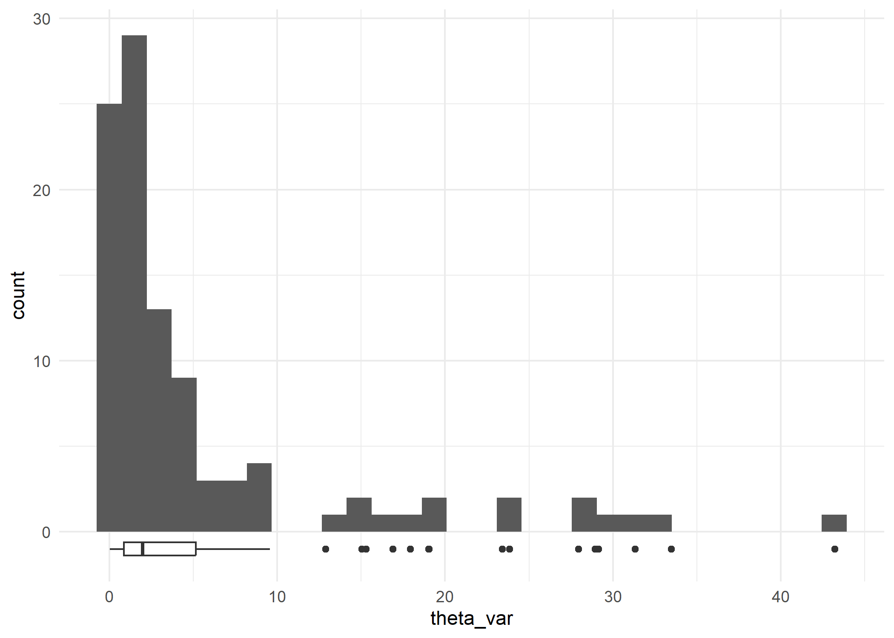
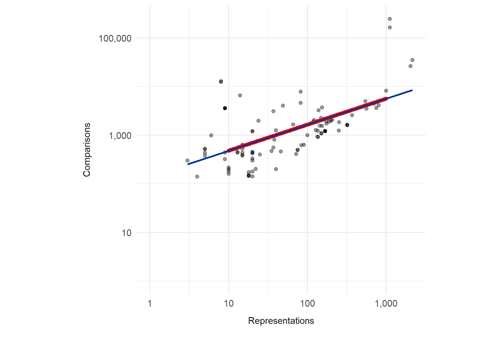
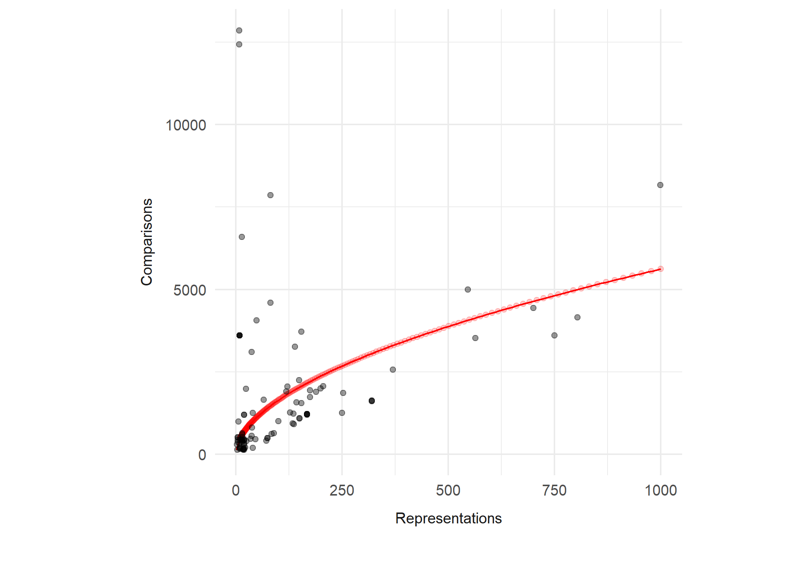

CJ meta-analysis: RQ1
================
George Kinnear
2023-08-15

# About the sample

    ## # A tibble: 1 × 1
    ##   n_datatsets
    ##         <int>
    ## 1         101

# Judging session characteristics

<!-- --><!-- -->

<table class="table table-striped" style="width: auto !important; margin-left: auto; margin-right: auto;">
<thead>
<tr>
<th style="text-align:left;">
N_A
</th>
<th style="text-align:right;">
expert
</th>
<th style="text-align:right;">
layperson
</th>
<th style="text-align:right;">
novice
</th>
<th style="text-align:right;">
peer
</th>
</tr>
</thead>
<tbody>
<tr>
<td style="text-align:left;">
\<= 10
</td>
<td style="text-align:right;">
16
</td>
<td style="text-align:right;">
2
</td>
<td style="text-align:right;">
3
</td>
<td style="text-align:right;">
0
</td>
</tr>
<tr>
<td style="text-align:left;">
\<= 100
</td>
<td style="text-align:right;">
40
</td>
<td style="text-align:right;">
16
</td>
<td style="text-align:right;">
10
</td>
<td style="text-align:right;">
4
</td>
</tr>
<tr>
<td style="text-align:left;">
\<= 1000
</td>
<td style="text-align:right;">
3
</td>
<td style="text-align:right;">
3
</td>
<td style="text-align:right;">
0
</td>
<td style="text-align:right;">
2
</td>
</tr>
<tr>
<td style="text-align:left;">
1000+
</td>
<td style="text-align:right;">
0
</td>
<td style="text-align:right;">
2
</td>
<td style="text-align:right;">
0
</td>
<td style="text-align:right;">
0
</td>
</tr>
</tbody>
</table>

We can also consider the observed variance of the theta estimates for
each judging session:

    ## # A tibble: 101 × 2
    ##    judging_session     theta_var
    ##    <chr>                   <dbl>
    ##  1 AlMaimani2017            5.15
    ##  2 Bisson2016_algebra       3.80
    ##  3 Bisson2016_calculus      1.93
    ##  4 Bisson2016_stats         1.16
    ##  5 Bisson2019               2.92
    ##  6 Bramley2018_1a          15.3 
    ##  7 Bramley2018_1b           1.46
    ##  8 Bramley2018_2            2.43
    ##  9 Clark2018_Study1         2.44
    ## 10 Clark2018_Study2         1.75
    ## # ℹ 91 more rows

    ## `stat_bin()` using `bins = 30`. Pick better value with `binwidth`.

<!-- -->

# Relationship between characteristics

<!-- -->

Correlations (Spearman):

    ## Warning in cor.test.default(rq1_data_wide$Assessors, rq1_data_wide$Comparisons,
    ## : Cannot compute exact p-value with ties

    ## 
    ##  Spearman's rank correlation rho
    ## 
    ## data:  rq1_data_wide$Assessors and rq1_data_wide$Comparisons
    ## S = 89220, p-value = 3.701e-07
    ## alternative hypothesis: true rho is not equal to 0
    ## sample estimates:
    ##       rho 
    ## 0.4803719

    ## Warning in cor.test.default(rq1_data_wide$Assessors,
    ## rq1_data_wide$Representations, : Cannot compute exact p-value with ties

    ## 
    ##  Spearman's rank correlation rho
    ## 
    ## data:  rq1_data_wide$Assessors and rq1_data_wide$Representations
    ## S = 194163, p-value = 0.1922
    ## alternative hypothesis: true rho is not equal to 0
    ## sample estimates:
    ##        rho 
    ## -0.1308266

    ## Warning in cor.test.default(rq1_data_wide$Comparisons,
    ## rq1_data_wide$Representations, : Cannot compute exact p-value with ties

    ## 
    ##  Spearman's rank correlation rho
    ## 
    ## data:  rq1_data_wide$Comparisons and rq1_data_wide$Representations
    ## S = 79860, p-value = 8.309e-09
    ## alternative hypothesis: true rho is not equal to 0
    ## sample estimates:
    ##       rho 
    ## 0.5348872

Try some more elaborate methods for computing correlations:

<table class="table table-striped" style="width: auto !important; margin-left: auto; margin-right: auto;">
<thead>
<tr>
<th style="text-align:left;">
var1
</th>
<th style="text-align:left;">
var2
</th>
<th style="text-align:right;">
cor
</th>
<th style="text-align:right;">
statistic
</th>
<th style="text-align:right;">
p
</th>
</tr>
</thead>
<tbody>
<tr>
<td style="text-align:left;">
Assessors
</td>
<td style="text-align:left;">
Representations
</td>
<td style="text-align:right;">
-0.13
</td>
<td style="text-align:right;">
194162.92
</td>
<td style="text-align:right;">
1.92e-01
</td>
</tr>
<tr>
<td style="text-align:left;">
Assessors
</td>
<td style="text-align:left;">
Comparisons
</td>
<td style="text-align:right;">
0.48
</td>
<td style="text-align:right;">
89220.14
</td>
<td style="text-align:right;">
4.00e-07
</td>
</tr>
<tr>
<td style="text-align:left;">
Comparisons
</td>
<td style="text-align:left;">
Representations
</td>
<td style="text-align:right;">
0.53
</td>
<td style="text-align:right;">
79859.87
</td>
<td style="text-align:right;">
0.00e+00
</td>
</tr>
</tbody>
</table>

## Special N_CR plot

There is a linear relationship in the log-log plot of N_C vs N_R, which
means there is a relationship of the form
$\log_{10} N_C = \beta_1\log_{10} N_R+\beta_0$,
i.e. $N_C = 10^{\beta_0} N_R^{\beta_1}$

    ## 
    ## Call:
    ## lm(formula = Comparisons ~ Representations, data = .)
    ## 
    ## Residuals:
    ##     Min      1Q  Median      3Q     Max 
    ## -0.7013 -0.2911 -0.1090  0.1190  1.6181 
    ## 
    ## Coefficients:
    ##                 Estimate Std. Error t value Pr(>|t|)    
    ## (Intercept)      2.14589    0.13332  16.096  < 2e-16 ***
    ## Representations  0.53456    0.07219   7.405 4.42e-11 ***
    ## ---
    ## Signif. codes:  0 '***' 0.001 '**' 0.01 '*' 0.05 '.' 0.1 ' ' 1
    ## 
    ## Residual standard error: 0.4923 on 99 degrees of freedom
    ## Multiple R-squared:  0.3564, Adjusted R-squared:  0.3499 
    ## F-statistic: 54.83 on 1 and 99 DF,  p-value: 4.417e-11

Here we compute some values predicted by the linear regression (red
points) and check that they match up with the plot from before:

<!-- -->

Here is what it looks like on the non-transformed axes (restricted to
$N_R<1000$):

<!-- -->

# Derived characteristics

Now we look at ratios of the session characteristics.

<!-- --><!-- -->

Top 3:

<table class="table table-striped" style="width: auto !important; margin-left: auto; margin-right: auto;">
<thead>
<tr>
<th style="text-align:left;">
judging_session
</th>
<th style="text-align:left;">
feature
</th>
<th style="text-align:right;">
count
</th>
</tr>
</thead>
<tbody>
<tr>
<td style="text-align:left;">
Ofqual2015
</td>
<td style="text-align:left;">
Comparisons per assessor
</td>
<td style="text-align:right;">
1000.00000
</td>
</tr>
<tr>
<td style="text-align:left;">
Hunter2018
</td>
<td style="text-align:left;">
Comparisons per assessor
</td>
<td style="text-align:right;">
676.00000
</td>
</tr>
<tr>
<td style="text-align:left;">
McMahon2014_teachers
</td>
<td style="text-align:left;">
Comparisons per assessor
</td>
<td style="text-align:right;">
310.00000
</td>
</tr>
<tr>
<td style="text-align:left;">
Esen2019
</td>
<td style="text-align:left;">
Comparisons per representation
</td>
<td style="text-align:right;">
3213.00000
</td>
</tr>
<tr>
<td style="text-align:left;">
Isnac2020
</td>
<td style="text-align:left;">
Comparisons per representation
</td>
<td style="text-align:right;">
3108.00000
</td>
</tr>
<tr>
<td style="text-align:left;">
Vatavu2020
</td>
<td style="text-align:left;">
Comparisons per representation
</td>
<td style="text-align:right;">
942.14286
</td>
</tr>
<tr>
<td style="text-align:left;">
Ofqual2015
</td>
<td style="text-align:left;">
Representations per assessor
</td>
<td style="text-align:right;">
61.42857
</td>
</tr>
<tr>
<td style="text-align:left;">
Hunter2018
</td>
<td style="text-align:left;">
Representations per assessor
</td>
<td style="text-align:right;">
52.17949
</td>
</tr>
<tr>
<td style="text-align:left;">
Jones2015a_all-scripts
</td>
<td style="text-align:left;">
Representations per assessor
</td>
<td style="text-align:right;">
50.00000
</td>
</tr>
<tr>
<td style="text-align:left;">
Jones2015a_subset-of-scripts
</td>
<td style="text-align:left;">
Representations per assessor
</td>
<td style="text-align:right;">
50.00000
</td>
</tr>
</tbody>
</table>

Bottom 3:

<table class="table table-striped" style="width: auto !important; margin-left: auto; margin-right: auto;">
<thead>
<tr>
<th style="text-align:left;">
judging_session
</th>
<th style="text-align:left;">
feature
</th>
<th style="text-align:right;">
count
</th>
</tr>
</thead>
<tbody>
<tr>
<td style="text-align:left;">
Luckett2018_coldbrew
</td>
<td style="text-align:left;">
Comparisons per assessor
</td>
<td style="text-align:right;">
3.0000000
</td>
</tr>
<tr>
<td style="text-align:left;">
Luckett2018_pizza
</td>
<td style="text-align:left;">
Comparisons per assessor
</td>
<td style="text-align:right;">
4.0000000
</td>
</tr>
<tr>
<td style="text-align:left;">
Zucco2019_legislators
</td>
<td style="text-align:left;">
Comparisons per assessor
</td>
<td style="text-align:right;">
4.0000000
</td>
</tr>
<tr>
<td style="text-align:left;">
Jones2015a_all-scripts
</td>
<td style="text-align:left;">
Comparisons per representation
</td>
<td style="text-align:right;">
9.6186667
</td>
</tr>
<tr>
<td style="text-align:left;">
Jones2015a_subset-of-scripts
</td>
<td style="text-align:left;">
Comparisons per representation
</td>
<td style="text-align:right;">
10.0000000
</td>
</tr>
<tr>
<td style="text-align:left;">
PollittX_business
</td>
<td style="text-align:left;">
Comparisons per representation
</td>
<td style="text-align:right;">
10.0000000
</td>
</tr>
<tr>
<td style="text-align:left;">
Esen2019
</td>
<td style="text-align:left;">
Representations per assessor
</td>
<td style="text-align:right;">
0.0174292
</td>
</tr>
<tr>
<td style="text-align:left;">
Isnac2020
</td>
<td style="text-align:left;">
Representations per assessor
</td>
<td style="text-align:right;">
0.0180180
</td>
</tr>
<tr>
<td style="text-align:left;">
Luckett2018_coldbrew
</td>
<td style="text-align:left;">
Representations per assessor
</td>
<td style="text-align:right;">
0.0300000
</td>
</tr>
</tbody>
</table>

Proportion below certain levels:

<table class="table table-striped" style="width: auto !important; margin-left: auto; margin-right: auto;">
<thead>
<tr>
<th style="text-align:left;">
feature
</th>
<th style="text-align:left;">
prop_below_10
</th>
<th style="text-align:left;">
prop_below_100
</th>
</tr>
</thead>
<tbody>
<tr>
<td style="text-align:left;">
Representations per assessor
</td>
<td style="text-align:left;">
74.3%
</td>
<td style="text-align:left;">
100.0%
</td>
</tr>
<tr>
<td style="text-align:left;">
Comparisons per representation
</td>
<td style="text-align:left;">
3.0%
</td>
<td style="text-align:left;">
77.2%
</td>
</tr>
<tr>
<td style="text-align:left;">
Comparisons per assessor
</td>
<td style="text-align:left;">
8.9%
</td>
<td style="text-align:left;">
76.2%
</td>
</tr>
</tbody>
</table>
<table class="table table-striped" style="width: auto !important; margin-left: auto; margin-right: auto;">
<thead>
<tr>
<th style="text-align:left;">
feature
</th>
<th style="text-align:left;">
prop_above_10
</th>
<th style="text-align:left;">
prop_above_20
</th>
<th style="text-align:left;">
prop_above_37
</th>
</tr>
</thead>
<tbody>
<tr>
<td style="text-align:left;">
Comparisons per representation
</td>
<td style="text-align:left;">
99.0%
</td>
<td style="text-align:left;">
63.4%
</td>
<td style="text-align:left;">
43.6%
</td>
</tr>
</tbody>
</table>
