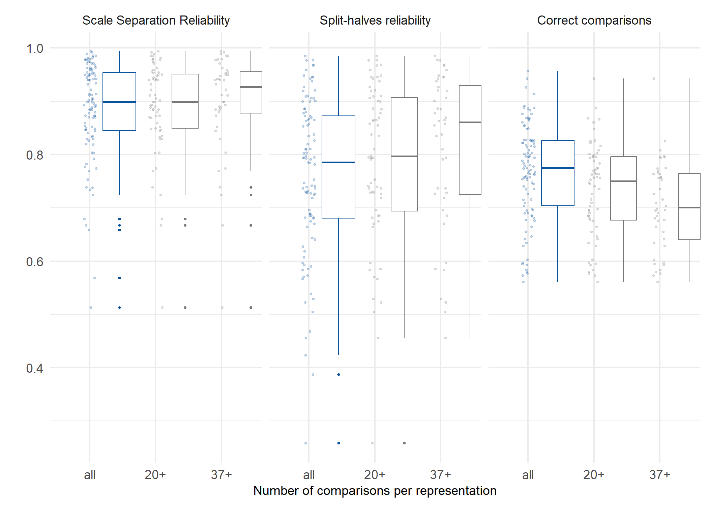
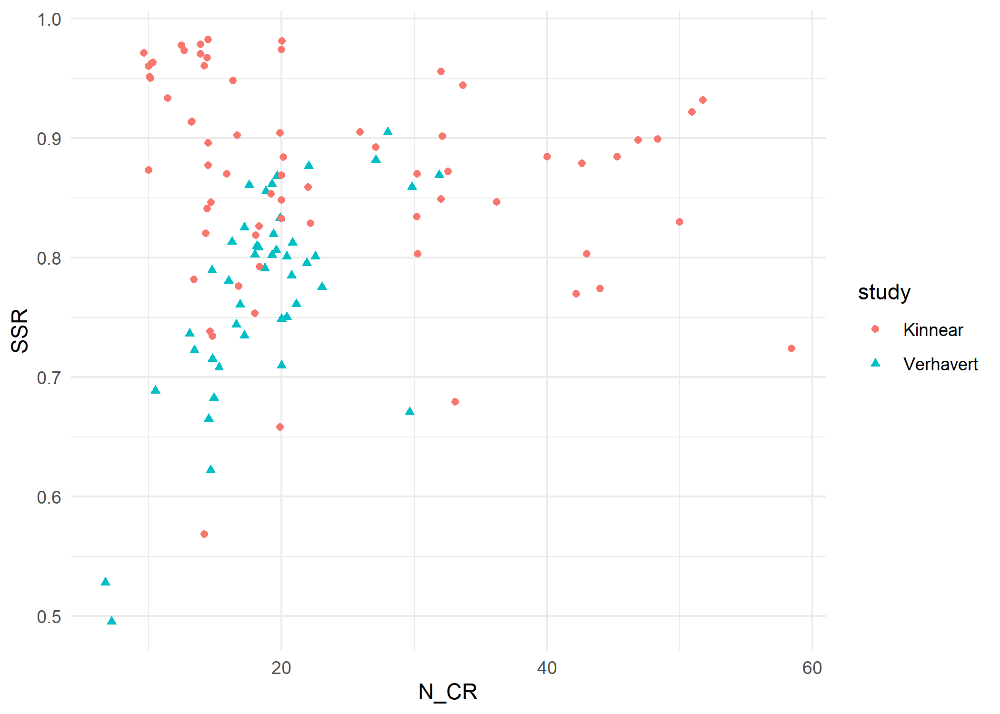
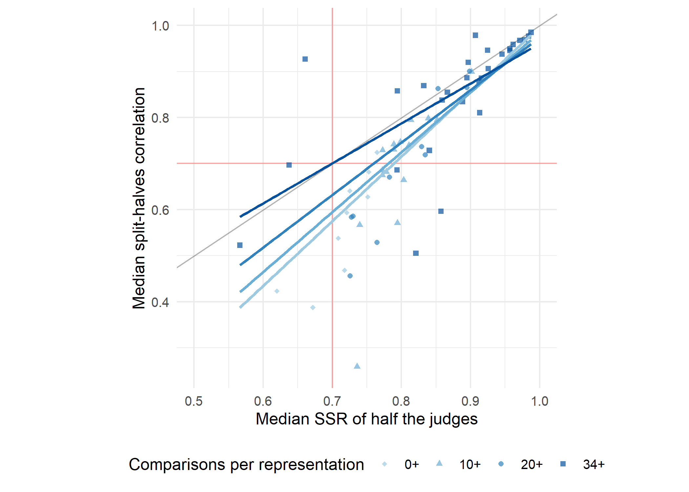

CJ meta-analysis: RQ2
================
George Kinnear
2023-08-15

# About the sample

    ## # A tibble: 1 × 1
    ##   n_datatsets
    ##         <int>
    ## 1         101

# Observed distribution of reliability measures

For these plots:

- Scale Separation Reliability (SSR) is the value of SSR computed from
  the item scores and standard errors using all of the available
  judgement data,
- Split-halves reliability comes from computing the Pearson correlation
  coefficient of the scores produced by fitting the Bradley-Terry model
  separately on two randomly-selected partitions of the judges, and
  taking the median of 100 such random splits,
- Correct comparisons is the proportion of individual decisions that
  agree with the final rank order of the items.

<!-- -->

## Relationship between observed measures

<!-- -->

# Effect of N_CR on reliability measures

The descriptive plot for RQ1 shows N_CR as simply N_C / N_R.

> TODO - update the RQ1 plot?

Verhavert et al. (2019) defined N_CR as 2 \* N_C / N_R, with the
multiplier of 2 reflecting the fact that each judgement contributes a
comparison for each of the items being compared.

With N_CR = 2 \* N_C / N_R, we consider various thresholds that have
been suggested in the literature:

- *N_CR \>= 10*. “assuming 10 decisions per script (or 5 pairs) for a
  good level of reliability.” (Wheadon et al., 2020, p. 59)
- *N_CR \>= 20*. “A general rule of thumb is to have at least 10 times
  the number of judgements to the number of scripts.” (Bisson et al.,
  2016, p. 154)
- *N_CR \>= 37*. “between 10 and 14 comparisons per representation are
  needed to reach a reliability of .70. To reach a reliability of .90,
  26 to 37 comparisons per representation are needed.” (Verhavert et
  al., 2019, p. 557)

<table class="table table-striped" style="width: auto !important; margin-left: auto; margin-right: auto;">
<thead>
<tr>
<th style="text-align:left;">
ncr
</th>
<th style="text-align:right;">
num_studies
</th>
</tr>
</thead>
<tbody>
<tr>
<td style="text-align:left;">
all
</td>
<td style="text-align:right;">
101
</td>
</tr>
<tr>
<td style="text-align:left;">
10+
</td>
<td style="text-align:right;">
100
</td>
</tr>
<tr>
<td style="text-align:left;">
20+
</td>
<td style="text-align:right;">
64
</td>
</tr>
<tr>
<td style="text-align:left;">
37+
</td>
<td style="text-align:right;">
44
</td>
</tr>
</tbody>
</table>

Since there is only one study that is just below the 10+ threshold, we
will just proceed with the all/20+/37+ groups.

<!-- -->

<table class="table table-striped" style="width: auto !important; margin-left: auto; margin-right: auto;">
<thead>
<tr>
<th style="text-align:left;">
ncr
</th>
<th style="text-align:left;">
measure
</th>
<th style="text-align:right;">
min
</th>
<th style="text-align:right;">
median
</th>
<th style="text-align:right;">
max
</th>
</tr>
</thead>
<tbody>
<tr>
<td style="text-align:left;">
all
</td>
<td style="text-align:left;">
Scale Separation Reliability
</td>
<td style="text-align:right;">
0.513
</td>
<td style="text-align:right;">
0.899
</td>
<td style="text-align:right;">
0.994
</td>
</tr>
<tr>
<td style="text-align:left;">
all
</td>
<td style="text-align:left;">
Split-halves reliability
</td>
<td style="text-align:right;">
0.259
</td>
<td style="text-align:right;">
0.785
</td>
<td style="text-align:right;">
0.985
</td>
</tr>
<tr>
<td style="text-align:left;">
all
</td>
<td style="text-align:left;">
Correct comparisons
</td>
<td style="text-align:right;">
0.561
</td>
<td style="text-align:right;">
0.775
</td>
<td style="text-align:right;">
0.956
</td>
</tr>
<tr>
<td style="text-align:left;">
20+
</td>
<td style="text-align:left;">
Scale Separation Reliability
</td>
<td style="text-align:right;">
0.513
</td>
<td style="text-align:right;">
0.899
</td>
<td style="text-align:right;">
0.994
</td>
</tr>
<tr>
<td style="text-align:left;">
20+
</td>
<td style="text-align:left;">
Split-halves reliability
</td>
<td style="text-align:right;">
0.259
</td>
<td style="text-align:right;">
0.797
</td>
<td style="text-align:right;">
0.985
</td>
</tr>
<tr>
<td style="text-align:left;">
20+
</td>
<td style="text-align:left;">
Correct comparisons
</td>
<td style="text-align:right;">
0.561
</td>
<td style="text-align:right;">
0.750
</td>
<td style="text-align:right;">
0.943
</td>
</tr>
<tr>
<td style="text-align:left;">
37+
</td>
<td style="text-align:left;">
Scale Separation Reliability
</td>
<td style="text-align:right;">
0.513
</td>
<td style="text-align:right;">
0.927
</td>
<td style="text-align:right;">
0.994
</td>
</tr>
<tr>
<td style="text-align:left;">
37+
</td>
<td style="text-align:left;">
Split-halves reliability
</td>
<td style="text-align:right;">
0.456
</td>
<td style="text-align:right;">
0.860
</td>
<td style="text-align:right;">
0.985
</td>
</tr>
<tr>
<td style="text-align:left;">
37+
</td>
<td style="text-align:left;">
Correct comparisons
</td>
<td style="text-align:right;">
0.561
</td>
<td style="text-align:right;">
0.701
</td>
<td style="text-align:right;">
0.943
</td>
</tr>
</tbody>
</table>

# Relationships between reliability measures

The split-halves reliability comes from the median of 100 random
iterations of the split-halves correlation coefficient.

For each iteration, the judges are split randomly into two groups, and
Bradley-Terry is run for each half of the data separately.

Thus, we can consider the SSR of either of those halves.

When running all the split-half computations, we recorded for each
split: the value of the correlation (`split_corr`) and the value of the
SSR of one of the halves (`ssr_x`):

    ## # A tibble: 6 × 4
    ##   judging_session iteration split_corr ssr_x
    ##   <chr>               <dbl>      <dbl> <dbl>
    ## 1 AlMaimani2017           1      0.978 0.906
    ## 2 AlMaimani2017           2      0.956 0.916
    ## 3 AlMaimani2017           3      0.997 0.892
    ## 4 AlMaimani2017           4      0.996 0.911
    ## 5 AlMaimani2017           5      0.956 0.916
    ## 6 AlMaimani2017           6      0.996 0.890

Now the question is: how do `ssr_x` and `split_corr` relate? (That would
give some information towards the situation where you have an SSR value
for some judging data, and would like to know the likely correlation you
would get between the scores generated from that data, and the scores
from another similar group of judges.)

From each judging session, we have 100 data points to address that
question, but they are not really independent since they are built on
the same judgement data. So we summarise each judging session by the
*median* of `ssr_x` and `split_corr` across the 100 different splits. We
could have used the *mean* but it doesn’t actually make much difference
as an estimate of the expected value; both averages are very similar in
practice, as shown in this plot of the raw values and their averages
(mean in red, median in green) in the first 16 sets of judging data:

<!-- -->

So using the medians, we have the following picture:

<!-- -->

We can add a 95% prediction interval from the linear regression:

    ## Warning: Removed 10 rows containing missing values (`geom_line()`).

    ## Warning: Removed 13 rows containing missing values (`geom_line()`).

<!-- -->

So for instance, with an SSR of 0.8 we might then expect to get a
correlation of anywhere between 0.55 and 0.9 with scores generated by a
similar group of judges.

## Considering the effect of N_CR

We split the data into groups, according to which ones meet various
thresholds that have been recommended in the past for N_CR, the number
of comparisons per representation.

The trend seems to be that with increasing N_CR, the relationship
between the two measures gets closer to the y=x line. (i.e., with
sufficient judgements that split-halves makes sense, the SSR is
split-halves reliability)

<!-- -->

<!-- -->

However, looking at the correlations somewhat undermines that
interpretation, as the correlation between the two variables decreases
as the threshold on N_CR is increased:

<table class="table table-striped" style="width: auto !important; margin-left: auto; margin-right: auto;">
<thead>
<tr>
<th style="text-align:right;">
ncr_threshold
</th>
<th style="text-align:right;">
num_studies
</th>
<th style="text-align:right;">
correlation
</th>
<th style="text-align:right;">
p_value
</th>
</tr>
</thead>
<tbody>
<tr>
<td style="text-align:right;">
0
</td>
<td style="text-align:right;">
101
</td>
<td style="text-align:right;">
0.801
</td>
<td style="text-align:right;">
0
</td>
</tr>
<tr>
<td style="text-align:right;">
20
</td>
<td style="text-align:right;">
64
</td>
<td style="text-align:right;">
0.749
</td>
<td style="text-align:right;">
0
</td>
</tr>
<tr>
<td style="text-align:right;">
37
</td>
<td style="text-align:right;">
44
</td>
<td style="text-align:right;">
0.737
</td>
<td style="text-align:right;">
0
</td>
</tr>
</tbody>
</table>

(This seems to be driven by a couple of low outliers in the 37+ group.)

    ## # A tibble: 2 × 5
    ##   judging_session        median_ssr_x median_split_corr  N_CR ncr  
    ##   <chr>                         <dbl>             <dbl> <dbl> <chr>
    ## 1 Spehar2016_expt2-Edges        0.857             0.596   800 37+  
    ## 2 Spehar2016_expt2-Plain        0.821             0.505   800 37+

Likewise, the details for the linear model in each case show that the
variance explained decreases with higher thresholds, i.e. `median_ssr_x`
is less predictive of `median_split_corr`:

    ## 
    ## Call:
    ## lm(formula = median_split_corr ~ median_ssr_x, data = reliability_corr_plot_data)
    ## 
    ## Residuals:
    ##      Min       1Q   Median       3Q      Max 
    ## -0.37257 -0.02588  0.00454  0.03109  0.39919 
    ## 
    ## Coefficients:
    ##              Estimate Std. Error t value Pr(>|t|)    
    ## (Intercept)  -0.38572    0.08655  -4.457  2.2e-05 ***
    ## median_ssr_x  1.38217    0.10392  13.301  < 2e-16 ***
    ## ---
    ## Signif. codes:  0 '***' 0.001 '**' 0.01 '*' 0.05 '.' 0.1 ' ' 1
    ## 
    ## Residual standard error: 0.08927 on 99 degrees of freedom
    ## Multiple R-squared:  0.6412, Adjusted R-squared:  0.6376 
    ## F-statistic: 176.9 on 1 and 99 DF,  p-value: < 2.2e-16

    ## 
    ## Call:
    ## lm(formula = median_split_corr ~ median_ssr_x, data = reliability_corr_plot_data %>% 
    ##     filter(N_CR >= 20))
    ## 
    ## Residuals:
    ##      Min       1Q   Median       3Q      Max 
    ## -0.38405 -0.02772  0.01544  0.03899  0.38033 
    ## 
    ## Coefficients:
    ##              Estimate Std. Error t value Pr(>|t|)    
    ## (Intercept)   -0.3018     0.1224  -2.465   0.0165 *  
    ## median_ssr_x   1.2838     0.1440   8.913 1.05e-12 ***
    ## ---
    ## Signif. codes:  0 '***' 0.001 '**' 0.01 '*' 0.05 '.' 0.1 ' ' 1
    ## 
    ## Residual standard error: 0.1013 on 62 degrees of freedom
    ## Multiple R-squared:  0.5617, Adjusted R-squared:  0.5546 
    ## F-statistic: 79.44 on 1 and 62 DF,  p-value: 1.048e-12

    ## 
    ## Call:
    ## lm(formula = median_split_corr ~ median_ssr_x, data = reliability_corr_plot_data %>% 
    ##     filter(N_CR >= 37))
    ## 
    ## Residuals:
    ##      Min       1Q   Median       3Q      Max 
    ## -0.26250 -0.05123  0.02087  0.03773  0.34166 
    ## 
    ## Coefficients:
    ##              Estimate Std. Error t value Pr(>|t|)    
    ## (Intercept)   -0.1667     0.1389  -1.200    0.237    
    ## median_ssr_x   1.1378     0.1609   7.071 1.15e-08 ***
    ## ---
    ## Signif. codes:  0 '***' 0.001 '**' 0.01 '*' 0.05 '.' 0.1 ' ' 1
    ## 
    ## Residual standard error: 0.1012 on 42 degrees of freedom
    ## Multiple R-squared:  0.5435, Adjusted R-squared:  0.5326 
    ## F-statistic:    50 on 1 and 42 DF,  p-value: 1.151e-08

## Recreating Verhavert et al. (2019) Figure 4

Verhavert et al. (2019) analysed data from 49 different CJ sessions.

Here we combine their data with our own, to extend their analysis.

<!-- -->

We seem to have many more studies with low N_CR yet high SSR.

<table class="table table-striped" style="width: auto !important; margin-left: auto; margin-right: auto;">
<thead>
<tr>
<th style="text-align:left;">
judging_session
</th>
<th style="text-align:left;">
adaptivity
</th>
<th style="text-align:right;">
N_CR
</th>
<th style="text-align:right;">
SSR
</th>
</tr>
</thead>
<tbody>
<tr>
<td style="text-align:left;">
Bramley2018_1a
</td>
<td style="text-align:left;">
TRUE
</td>
<td style="text-align:right;">
14.386667
</td>
<td style="text-align:right;">
0.9675736
</td>
</tr>
<tr>
<td style="text-align:left;">
Jones2013a_novice
</td>
<td style="text-align:left;">
TRUE
</td>
<td style="text-align:right;">
14.488095
</td>
<td style="text-align:right;">
0.9824695
</td>
</tr>
<tr>
<td style="text-align:left;">
Jones2014_GCSE070211data
</td>
<td style="text-align:left;">
TRUE
</td>
<td style="text-align:right;">
16.666667
</td>
<td style="text-align:right;">
0.9027410
</td>
</tr>
<tr>
<td style="text-align:left;">
Jones2015a_all-scripts
</td>
<td style="text-align:left;">
unknown
</td>
<td style="text-align:right;">
9.618667
</td>
<td style="text-align:right;">
0.9714079
</td>
</tr>
<tr>
<td style="text-align:left;">
Jones2015a_subset-of-scripts
</td>
<td style="text-align:left;">
unknown
</td>
<td style="text-align:right;">
10.000000
</td>
<td style="text-align:right;">
0.9602843
</td>
</tr>
<tr>
<td style="text-align:left;">
Pollitt2012a
</td>
<td style="text-align:left;">
TRUE
</td>
<td style="text-align:right;">
12.478723
</td>
<td style="text-align:right;">
0.9779996
</td>
</tr>
<tr>
<td style="text-align:left;">
Pollitt2017_example4
</td>
<td style="text-align:left;">
TRUE
</td>
<td style="text-align:right;">
16.338338
</td>
<td style="text-align:right;">
0.9485595
</td>
</tr>
<tr>
<td style="text-align:left;">
PollittX_art1
</td>
<td style="text-align:left;">
unknown
</td>
<td style="text-align:right;">
13.226667
</td>
<td style="text-align:right;">
0.9136365
</td>
</tr>
<tr>
<td style="text-align:left;">
PollittX_art2
</td>
<td style="text-align:left;">
unknown
</td>
<td style="text-align:right;">
13.253333
</td>
<td style="text-align:right;">
0.9139111
</td>
</tr>
<tr>
<td style="text-align:left;">
PollittX_college
</td>
<td style="text-align:left;">
unknown
</td>
<td style="text-align:right;">
11.416667
</td>
<td style="text-align:right;">
0.9335833
</td>
</tr>
<tr>
<td style="text-align:left;">
PollittX_design
</td>
<td style="text-align:left;">
unknown
</td>
<td style="text-align:right;">
13.886487
</td>
<td style="text-align:right;">
0.9787771
</td>
</tr>
<tr>
<td style="text-align:left;">
PollittX_efl-oracy
</td>
<td style="text-align:left;">
unknown
</td>
<td style="text-align:right;">
13.910448
</td>
<td style="text-align:right;">
0.9708549
</td>
</tr>
<tr>
<td style="text-align:left;">
PollittX_ielts-writing
</td>
<td style="text-align:left;">
unknown
</td>
<td style="text-align:right;">
14.200000
</td>
<td style="text-align:right;">
0.9608904
</td>
</tr>
<tr>
<td style="text-align:left;">
PollittX_music
</td>
<td style="text-align:left;">
unknown
</td>
<td style="text-align:right;">
10.318408
</td>
<td style="text-align:right;">
0.9634046
</td>
</tr>
<tr>
<td style="text-align:left;">
PollittX_peer-assessment
</td>
<td style="text-align:left;">
unknown
</td>
<td style="text-align:right;">
19.875000
</td>
<td style="text-align:right;">
0.9044001
</td>
</tr>
<tr>
<td style="text-align:left;">
PollittX_philosophy1
</td>
<td style="text-align:left;">
unknown
</td>
<td style="text-align:right;">
12.674286
</td>
<td style="text-align:right;">
0.9734448
</td>
</tr>
<tr>
<td style="text-align:left;">
PollittX_philosophy2a
</td>
<td style="text-align:left;">
unknown
</td>
<td style="text-align:right;">
10.062500
</td>
<td style="text-align:right;">
0.9516662
</td>
</tr>
<tr>
<td style="text-align:left;">
PollittX_philosophy2b
</td>
<td style="text-align:left;">
unknown
</td>
<td style="text-align:right;">
10.131250
</td>
<td style="text-align:right;">
0.9503385
</td>
</tr>
<tr>
<td style="text-align:left;">
PollittX_philosophy2c
</td>
<td style="text-align:left;">
unknown
</td>
<td style="text-align:right;">
10.193750
</td>
<td style="text-align:right;">
0.9627824
</td>
</tr>
</tbody>
</table>

The bulk of those are from Pollitt, where it is likely that adaptivity
was used – and this is known to inflate SSR (indeed, Bramley2018_1a was
a study designed to show just that).

The adaptivity seems to produce separate clusters in our sample:

<!-- -->

Let’s see what the main SSR vs split-halves plot looks like for only the
non-adaptive studies.

<!-- -->

Or the simpler version, with adaptive vs non-adaptive highlighted:

<!-- -->

This suggests that the SSR/split-halves relationship looks quite similar
whether studies used adaptivity or not.
