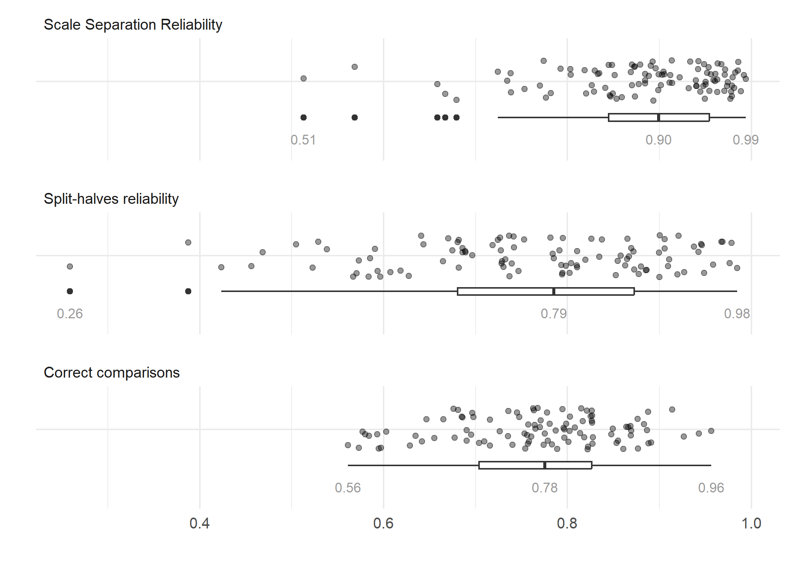
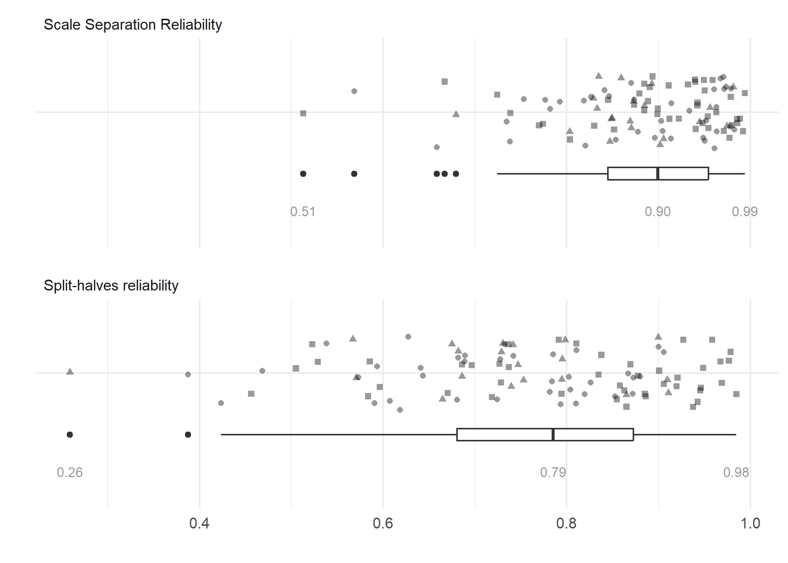
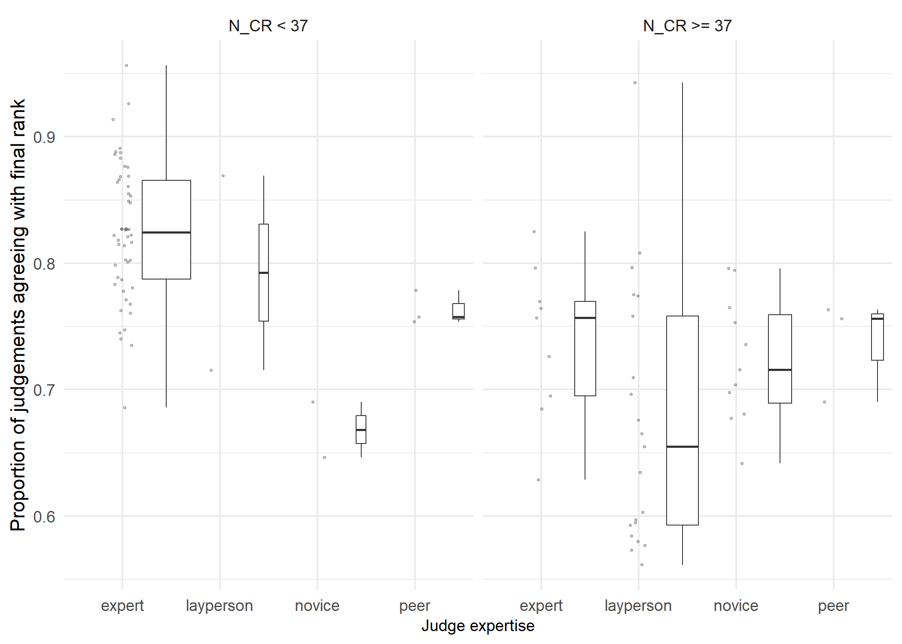
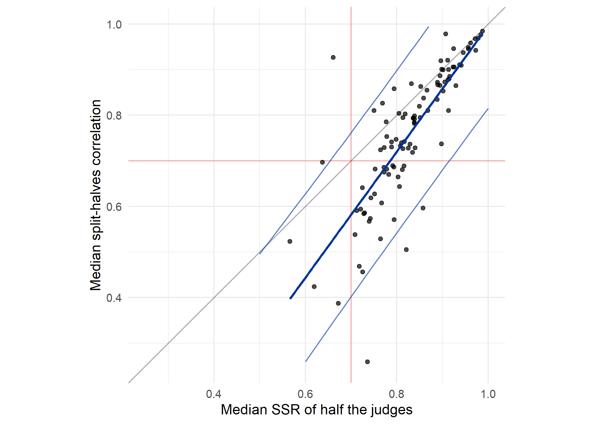
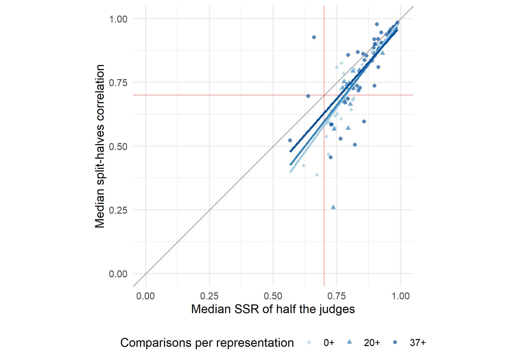
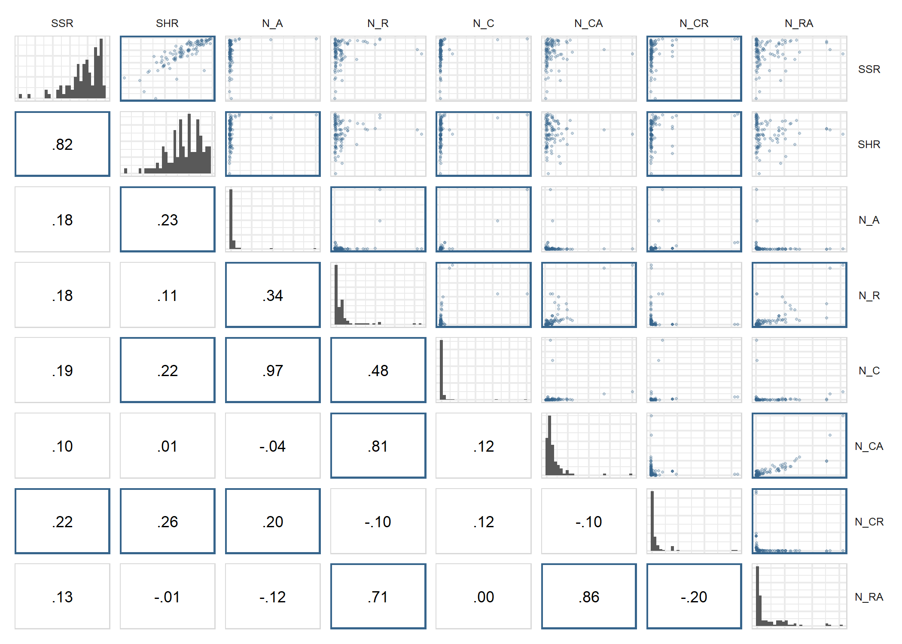
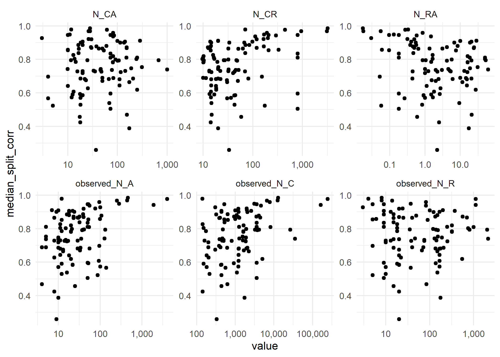
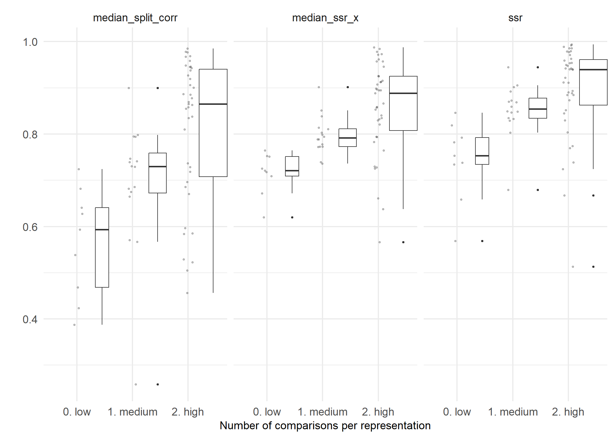
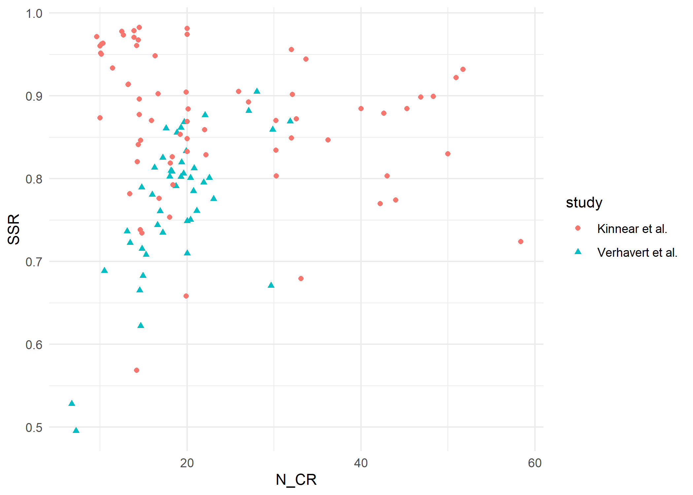
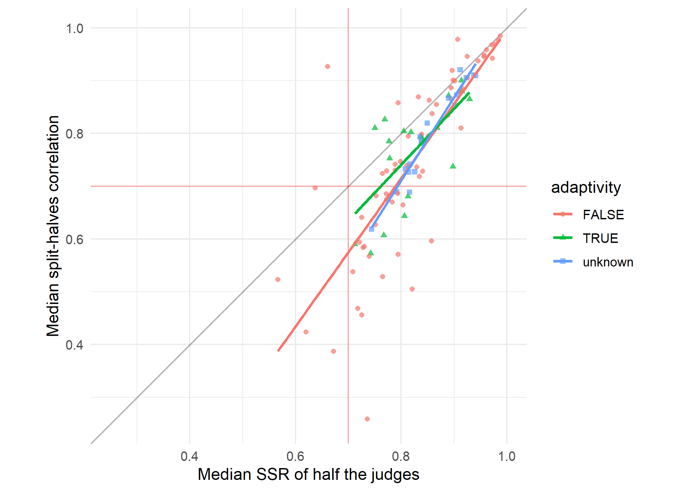

CJ meta-analysis: RQ2
================
George Kinnear
2023-08-15

# About the sample

    ## # A tibble: 1 × 1
    ##   n_datatsets
    ##         <int>
    ## 1         101

# Observed distribution of reliability measures

For these plots:

- Scale Separation Reliability (SSR) is the value of SSR computed from
  the item scores and standard errors using all of the available
  judgement data,
- Split-halves reliability comes from computing the Pearson correlation
  coefficient of the scores produced by fitting the Bradley-Terry model
  separately on two randomly-selected partitions of the judges, and
  taking the median of 100 such random splits,
- Correct comparisons is the proportion of individual decisions that
  agree with the final rank order of the items.

<!-- -->

## Relationship between observed measures

<!-- -->

# Effect of N_CR on reliability measures

Verhavert et al. (2019) defined N_CR as 2 \* N_C / N_R, with the
multiplier of 2 reflecting the fact that each judgement contributes a
comparison for each of the items being compared.

With N_CR = 2 \* N_C / N_R, we consider various thresholds that have
been suggested in the literature:

- *N_CR \>= 10*. “assuming 10 decisions per script (or 5 pairs) for a
  good level of reliability.” (Wheadon et al., 2020, p. 59)
- *N_CR \>= 20*. “A general rule of thumb is to have at least 10 times
  the number of judgements to the number of scripts.” (Bisson et al.,
  2016, p. 154)
- *N_CR \>= 37*. “between 10 and 14 comparisons per representation are
  needed to reach a reliability of .70. To reach a reliability of .90,
  26 to 37 comparisons per representation are needed.” (Verhavert et
  al., 2019, p. 557)

<table class="table table-striped" style="width: auto !important; margin-left: auto; margin-right: auto;">
<thead>
<tr>
<th style="text-align:left;">
ncr
</th>
<th style="text-align:right;">
num_studies
</th>
</tr>
</thead>
<tbody>
<tr>
<td style="text-align:left;">
all
</td>
<td style="text-align:right;">
101
</td>
</tr>
<tr>
<td style="text-align:left;">
10+
</td>
<td style="text-align:right;">
100
</td>
</tr>
<tr>
<td style="text-align:left;">
20+
</td>
<td style="text-align:right;">
64
</td>
</tr>
<tr>
<td style="text-align:left;">
37+
</td>
<td style="text-align:right;">
44
</td>
</tr>
</tbody>
</table>

Since there is only one study that is just below the 10+ threshold, we
will just proceed with the all/20+/37+ groups.

<!-- -->

<table class="table table-striped" style="width: auto !important; margin-left: auto; margin-right: auto;">
<thead>
<tr>
<th style="text-align:left;">
measure
</th>
<th style="text-align:left;">
ncr
</th>
<th style="text-align:right;">
min
</th>
<th style="text-align:right;">
median
</th>
<th style="text-align:right;">
max
</th>
<th style="text-align:right;">
prop_above_0.7
</th>
</tr>
</thead>
<tbody>
<tr>
<td style="text-align:left;">
Scale Separation Reliability
</td>
<td style="text-align:left;">
all
</td>
<td style="text-align:right;">
0.513
</td>
<td style="text-align:right;">
0.899
</td>
<td style="text-align:right;">
0.994
</td>
<td style="text-align:right;">
0.950
</td>
</tr>
<tr>
<td style="text-align:left;">
Split-halves reliability
</td>
<td style="text-align:left;">
all
</td>
<td style="text-align:right;">
0.259
</td>
<td style="text-align:right;">
0.785
</td>
<td style="text-align:right;">
0.985
</td>
<td style="text-align:right;">
0.673
</td>
</tr>
<tr>
<td style="text-align:left;">
Correct comparisons
</td>
<td style="text-align:left;">
all
</td>
<td style="text-align:right;">
0.561
</td>
<td style="text-align:right;">
0.775
</td>
<td style="text-align:right;">
0.956
</td>
<td style="text-align:right;">
0.752
</td>
</tr>
<tr>
<td style="text-align:left;">
Scale Separation Reliability
</td>
<td style="text-align:left;">
20+
</td>
<td style="text-align:right;">
0.513
</td>
<td style="text-align:right;">
0.899
</td>
<td style="text-align:right;">
0.994
</td>
<td style="text-align:right;">
0.953
</td>
</tr>
<tr>
<td style="text-align:left;">
Split-halves reliability
</td>
<td style="text-align:left;">
20+
</td>
<td style="text-align:right;">
0.259
</td>
<td style="text-align:right;">
0.797
</td>
<td style="text-align:right;">
0.985
</td>
<td style="text-align:right;">
0.734
</td>
</tr>
<tr>
<td style="text-align:left;">
Correct comparisons
</td>
<td style="text-align:left;">
20+
</td>
<td style="text-align:right;">
0.561
</td>
<td style="text-align:right;">
0.750
</td>
<td style="text-align:right;">
0.943
</td>
<td style="text-align:right;">
0.625
</td>
</tr>
<tr>
<td style="text-align:left;">
Scale Separation Reliability
</td>
<td style="text-align:left;">
37+
</td>
<td style="text-align:right;">
0.513
</td>
<td style="text-align:right;">
0.927
</td>
<td style="text-align:right;">
0.994
</td>
<td style="text-align:right;">
0.955
</td>
</tr>
<tr>
<td style="text-align:left;">
Split-halves reliability
</td>
<td style="text-align:left;">
37+
</td>
<td style="text-align:right;">
0.456
</td>
<td style="text-align:right;">
0.860
</td>
<td style="text-align:right;">
0.985
</td>
<td style="text-align:right;">
0.773
</td>
</tr>
<tr>
<td style="text-align:left;">
Correct comparisons
</td>
<td style="text-align:left;">
37+
</td>
<td style="text-align:right;">
0.561
</td>
<td style="text-align:right;">
0.701
</td>
<td style="text-align:right;">
0.943
</td>
<td style="text-align:right;">
0.500
</td>
</tr>
</tbody>
</table>

The trend in “correct comparisons” seems to be down to the adaptive
studies being more likely to have high values on that measure while
having low N_CR:

<!-- -->

It may also be ascribed to the prevalence of layperson judges in studies
with large N_CR:

<!-- -->

## SSR and split-halves only

Focusing only on the SSR and split-halves measures:

<!-- -->

<!-- -->

# Relationships between reliability measures

## Using SSR_ALL

For each study, we computed the SSR and SHR from the judgement data.
Here, each point is one study and we see that the two values are closely
related:

<!-- -->

    ## 
    ## Call:
    ## lm(formula = median_split_corr ~ ssr, data = meta_analysis_data)
    ## 
    ## Residuals:
    ##      Min       1Q   Median       3Q      Max 
    ## -0.23153 -0.04464 -0.00094  0.05017  0.35854 
    ## 
    ## Coefficients:
    ##             Estimate Std. Error t value Pr(>|t|)    
    ## (Intercept) -0.40219    0.08112  -4.958 2.96e-06 ***
    ## ssr          1.31415    0.09129  14.396  < 2e-16 ***
    ## ---
    ## Signif. codes:  0 '***' 0.001 '**' 0.01 '*' 0.05 '.' 0.1 ' ' 1
    ## 
    ## Residual standard error: 0.08473 on 99 degrees of freedom
    ## Multiple R-squared:  0.6767, Adjusted R-squared:  0.6735 
    ## F-statistic: 207.2 on 1 and 99 DF,  p-value: < 2.2e-16

    ## 
    ##  Spearman's rank correlation rho
    ## 
    ## data:  median_split_corr and ssr
    ## S = 24378, p-value < 2.2e-16
    ## alternative hypothesis: true rho is not equal to 0
    ## sample estimates:
    ##       rho 
    ## 0.8580198

## Introducing SSR_HALF

The split-halves reliability comes from the median of 100 random
iterations of the split-halves correlation coefficient.

For each iteration, the judges are split randomly into two groups, and
Bradley-Terry is run for each half of the data separately.

Thus, we can consider the SSR of either of those halves.

When running all the split-half computations, we recorded for each
split: the value of the correlation (`split_corr`) and the value of the
SSR of one of the halves (`ssr_x`):

    ## # A tibble: 6 × 4
    ##   judging_session iteration split_corr ssr_x
    ##   <chr>               <dbl>      <dbl> <dbl>
    ## 1 AlMaimani2017           1      0.978 0.906
    ## 2 AlMaimani2017           2      0.956 0.916
    ## 3 AlMaimani2017           3      0.997 0.892
    ## 4 AlMaimani2017           4      0.996 0.911
    ## 5 AlMaimani2017           5      0.956 0.916
    ## 6 AlMaimani2017           6      0.996 0.890

Now the question is: how do `ssr_x` and `split_corr` relate? (That would
give some information towards the situation where you have an SSR value
for some judging data, and would like to know the likely correlation you
would get between the scores generated from that data, and the scores
from another similar group of judges.)

From each judging session, we have 100 data points to address that
question, but they are not really independent since they are built on
the same judgement data. So we summarise each judging session by the
*median* of `ssr_x` and `split_corr` across the 100 different splits. We
could have used the *mean* but it doesn’t actually make much difference
as an estimate of the expected value; both averages are very similar in
practice, as shown in this plot of the raw values and their averages
(mean in red, median in green) in the first 16 sets of judging data:

<!-- -->

So using the medians, we have the following picture:

<!-- --> There is a
strong linear relationship here:

    ## 
    ## Call:
    ## lm(formula = median_split_corr ~ median_ssr_x, data = meta_analysis_data)
    ## 
    ## Residuals:
    ##      Min       1Q   Median       3Q      Max 
    ## -0.37257 -0.02588  0.00454  0.03109  0.39919 
    ## 
    ## Coefficients:
    ##              Estimate Std. Error t value Pr(>|t|)    
    ## (Intercept)  -0.38572    0.08655  -4.457  2.2e-05 ***
    ## median_ssr_x  1.38217    0.10392  13.301  < 2e-16 ***
    ## ---
    ## Signif. codes:  0 '***' 0.001 '**' 0.01 '*' 0.05 '.' 0.1 ' ' 1
    ## 
    ## Residual standard error: 0.08927 on 99 degrees of freedom
    ## Multiple R-squared:  0.6412, Adjusted R-squared:  0.6376 
    ## F-statistic: 176.9 on 1 and 99 DF,  p-value: < 2.2e-16

We can add a 95% prediction interval from the linear regression:

    ## Warning: Removed 13 rows containing missing values (`geom_line()`).

<!-- -->

So for instance, with an SSR of 0.8 we might then read off the blue
prediction interval and expect to get a correlation of anywhere between
0.55 and 0.9 with scores generated by a similar group of judges.

## Comparing SSR and SHR thresholds

If we use a particular SSR threshold in our study, what sort of
correlation might we expect with the scores we’d get if we gathered the
same number of judgements again?

The above analysis does a sort of simulation of this situation, by
splitting the data from each of the studies in the meta-analysis into
two halves (which you could think of as the original and replication),
and computing:

- SSR_HALF - the SSR of the “original” half dataset,
- SHR - the correlation between the scores from the “original” and
  “replication” datasets

(where in fact each of these is the median over 100 iterations of
splitting the data into random halves).

We can then look at what a given SSR threshold should imply for the SHR.

Here we look at how likely a given SSR threshold is to produce an SHR of
.7 or higher:

<table class="table table-striped" style="width: auto !important; margin-left: auto; margin-right: auto;">
<thead>
<tr>
<th style="text-align:right;">
ssr_threshold
</th>
<th style="text-align:right;">
n
</th>
<th style="text-align:right;">
n_with_shr_above_pt7
</th>
<th style="text-align:left;">
pct
</th>
</tr>
</thead>
<tbody>
<tr>
<td style="text-align:right;">
0.70
</td>
<td style="text-align:right;">
96
</td>
<td style="text-align:right;">
67
</td>
<td style="text-align:left;">
70%
</td>
</tr>
<tr>
<td style="text-align:right;">
0.75
</td>
<td style="text-align:right;">
84
</td>
<td style="text-align:right;">
67
</td>
<td style="text-align:left;">
80%
</td>
</tr>
<tr>
<td style="text-align:right;">
0.80
</td>
<td style="text-align:right;">
63
</td>
<td style="text-align:right;">
57
</td>
<td style="text-align:left;">
90%
</td>
</tr>
<tr>
<td style="text-align:right;">
0.85
</td>
<td style="text-align:right;">
39
</td>
<td style="text-align:right;">
38
</td>
<td style="text-align:left;">
97%
</td>
</tr>
<tr>
<td style="text-align:right;">
0.90
</td>
<td style="text-align:right;">
25
</td>
<td style="text-align:right;">
25
</td>
<td style="text-align:left;">
100%
</td>
</tr>
</tbody>
</table>

Here we look at other SHR thresholds too:

<table class="table table-striped" style="width: auto !important; margin-left: auto; margin-right: auto;">
<thead>
<tr>
<th style="empty-cells: hide;border-bottom:hidden;" colspan="2">
</th>
<th style="border-bottom:hidden;padding-bottom:0; padding-left:3px;padding-right:3px;text-align: center; " colspan="3">

SHR Threshold

</th>
</tr>
<tr>
<th style="text-align:right;">
SSR Threshold
</th>
<th style="text-align:right;">
Number of studies
</th>
<th style="text-align:left;">
.7
</th>
<th style="text-align:left;">
.8
</th>
<th style="text-align:left;">
.9
</th>
</tr>
</thead>
<tbody>
<tr>
<td style="text-align:right;">
0.70
</td>
<td style="text-align:right;">
96
</td>
<td style="text-align:left;">
67 (70%)
</td>
<td style="text-align:left;">
43 (45%)
</td>
<td style="text-align:left;">
18 (19%)
</td>
</tr>
<tr>
<td style="text-align:right;">
0.75
</td>
<td style="text-align:right;">
84
</td>
<td style="text-align:left;">
67 (80%)
</td>
<td style="text-align:left;">
43 (51%)
</td>
<td style="text-align:left;">
18 (21%)
</td>
</tr>
<tr>
<td style="text-align:right;">
0.80
</td>
<td style="text-align:right;">
63
</td>
<td style="text-align:left;">
57 (90%)
</td>
<td style="text-align:left;">
40 (63%)
</td>
<td style="text-align:left;">
18 (29%)
</td>
</tr>
<tr>
<td style="text-align:right;">
0.85
</td>
<td style="text-align:right;">
39
</td>
<td style="text-align:left;">
38 (97%)
</td>
<td style="text-align:left;">
36 (92%)
</td>
<td style="text-align:left;">
18 (46%)
</td>
</tr>
<tr>
<td style="text-align:right;">
0.90
</td>
<td style="text-align:right;">
25
</td>
<td style="text-align:left;">
25 (100%)
</td>
<td style="text-align:left;">
25 (100%)
</td>
<td style="text-align:left;">
16 (64%)
</td>
</tr>
</tbody>
</table>

## Considering the effect of N_CR

We split the data into groups, according to which ones meet various
thresholds that have been recommended in the past for N_CR, the number
of comparisons per representation.

The trend seems to be that with increasing N_CR, the relationship
between the two measures gets closer to the y=x line. (i.e., with
sufficient judgements that split-halves makes sense, the SSR is
split-halves reliability)

<!-- -->

<!-- -->

However, looking at the correlations somewhat undermines that
interpretation, as the correlation between the two variables decreases
as the threshold on N_CR is increased:

<table class="table table-striped" style="width: auto !important; margin-left: auto; margin-right: auto;">
<thead>
<tr>
<th style="text-align:right;">
ncr_threshold
</th>
<th style="text-align:right;">
num_studies
</th>
<th style="text-align:right;">
correlation
</th>
<th style="text-align:right;">
p_value
</th>
</tr>
</thead>
<tbody>
<tr>
<td style="text-align:right;">
0
</td>
<td style="text-align:right;">
101
</td>
<td style="text-align:right;">
0.841
</td>
<td style="text-align:right;">
0
</td>
</tr>
<tr>
<td style="text-align:right;">
20
</td>
<td style="text-align:right;">
64
</td>
<td style="text-align:right;">
0.835
</td>
<td style="text-align:right;">
0
</td>
</tr>
<tr>
<td style="text-align:right;">
37
</td>
<td style="text-align:right;">
44
</td>
<td style="text-align:right;">
0.837
</td>
<td style="text-align:right;">
0
</td>
</tr>
</tbody>
</table>

(This seems to be driven by a couple of low outliers in the 37+ group.)

    ## # A tibble: 2 × 5
    ##   judging_session        median_ssr_x median_split_corr  N_CR ncr  
    ##   <chr>                         <dbl>             <dbl> <dbl> <chr>
    ## 1 Spehar2016_expt2-Edges        0.857             0.596   800 37+  
    ## 2 Spehar2016_expt2-Plain        0.821             0.505   800 37+

Likewise, the details for the linear model in each case show that the
variance explained decreases with higher thresholds, i.e. `median_ssr_x`
is less predictive of `median_split_corr`:

    ## 
    ## Call:
    ## lm(formula = median_split_corr ~ median_ssr_x, data = reliability_corr_plot_data)
    ## 
    ## Residuals:
    ##      Min       1Q   Median       3Q      Max 
    ## -0.37257 -0.02588  0.00454  0.03109  0.39919 
    ## 
    ## Coefficients:
    ##              Estimate Std. Error t value Pr(>|t|)    
    ## (Intercept)  -0.38572    0.08655  -4.457  2.2e-05 ***
    ## median_ssr_x  1.38217    0.10392  13.301  < 2e-16 ***
    ## ---
    ## Signif. codes:  0 '***' 0.001 '**' 0.01 '*' 0.05 '.' 0.1 ' ' 1
    ## 
    ## Residual standard error: 0.08927 on 99 degrees of freedom
    ## Multiple R-squared:  0.6412, Adjusted R-squared:  0.6376 
    ## F-statistic: 176.9 on 1 and 99 DF,  p-value: < 2.2e-16

    ## 
    ## Call:
    ## lm(formula = median_split_corr ~ median_ssr_x, data = reliability_corr_plot_data %>% 
    ##     filter(N_CR >= 20))
    ## 
    ## Residuals:
    ##      Min       1Q   Median       3Q      Max 
    ## -0.38405 -0.02772  0.01544  0.03899  0.38033 
    ## 
    ## Coefficients:
    ##              Estimate Std. Error t value Pr(>|t|)    
    ## (Intercept)   -0.3018     0.1224  -2.465   0.0165 *  
    ## median_ssr_x   1.2838     0.1440   8.913 1.05e-12 ***
    ## ---
    ## Signif. codes:  0 '***' 0.001 '**' 0.01 '*' 0.05 '.' 0.1 ' ' 1
    ## 
    ## Residual standard error: 0.1013 on 62 degrees of freedom
    ## Multiple R-squared:  0.5617, Adjusted R-squared:  0.5546 
    ## F-statistic: 79.44 on 1 and 62 DF,  p-value: 1.048e-12

    ## 
    ## Call:
    ## lm(formula = median_split_corr ~ median_ssr_x, data = reliability_corr_plot_data %>% 
    ##     filter(N_CR >= 37))
    ## 
    ## Residuals:
    ##      Min       1Q   Median       3Q      Max 
    ## -0.26250 -0.05123  0.02087  0.03773  0.34166 
    ## 
    ## Coefficients:
    ##              Estimate Std. Error t value Pr(>|t|)    
    ## (Intercept)   -0.1667     0.1389  -1.200    0.237    
    ## median_ssr_x   1.1378     0.1609   7.071 1.15e-08 ***
    ## ---
    ## Signif. codes:  0 '***' 0.001 '**' 0.01 '*' 0.05 '.' 0.1 ' ' 1
    ## 
    ## Residual standard error: 0.1012 on 42 degrees of freedom
    ## Multiple R-squared:  0.5435, Adjusted R-squared:  0.5326 
    ## F-statistic:    50 on 1 and 42 DF,  p-value: 1.151e-08

# How do study characteristics relate to reliability?

Look at how representations, assessors, comparisons and their
derivatives relate to SSR and SHR.

This table shows the Pearson correlation of each characteristic with SSR
and with SHR:

<table class="table table-striped" style="width: auto !important; margin-left: auto; margin-right: auto;">
<thead>
<tr>
<th style="text-align:left;">
var1
</th>
<th style="text-align:left;">
N_A
</th>
<th style="text-align:left;">
N_R
</th>
<th style="text-align:left;">
N_C
</th>
<th style="text-align:left;">
N_CA
</th>
<th style="text-align:left;">
N_CR
</th>
<th style="text-align:left;">
N_RA
</th>
</tr>
</thead>
<tbody>
<tr>
<td style="text-align:left;">
SHR
</td>
<td style="text-align:left;">
.23\*
</td>
<td style="text-align:left;">
.11
</td>
<td style="text-align:left;">
.22\*
</td>
<td style="text-align:left;">
.01
</td>
<td style="text-align:left;">
.26\*\*
</td>
<td style="text-align:left;">
-.01
</td>
</tr>
<tr>
<td style="text-align:left;">
SSR
</td>
<td style="text-align:left;">
.18
</td>
<td style="text-align:left;">
.18
</td>
<td style="text-align:left;">
.19
</td>
<td style="text-align:left;">
.10
</td>
<td style="text-align:left;">
.22\*
</td>
<td style="text-align:left;">
.13
</td>
</tr>
</tbody>
</table>

LaTeX table

    ## \begin{table}
    ## \centering
    ## \begin{tabular}{lllllll}
    ## \toprule
    ## var1 & N\_A & N\_R & N\_C & N\_CA & N\_CR & N\_RA\\
    ## \midrule
    ## SHR & .23* & .11 & .22* & .01 & .26** & -.01\\
    ## SSR & .18 & .18 & .19 & .10 & .22* & .13\\
    ## \bottomrule
    ## \end{tabular}
    ## \end{table}

### Plotting

    ## Warning: package 'GGally' was built under R version 4.2.3

    ## Registered S3 method overwritten by 'GGally':
    ##   method from   
    ##   +.gg   ggplot2

<!-- -->

## Split-halves reliability

Sig correlations with SHR are observed_N_A, observed_N_C, N_CR. Check
scatter plots for SHR.

<!-- -->

Forced linear regression SHR:

    ## median_split_corr ~ observed_N_A + observed_N_C + N_CR

    ## 
    ## Call:
    ## lm(formula = formula_shr, data = reliability_characteristics)
    ## 
    ## Residuals:
    ##      Min       1Q   Median       3Q      Max 
    ## -0.48465 -0.06253  0.00572  0.11828  0.23211 
    ## 
    ## Coefficients:
    ##               Estimate Std. Error t value Pr(>|t|)    
    ## (Intercept)  7.407e-01  1.524e-02  48.614   <2e-16 ***
    ## observed_N_A 9.699e-06  1.490e-04   0.065   0.9482    
    ## observed_N_C 8.113e-07  2.215e-06   0.366   0.7150    
    ## N_CR         7.566e-05  3.292e-05   2.298   0.0237 *  
    ## ---
    ## Signif. codes:  0 '***' 0.001 '**' 0.01 '*' 0.05 '.' 0.1 ' ' 1
    ## 
    ## Residual standard error: 0.1424 on 97 degrees of freedom
    ## Multiple R-squared:  0.1051, Adjusted R-squared:  0.07746 
    ## F-statistic: 3.799 on 3 and 97 DF,  p-value: 0.01268

    ## 
    ## Call:
    ## lm(formula = formula_shr, data = reliability_characteristics)
    ## 
    ## Standardized Coefficients::
    ##  (Intercept) observed_N_A observed_N_C         N_CR 
    ##           NA   0.02893218   0.16055744   0.24023892

## SSR

For SSR we have significant correlation with N_CR.

<!-- -->

<!-- -->

SSR forced linear regression:

    ## ssr ~ N_CR

    ## 
    ## Call:
    ## lm(formula = formula_ssr, data = reliability_characteristics)
    ## 
    ## Residuals:
    ##      Min       1Q   Median       3Q      Max 
    ## -0.37129 -0.03637  0.01870  0.07111  0.10510 
    ## 
    ## Coefficients:
    ##              Estimate Std. Error t value Pr(>|t|)    
    ## (Intercept) 8.767e-01  9.600e-03  91.329   <2e-16 ***
    ## N_CR        4.316e-05  1.933e-05   2.233   0.0278 *  
    ## ---
    ## Signif. codes:  0 '***' 0.001 '**' 0.01 '*' 0.05 '.' 0.1 ' ' 1
    ## 
    ## Residual standard error: 0.09102 on 99 degrees of freedom
    ## Multiple R-squared:  0.04793,    Adjusted R-squared:  0.03832 
    ## F-statistic: 4.984 on 1 and 99 DF,  p-value: 0.02783

    ## 
    ## Call:
    ## lm(formula = formula_ssr, data = reliability_characteristics)
    ## 
    ## Standardized Coefficients::
    ## (Intercept)        N_CR 
    ##          NA   0.2189351

## Regression with interactions

As observed earlier, the three characteristics are inter-related, and
correlated predictors pose a problem for regression models. One way of
checking for correlated predictors is using the variance inflation
factor (VIF), where values above 10 are typically taken as an indicator
of high multicollinearity:

    ## observed_N_A observed_N_C observed_N_R 
    ##    32.553490    37.725036     2.319116

Regardless of multicollinearity, we can proceed with a regression model
involving all three characteristics, as well as interaction terms
between them:

    ## 
    ## Call:
    ## lm(formula = ssr ~ observed_N_A * observed_N_C * observed_N_R, 
    ##     data = reliability_characteristics)
    ## 
    ## Residuals:
    ##      Min       1Q   Median       3Q      Max 
    ## -0.32883 -0.03176  0.01415  0.05728  0.11792 
    ## 
    ## Coefficients:
    ##                                          Estimate Std. Error t value Pr(>|t|)
    ## (Intercept)                             8.443e-01  1.563e-02  54.033  < 2e-16
    ## observed_N_A                           -1.439e-04  2.689e-04  -0.535  0.59397
    ## observed_N_C                            2.405e-05  8.767e-06   2.744  0.00729
    ## observed_N_R                            9.966e-05  5.139e-05   1.939  0.05547
    ## observed_N_A:observed_N_C              -1.302e-08  2.998e-08  -0.434  0.66506
    ## observed_N_A:observed_N_R              -9.736e-07  6.463e-07  -1.507  0.13531
    ## observed_N_C:observed_N_R              -1.305e-08  3.972e-09  -3.285  0.00144
    ## observed_N_A:observed_N_C:observed_N_R  1.409e-11  2.767e-11   0.509  0.61187
    ##                                           
    ## (Intercept)                            ***
    ## observed_N_A                              
    ## observed_N_C                           ** 
    ## observed_N_R                           .  
    ## observed_N_A:observed_N_C                 
    ## observed_N_A:observed_N_R                 
    ## observed_N_C:observed_N_R              ** 
    ## observed_N_A:observed_N_C:observed_N_R    
    ## ---
    ## Signif. codes:  0 '***' 0.001 '**' 0.01 '*' 0.05 '.' 0.1 ' ' 1
    ## 
    ## Residual standard error: 0.08589 on 93 degrees of freedom
    ## Multiple R-squared:  0.2036, Adjusted R-squared:  0.1437 
    ## F-statistic: 3.397 on 7 and 93 DF,  p-value: 0.002829

It is interesting here to see the interaction between $N_C$ and $N_R$
appearing significant in the model.

Focusing on N_CR, here is a model with just $N_C$ and $N_R$ (and their
interaction):

    ## 
    ## Call:
    ## lm(formula = ssr ~ observed_N_C * observed_N_R, data = reliability_characteristics)
    ## 
    ## Residuals:
    ##      Min       1Q   Median       3Q      Max 
    ## -0.34081 -0.04368  0.01338  0.05792  0.10847 
    ## 
    ## Coefficients:
    ##                             Estimate Std. Error t value Pr(>|t|)    
    ## (Intercept)                8.483e-01  1.186e-02  71.533  < 2e-16 ***
    ## observed_N_C               1.084e-05  2.713e-06   3.996 0.000125 ***
    ## observed_N_R               1.502e-04  4.118e-05   3.648 0.000428 ***
    ## observed_N_C:observed_N_R -9.835e-09  2.537e-09  -3.876 0.000193 ***
    ## ---
    ## Signif. codes:  0 '***' 0.001 '**' 0.01 '*' 0.05 '.' 0.1 ' ' 1
    ## 
    ## Residual standard error: 0.08565 on 97 degrees of freedom
    ## Multiple R-squared:  0.174,  Adjusted R-squared:  0.1485 
    ## F-statistic: 6.811 on 3 and 97 DF,  p-value: 0.0003251

    ## 
    ## Call:
    ## lm(formula = ssr ~ observed_N_C * observed_N_R, data = reliability_characteristics)
    ## 
    ## Standardized Coefficients::
    ##               (Intercept)              observed_N_C              observed_N_R 
    ##                        NA                 3.4277904                 0.5748469 
    ## observed_N_C:observed_N_R 
    ##                -3.5596338

Another approach would be to consider log-transformed versions of the
three characteristics:

    ## 
    ## Call:
    ## lm(formula = ssr ~ log_N_A * log_N_C * log_N_R, data = .)
    ## 
    ## Residuals:
    ##      Min       1Q   Median       3Q      Max 
    ## -0.26927 -0.04268  0.01021  0.06053  0.14215 
    ## 
    ## Coefficients:
    ##                         Estimate Std. Error t value Pr(>|t|)   
    ## (Intercept)              0.99254    0.32223   3.080  0.00272 **
    ## log_N_A                 -0.43596    0.19844  -2.197  0.03051 * 
    ## log_N_C                  0.05188    0.11489   0.452  0.65267   
    ## log_N_R                 -0.16639    0.16741  -0.994  0.32284   
    ## log_N_A:log_N_C          0.08853    0.06001   1.475  0.14351   
    ## log_N_A:log_N_R          0.19655    0.09920   1.981  0.05051 . 
    ## log_N_C:log_N_R          0.01429    0.04775   0.299  0.76540   
    ## log_N_A:log_N_C:log_N_R -0.03923    0.02452  -1.600  0.11300   
    ## ---
    ## Signif. codes:  0 '***' 0.001 '**' 0.01 '*' 0.05 '.' 0.1 ' ' 1
    ## 
    ## Residual standard error: 0.08245 on 93 degrees of freedom
    ## Multiple R-squared:  0.2662, Adjusted R-squared:  0.211 
    ## F-statistic: 4.821 on 7 and 93 DF,  p-value: 0.0001154

## What about the suggested thesholds of N_CR\>=20 and NC_R\>=37?

Let’s compare SSR and SHR for these thresholds

<!-- -->

For the case of SSR

    ## # A tibble: 3 × 5
    ##   ncr_level count median   min   max
    ##   <chr>     <int>  <dbl> <dbl> <dbl>
    ## 1 0. low       37  0.903 0.569 0.982
    ## 2 1. medium    20  0.870 0.679 0.981
    ## 3 2. high      44  0.927 0.513 0.994

    ## # A tibble: 1 × 6
    ##   .y.       n statistic    df     p method        
    ## * <chr> <int>     <dbl> <int> <dbl> <chr>         
    ## 1 ssr     101      3.51     2 0.173 Kruskal-Wallis

    ## # A tibble: 3 × 9
    ##   .y.   group1    group2       n1    n2 statistic      p p.adj p.adj.signif
    ## * <chr> <chr>     <chr>     <int> <int>     <dbl>  <dbl> <dbl> <chr>       
    ## 1 ssr   0. low    1. medium    37    20    -0.898 0.369  0.554 ns          
    ## 2 ssr   0. low    2. high      37    44     1.09  0.277  0.554 ns          
    ## 3 ssr   1. medium 2. high      20    44     1.82  0.0683 0.205 ns

For the case of SHR

    ## # A tibble: 3 × 5
    ##   ncr_level count median   min   max
    ##   <chr>     <int>  <dbl> <dbl> <dbl>
    ## 1 0. low       37  0.732 0.387 0.906
    ## 2 1. medium    20  0.740 0.259 0.911
    ## 3 2. high      44  0.860 0.456 0.985

    ## # A tibble: 1 × 6
    ##   .y.                   n statistic    df       p method        
    ## * <chr>             <int>     <dbl> <int>   <dbl> <chr>         
    ## 1 median_split_corr   101      11.0     2 0.00402 Kruskal-Wallis

    ## # A tibble: 3 × 9
    ##   .y.           group1 group2    n1    n2 statistic       p   p.adj p.adj.signif
    ## * <chr>         <chr>  <chr>  <int> <int>     <dbl>   <dbl>   <dbl> <chr>       
    ## 1 median_split… 0. low 1. me…    37    20     0.298 0.766   0.766   ns          
    ## 2 median_split… 0. low 2. hi…    37    44     3.11  0.00189 0.00568 **          
    ## 3 median_split… 1. me… 2. hi…    20    44     2.26  0.0237  0.0473  *

### Restricting to non-adaptive CJ

<!-- -->

For the case of SSR

    ## # A tibble: 3 × 5
    ##   ncr_level count median   min   max
    ##   <chr>     <int>  <dbl> <dbl> <dbl>
    ## 1 0. low        9  0.753 0.569 0.846
    ## 2 1. medium    16  0.854 0.679 0.944
    ## 3 2. high      39  0.940 0.513 0.994

    ## # A tibble: 1 × 6
    ##   .y.       n statistic    df         p method        
    ## * <chr> <int>     <dbl> <int>     <dbl> <chr>         
    ## 1 ssr      64      19.2     2 0.0000668 Kruskal-Wallis

    ## # A tibble: 3 × 9
    ##   .y.   group1    group2       n1    n2 statistic         p   p.adj p.adj.signif
    ## * <chr> <chr>     <chr>     <int> <int>     <dbl>     <dbl>   <dbl> <chr>       
    ## 1 ssr   0. low    1. medium     9    16      2.13 0.0331    5.15e-2 ns          
    ## 2 ssr   0. low    2. high       9    39      4.19 0.0000276 8.29e-5 ****        
    ## 3 ssr   1. medium 2. high      16    39      2.23 0.0257    5.15e-2 ns

For the case of SHR

    ## # A tibble: 3 × 5
    ##   ncr_level count median   min   max
    ##   <chr>     <int>  <dbl> <dbl> <dbl>
    ## 1 0. low        9  0.593 0.387 0.724
    ## 2 1. medium    16  0.730 0.259 0.900
    ## 3 2. high      39  0.865 0.456 0.985

    ## # A tibble: 1 × 6
    ##   .y.                   n statistic    df        p method        
    ## * <chr>             <int>     <dbl> <int>    <dbl> <chr>         
    ## 1 median_split_corr    64      17.7     2 0.000145 Kruskal-Wallis

    ## # A tibble: 3 × 9
    ##   .y.           group1 group2    n1    n2 statistic       p   p.adj p.adj.signif
    ## * <chr>         <chr>  <chr>  <int> <int>     <dbl>   <dbl>   <dbl> <chr>       
    ## 1 median_split… 0. low 1. me…     9    16      1.73 8.39e-2 8.39e-2 ns          
    ## 2 median_split… 0. low 2. hi…     9    39      3.90 9.56e-5 2.87e-4 ***         
    ## 3 median_split… 1. me… 2. hi…    16    39      2.43 1.49e-2 2.99e-2 *

# Recreating Verhavert et al. (2019) Figure 4

Verhavert et al. (2019) analysed data from 49 different CJ sessions.

Here we combine their data with our own, to extend their analysis.

<!-- -->

We seem to have many more studies with low N_CR yet high SSR.

<table class="table table-striped" style="width: auto !important; margin-left: auto; margin-right: auto;">
<thead>
<tr>
<th style="text-align:left;">
judging_session
</th>
<th style="text-align:left;">
adaptivity
</th>
<th style="text-align:right;">
N_CR
</th>
<th style="text-align:right;">
SSR
</th>
</tr>
</thead>
<tbody>
<tr>
<td style="text-align:left;">
Bramley2018_1a
</td>
<td style="text-align:left;">
TRUE
</td>
<td style="text-align:right;">
14.386667
</td>
<td style="text-align:right;">
0.9675736
</td>
</tr>
<tr>
<td style="text-align:left;">
Jones2013a_novice
</td>
<td style="text-align:left;">
TRUE
</td>
<td style="text-align:right;">
14.488095
</td>
<td style="text-align:right;">
0.9824695
</td>
</tr>
<tr>
<td style="text-align:left;">
Jones2014_GCSE070211data
</td>
<td style="text-align:left;">
TRUE
</td>
<td style="text-align:right;">
16.666667
</td>
<td style="text-align:right;">
0.9027410
</td>
</tr>
<tr>
<td style="text-align:left;">
Jones2015a_all-scripts
</td>
<td style="text-align:left;">
TRUE
</td>
<td style="text-align:right;">
9.618667
</td>
<td style="text-align:right;">
0.9714079
</td>
</tr>
<tr>
<td style="text-align:left;">
Jones2015a_subset-of-scripts
</td>
<td style="text-align:left;">
TRUE
</td>
<td style="text-align:right;">
10.000000
</td>
<td style="text-align:right;">
0.9602843
</td>
</tr>
<tr>
<td style="text-align:left;">
Pollitt2012a
</td>
<td style="text-align:left;">
TRUE
</td>
<td style="text-align:right;">
12.478723
</td>
<td style="text-align:right;">
0.9779996
</td>
</tr>
<tr>
<td style="text-align:left;">
Pollitt2017_example4
</td>
<td style="text-align:left;">
TRUE
</td>
<td style="text-align:right;">
16.338338
</td>
<td style="text-align:right;">
0.9485595
</td>
</tr>
<tr>
<td style="text-align:left;">
PollittX_art1
</td>
<td style="text-align:left;">
unknown
</td>
<td style="text-align:right;">
13.226667
</td>
<td style="text-align:right;">
0.9136365
</td>
</tr>
<tr>
<td style="text-align:left;">
PollittX_art2
</td>
<td style="text-align:left;">
unknown
</td>
<td style="text-align:right;">
13.253333
</td>
<td style="text-align:right;">
0.9139111
</td>
</tr>
<tr>
<td style="text-align:left;">
PollittX_college
</td>
<td style="text-align:left;">
unknown
</td>
<td style="text-align:right;">
11.416667
</td>
<td style="text-align:right;">
0.9335833
</td>
</tr>
<tr>
<td style="text-align:left;">
PollittX_design
</td>
<td style="text-align:left;">
unknown
</td>
<td style="text-align:right;">
13.886487
</td>
<td style="text-align:right;">
0.9787771
</td>
</tr>
<tr>
<td style="text-align:left;">
PollittX_efl-oracy
</td>
<td style="text-align:left;">
unknown
</td>
<td style="text-align:right;">
13.910448
</td>
<td style="text-align:right;">
0.9708549
</td>
</tr>
<tr>
<td style="text-align:left;">
PollittX_ielts-writing
</td>
<td style="text-align:left;">
unknown
</td>
<td style="text-align:right;">
14.200000
</td>
<td style="text-align:right;">
0.9608904
</td>
</tr>
<tr>
<td style="text-align:left;">
PollittX_music
</td>
<td style="text-align:left;">
unknown
</td>
<td style="text-align:right;">
10.318408
</td>
<td style="text-align:right;">
0.9634046
</td>
</tr>
<tr>
<td style="text-align:left;">
PollittX_peer-assessment
</td>
<td style="text-align:left;">
unknown
</td>
<td style="text-align:right;">
19.875000
</td>
<td style="text-align:right;">
0.9044001
</td>
</tr>
<tr>
<td style="text-align:left;">
PollittX_philosophy1
</td>
<td style="text-align:left;">
unknown
</td>
<td style="text-align:right;">
12.674286
</td>
<td style="text-align:right;">
0.9734448
</td>
</tr>
<tr>
<td style="text-align:left;">
PollittX_philosophy2a
</td>
<td style="text-align:left;">
unknown
</td>
<td style="text-align:right;">
10.062500
</td>
<td style="text-align:right;">
0.9516662
</td>
</tr>
<tr>
<td style="text-align:left;">
PollittX_philosophy2b
</td>
<td style="text-align:left;">
unknown
</td>
<td style="text-align:right;">
10.131250
</td>
<td style="text-align:right;">
0.9503385
</td>
</tr>
<tr>
<td style="text-align:left;">
PollittX_philosophy2c
</td>
<td style="text-align:left;">
unknown
</td>
<td style="text-align:right;">
10.193750
</td>
<td style="text-align:right;">
0.9627824
</td>
</tr>
</tbody>
</table>

The bulk of those are from Pollitt, where it is likely that adaptivity
was used – and this is known to inflate SSR (indeed, Bramley2018_1a was
a study designed to show just that).

The adaptivity seems to produce separate clusters in our sample:

<!-- -->

Let’s see what the main SSR vs split-halves plot looks like for only the
non-adaptive studies.

<!-- -->

Or the simpler version, with adaptive vs non-adaptive highlighted:

<!-- -->

This suggests that the SSR/split-halves relationship looks quite similar
whether studies used adaptivity or not.

### Regression with logit link function

Following Verhavert et al. (2019), try using a logit link function on
our data:

    ## 
    ## Call:
    ## glm(formula = ssr ~ N_CR, family = gaussian(link = "logit"), 
    ##     data = .)
    ## 
    ## Deviance Residuals: 
    ##      Min        1Q    Median        3Q       Max  
    ## -0.37625  -0.04116   0.00970   0.06846   0.10834  
    ## 
    ## Coefficients:
    ##              Estimate Std. Error t value Pr(>|t|)    
    ## (Intercept) 1.9248399  0.0976193  19.718   <2e-16 ***
    ## N_CR        0.0009076  0.0006650   1.365    0.175    
    ## ---
    ## Signif. codes:  0 '***' 0.001 '**' 0.01 '*' 0.05 '.' 0.1 ' ' 1
    ## 
    ## (Dispersion parameter for gaussian family taken to be 0.008229981)
    ## 
    ##     Null deviance: 0.86153  on 100  degrees of freedom
    ## Residual deviance: 0.81477  on  99  degrees of freedom
    ## AIC: -194.19
    ## 
    ## Number of Fisher Scoring iterations: 6

Verhavert et al. (2019) found that N_CR was significant in the model,
while it’s not for us.

Restricting to only the non-adaptive studies in our sample, it is *just*
significant:

    ## 
    ## Call:
    ## glm(formula = ssr ~ N_CR, family = gaussian(link = "logit"), 
    ##     data = .)
    ## 
    ## Deviance Residuals: 
    ##      Min        1Q    Median        3Q       Max  
    ## -0.36216  -0.03657   0.01282   0.06820   0.11234  
    ## 
    ## Coefficients:
    ##             Estimate Std. Error t value Pr(>|t|)    
    ## (Intercept) 1.546540   0.123793  12.493   <2e-16 ***
    ## N_CR        0.002302   0.001140   2.019   0.0478 *  
    ## ---
    ## Signif. codes:  0 '***' 0.001 '**' 0.01 '*' 0.05 '.' 0.1 ' ' 1
    ## 
    ## (Dispersion parameter for gaussian family taken to be 0.00908987)
    ## 
    ##     Null deviance: 0.67920  on 63  degrees of freedom
    ## Residual deviance: 0.56353  on 62  degrees of freedom
    ## AIC: -115.25
    ## 
    ## Number of Fisher Scoring iterations: 12
