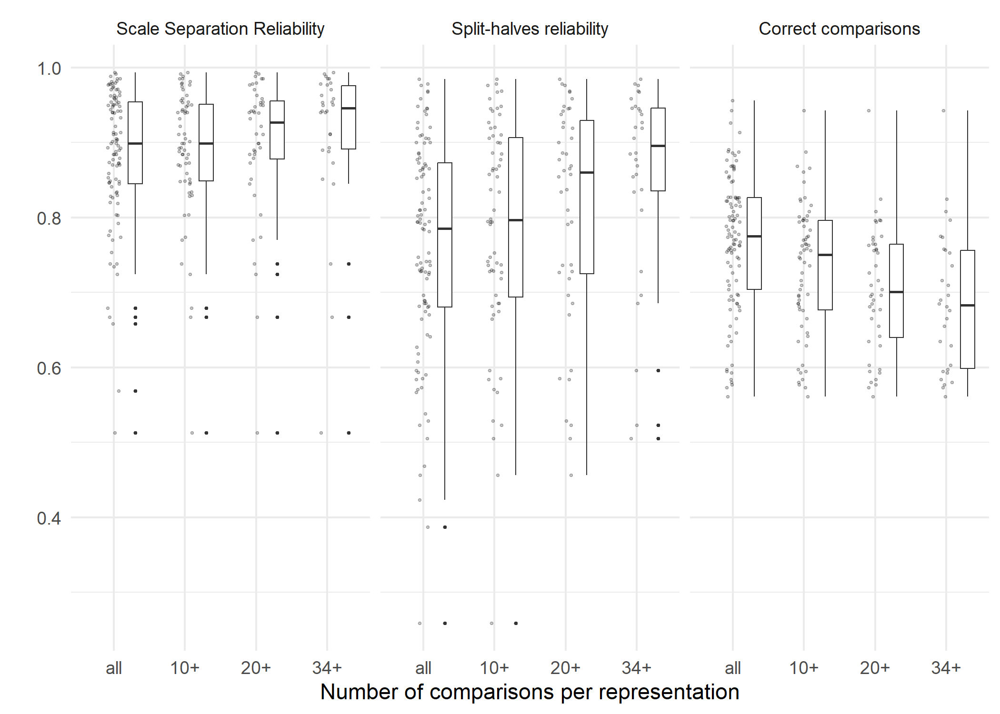

CJ meta-analysis: RQ2
================
George Kinnear
2023-08-15

# About the sample

    ## # A tibble: 1 × 1
    ##   n_datatsets
    ##         <int>
    ## 1         101

# Observed distribution of reliability measures

For these plots:

- Scale Separation Reliability (SSR) is the value of SSR computed from
  the item scores and standard errors using all of the available
  judgement data,
- Split-halves reliability comes from computing the Pearson correlation
  coefficient of the scores produced by fitting the Bradley-Terry model
  separately on two randomly-selected partitions of the judges, and
  taking the median of 100 such random splits,
- Correct comparisons is the proportion of individual decisions that
  agree with the final rank order of the items.

<!-- -->

## Relationship between observed measures

<!-- -->

# Effect of N_CR on reliability measures

> TODO - decide which thresholds to use

<!-- -->

<!-- -->

<table class="table table-striped" style="width: auto !important; margin-left: auto; margin-right: auto;">
<thead>
<tr>
<th style="text-align:left;">
ncr
</th>
<th style="text-align:left;">
measure
</th>
<th style="text-align:right;">
min
</th>
<th style="text-align:right;">
median
</th>
<th style="text-align:right;">
max
</th>
</tr>
</thead>
<tbody>
<tr>
<td style="text-align:left;">
all
</td>
<td style="text-align:left;">
Scale Separation Reliability
</td>
<td style="text-align:right;">
0.513
</td>
<td style="text-align:right;">
0.899
</td>
<td style="text-align:right;">
0.994
</td>
</tr>
<tr>
<td style="text-align:left;">
all
</td>
<td style="text-align:left;">
Split-halves reliability
</td>
<td style="text-align:right;">
0.259
</td>
<td style="text-align:right;">
0.785
</td>
<td style="text-align:right;">
0.985
</td>
</tr>
<tr>
<td style="text-align:left;">
all
</td>
<td style="text-align:left;">
Correct comparisons
</td>
<td style="text-align:right;">
0.561
</td>
<td style="text-align:right;">
0.775
</td>
<td style="text-align:right;">
0.956
</td>
</tr>
<tr>
<td style="text-align:left;">
10+
</td>
<td style="text-align:left;">
Scale Separation Reliability
</td>
<td style="text-align:right;">
0.513
</td>
<td style="text-align:right;">
0.899
</td>
<td style="text-align:right;">
0.994
</td>
</tr>
<tr>
<td style="text-align:left;">
10+
</td>
<td style="text-align:left;">
Split-halves reliability
</td>
<td style="text-align:right;">
0.259
</td>
<td style="text-align:right;">
0.797
</td>
<td style="text-align:right;">
0.985
</td>
</tr>
<tr>
<td style="text-align:left;">
10+
</td>
<td style="text-align:left;">
Correct comparisons
</td>
<td style="text-align:right;">
0.561
</td>
<td style="text-align:right;">
0.750
</td>
<td style="text-align:right;">
0.943
</td>
</tr>
<tr>
<td style="text-align:left;">
20+
</td>
<td style="text-align:left;">
Scale Separation Reliability
</td>
<td style="text-align:right;">
0.513
</td>
<td style="text-align:right;">
0.927
</td>
<td style="text-align:right;">
0.994
</td>
</tr>
<tr>
<td style="text-align:left;">
20+
</td>
<td style="text-align:left;">
Split-halves reliability
</td>
<td style="text-align:right;">
0.456
</td>
<td style="text-align:right;">
0.860
</td>
<td style="text-align:right;">
0.985
</td>
</tr>
<tr>
<td style="text-align:left;">
20+
</td>
<td style="text-align:left;">
Correct comparisons
</td>
<td style="text-align:right;">
0.561
</td>
<td style="text-align:right;">
0.701
</td>
<td style="text-align:right;">
0.943
</td>
</tr>
<tr>
<td style="text-align:left;">
34+
</td>
<td style="text-align:left;">
Scale Separation Reliability
</td>
<td style="text-align:right;">
0.513
</td>
<td style="text-align:right;">
0.946
</td>
<td style="text-align:right;">
0.994
</td>
</tr>
<tr>
<td style="text-align:left;">
34+
</td>
<td style="text-align:left;">
Split-halves reliability
</td>
<td style="text-align:right;">
0.505
</td>
<td style="text-align:right;">
0.896
</td>
<td style="text-align:right;">
0.985
</td>
</tr>
<tr>
<td style="text-align:left;">
34+
</td>
<td style="text-align:left;">
Correct comparisons
</td>
<td style="text-align:right;">
0.561
</td>
<td style="text-align:right;">
0.683
</td>
<td style="text-align:right;">
0.943
</td>
</tr>
</tbody>
</table>

# Relationships between reliability measures

> TODO - single scatter plot version of Figure 6
