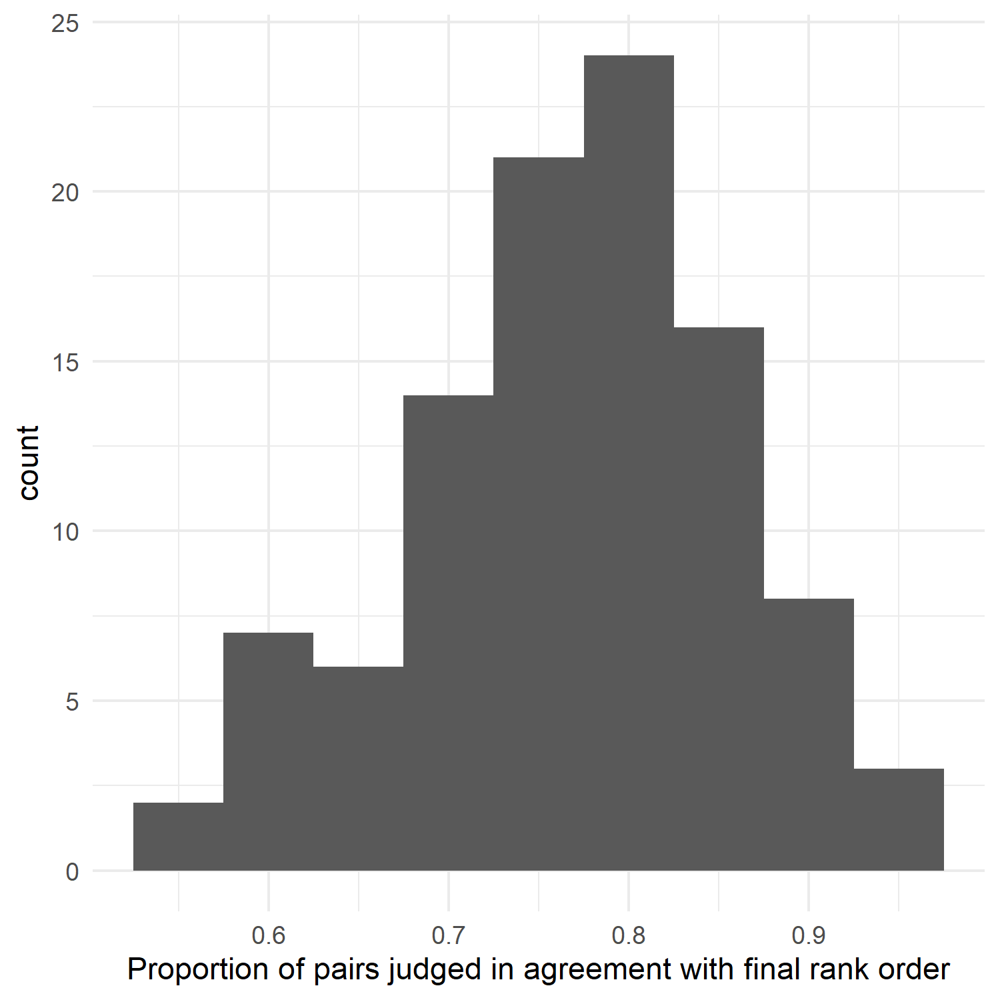
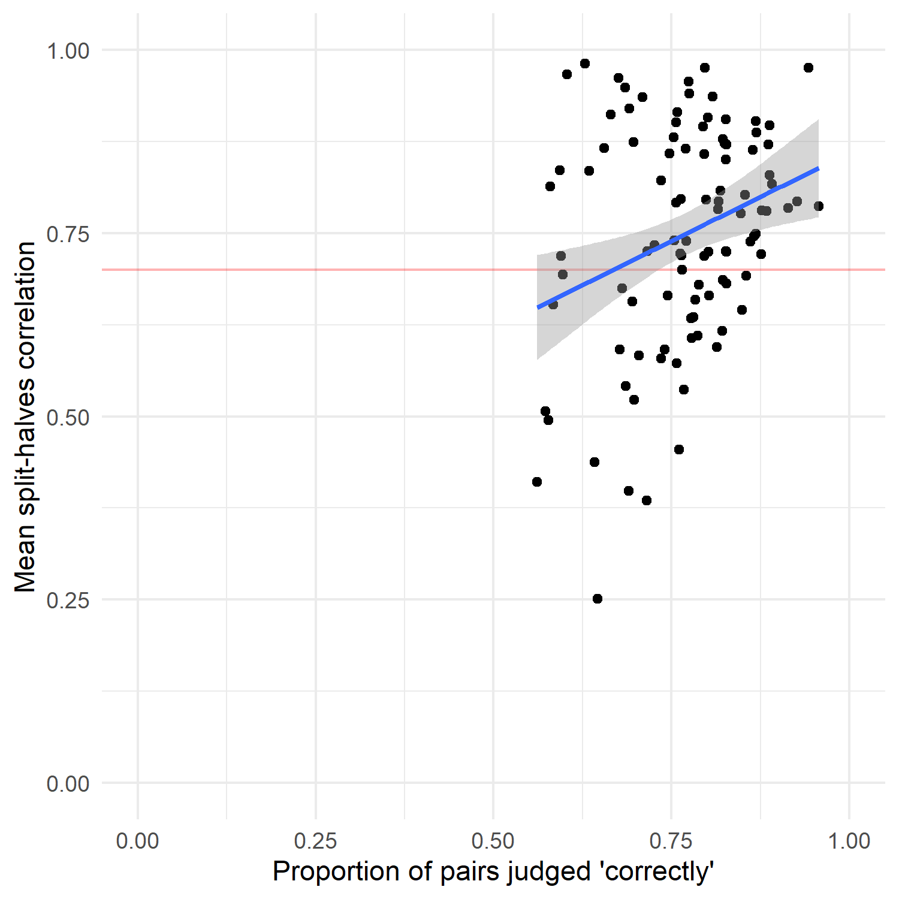

CJ meta-analysis: factors affecting reliability measures
================
George Kinnear
2022-08-22

# About the sample

The judging sessions in the sample span a wide range of number of
judgements made:

<!-- -->

Similarly, the number of judges in each session varies a lot:

<!-- -->

There is also a wide range of numbers of items in the different judging
sessions - from a handful to a maximum of 2150.

<!-- -->

# Proportion of the comparison matrix that is filled

For a judging session with

items, there are
}{2}")
possible pairs to judge.

Perhaps a factor that influences reliability is how many of these
possible pairs are actually considered by judges?

We compute the number of possible pairs in each judging session, and
compare that with the actual number of pairs that were seen by judges.

There is a bimodal pattern. Most commonly, all (or nearly all) pairs are
judged. But another common case is for only around 10% of possible pairs
to be judged.

<!-- -->

The proportion of pairs judged does not seem to have a relationship with
reliability:

<!-- -->

# Percentage agreement

What proportion of the decisions agree with the final rank order?

<!-- -->

It is generally quite high, but with a few on the low end - here are
details of all the ones with less than 70% in agreement:

<table class="table table-striped" style="width: auto !important; margin-left: auto; margin-right: auto;">
<thead>
<tr>
<th style="text-align:left;">
judging_session
</th>
<th style="text-align:right;">
prop_correct_judgements
</th>
<th style="text-align:right;">
observed_N\_A
</th>
<th style="text-align:right;">
observed_N\_R
</th>
<th style="text-align:right;">
observed_N\_C
</th>
<th style="text-align:left;">
judge_expertise
</th>
<th style="text-align:left;">
adaptivity
</th>
</tr>
</thead>
<tbody>
<tr>
<td style="text-align:left;">
Spehar2016_expt2-Plain
</td>
<td style="text-align:right;">
0.5613889
</td>
<td style="text-align:right;">
50
</td>
<td style="text-align:right;">
9
</td>
<td style="text-align:right;">
3600
</td>
<td style="text-align:left;">
layperson
</td>
<td style="text-align:left;">
FALSE
</td>
</tr>
<tr>
<td style="text-align:left;">
Spehar2016_expt2-Edges
</td>
<td style="text-align:right;">
0.5730556
</td>
<td style="text-align:right;">
50
</td>
<td style="text-align:right;">
9
</td>
<td style="text-align:right;">
3600
</td>
<td style="text-align:left;">
layperson
</td>
<td style="text-align:left;">
FALSE
</td>
</tr>
<tr>
<td style="text-align:left;">
Luckett2018_icecream
</td>
<td style="text-align:right;">
0.5770115
</td>
<td style="text-align:right;">
87
</td>
<td style="text-align:right;">
5
</td>
<td style="text-align:right;">
435
</td>
<td style="text-align:left;">
layperson
</td>
<td style="text-align:left;">
FALSE
</td>
</tr>
<tr>
<td style="text-align:left;">
Luckett2018_coldbrew
</td>
<td style="text-align:right;">
0.5800000
</td>
<td style="text-align:right;">
100
</td>
<td style="text-align:right;">
3
</td>
<td style="text-align:right;">
300
</td>
<td style="text-align:left;">
layperson
</td>
<td style="text-align:left;">
FALSE
</td>
</tr>
<tr>
<td style="text-align:left;">
Luckett2018_pizza
</td>
<td style="text-align:right;">
0.5842105
</td>
<td style="text-align:right;">
95
</td>
<td style="text-align:right;">
5
</td>
<td style="text-align:right;">
380
</td>
<td style="text-align:left;">
layperson
</td>
<td style="text-align:left;">
FALSE
</td>
</tr>
<tr>
<td style="text-align:left;">
Luckett2018_cola
</td>
<td style="text-align:right;">
0.5929293
</td>
<td style="text-align:right;">
99
</td>
<td style="text-align:right;">
6
</td>
<td style="text-align:right;">
990
</td>
<td style="text-align:left;">
layperson
</td>
<td style="text-align:left;">
FALSE
</td>
</tr>
<tr>
<td style="text-align:left;">
Spehar2016_expt2-Thr
</td>
<td style="text-align:right;">
0.5947222
</td>
<td style="text-align:right;">
50
</td>
<td style="text-align:right;">
9
</td>
<td style="text-align:right;">
3600
</td>
<td style="text-align:left;">
layperson
</td>
<td style="text-align:left;">
FALSE
</td>
</tr>
<tr>
<td style="text-align:left;">
Spehar2016_expt2-Mountain
</td>
<td style="text-align:right;">
0.5972222
</td>
<td style="text-align:right;">
50
</td>
<td style="text-align:right;">
9
</td>
<td style="text-align:right;">
3600
</td>
<td style="text-align:left;">
layperson
</td>
<td style="text-align:left;">
FALSE
</td>
</tr>
<tr>
<td style="text-align:left;">
Isnac2020
</td>
<td style="text-align:right;">
0.6028797
</td>
<td style="text-align:right;">
444
</td>
<td style="text-align:right;">
8
</td>
<td style="text-align:right;">
12432
</td>
<td style="text-align:left;">
layperson
</td>
<td style="text-align:left;">
FALSE
</td>
</tr>
<tr>
<td style="text-align:left;">
Esen2019
</td>
<td style="text-align:right;">
0.6287737
</td>
<td style="text-align:right;">
459
</td>
<td style="text-align:right;">
8
</td>
<td style="text-align:right;">
12852
</td>
<td style="text-align:left;">
expert
</td>
<td style="text-align:left;">
FALSE
</td>
</tr>
<tr>
<td style="text-align:left;">
LuckettX_odor-familiar
</td>
<td style="text-align:right;">
0.6346154
</td>
<td style="text-align:right;">
52
</td>
<td style="text-align:right;">
5
</td>
<td style="text-align:right;">
520
</td>
<td style="text-align:left;">
layperson
</td>
<td style="text-align:left;">
FALSE
</td>
</tr>
<tr>
<td style="text-align:left;">
Sangwin2021_study2-insight
</td>
<td style="text-align:right;">
0.6415525
</td>
<td style="text-align:right;">
25
</td>
<td style="text-align:right;">
15
</td>
<td style="text-align:right;">
438
</td>
<td style="text-align:left;">
novice
</td>
<td style="text-align:left;">
FALSE
</td>
</tr>
<tr>
<td style="text-align:left;">
Kinnear2021_students-withsolutions2
</td>
<td style="text-align:right;">
0.6465257
</td>
<td style="text-align:right;">
9
</td>
<td style="text-align:right;">
20
</td>
<td style="text-align:right;">
331
</td>
<td style="text-align:left;">
novice
</td>
<td style="text-align:left;">
FALSE
</td>
</tr>
<tr>
<td style="text-align:left;">
StadthagenGonzalez2019_spa-to-eng
</td>
<td style="text-align:right;">
0.6550000
</td>
<td style="text-align:right;">
40
</td>
<td style="text-align:right;">
20
</td>
<td style="text-align:right;">
1200
</td>
<td style="text-align:left;">
layperson
</td>
<td style="text-align:left;">
FALSE
</td>
</tr>
<tr>
<td style="text-align:left;">
Spehar2016_expt2-Fracts
</td>
<td style="text-align:right;">
0.6650000
</td>
<td style="text-align:right;">
50
</td>
<td style="text-align:right;">
9
</td>
<td style="text-align:right;">
3600
</td>
<td style="text-align:left;">
layperson
</td>
<td style="text-align:left;">
FALSE
</td>
</tr>
<tr>
<td style="text-align:left;">
Vatavu2020
</td>
<td style="text-align:right;">
0.6759666
</td>
<td style="text-align:right;">
251
</td>
<td style="text-align:right;">
14
</td>
<td style="text-align:right;">
6595
</td>
<td style="text-align:left;">
layperson
</td>
<td style="text-align:left;">
FALSE
</td>
</tr>
<tr>
<td style="text-align:left;">
Kinnear2021_students-withoutsolutions
</td>
<td style="text-align:right;">
0.6772727
</td>
<td style="text-align:right;">
22
</td>
<td style="text-align:right;">
20
</td>
<td style="text-align:right;">
440
</td>
<td style="text-align:left;">
novice
</td>
<td style="text-align:left;">
FALSE
</td>
</tr>
<tr>
<td style="text-align:left;">
Sangwin2021_study2-understanding
</td>
<td style="text-align:right;">
0.6808511
</td>
<td style="text-align:right;">
34
</td>
<td style="text-align:right;">
15
</td>
<td style="text-align:right;">
611
</td>
<td style="text-align:left;">
novice
</td>
<td style="text-align:left;">
FALSE
</td>
</tr>
<tr>
<td style="text-align:left;">
Zucco2019_experts
</td>
<td style="text-align:right;">
0.6849403
</td>
<td style="text-align:right;">
283
</td>
<td style="text-align:right;">
37
</td>
<td style="text-align:right;">
3101
</td>
<td style="text-align:left;">
expert
</td>
<td style="text-align:left;">
FALSE
</td>
</tr>
<tr>
<td style="text-align:left;">
Zucco2019_legislators
</td>
<td style="text-align:right;">
0.6857143
</td>
<td style="text-align:right;">
140
</td>
<td style="text-align:right;">
37
</td>
<td style="text-align:right;">
560
</td>
<td style="text-align:left;">
expert
</td>
<td style="text-align:left;">
FALSE
</td>
</tr>
<tr>
<td style="text-align:left;">
Kinnear2021_students-withsolutions1
</td>
<td style="text-align:right;">
0.6901408
</td>
<td style="text-align:right;">
8
</td>
<td style="text-align:right;">
20
</td>
<td style="text-align:right;">
142
</td>
<td style="text-align:left;">
novice
</td>
<td style="text-align:left;">
FALSE
</td>
</tr>
<tr>
<td style="text-align:left;">
Jones2015b
</td>
<td style="text-align:right;">
0.6903681
</td>
<td style="text-align:right;">
76
</td>
<td style="text-align:right;">
24
</td>
<td style="text-align:right;">
1983
</td>
<td style="text-align:left;">
peer
</td>
<td style="text-align:left;">
unknown
</td>
</tr>
<tr>
<td style="text-align:left;">
Holmes2017
</td>
<td style="text-align:right;">
0.6951515
</td>
<td style="text-align:right;">
33
</td>
<td style="text-align:right;">
66
</td>
<td style="text-align:right;">
1650
</td>
<td style="text-align:left;">
expert
</td>
<td style="text-align:left;">
FALSE
</td>
</tr>
<tr>
<td style="text-align:left;">
Vatavu2019
</td>
<td style="text-align:right;">
0.6964990
</td>
<td style="text-align:right;">
108
</td>
<td style="text-align:right;">
49
</td>
<td style="text-align:right;">
4056
</td>
<td style="text-align:left;">
layperson
</td>
<td style="text-align:left;">
FALSE
</td>
</tr>
<tr>
<td style="text-align:left;">
Kinnear2021_students-odd
</td>
<td style="text-align:right;">
0.6976744
</td>
<td style="text-align:right;">
12
</td>
<td style="text-align:right;">
10
</td>
<td style="text-align:right;">
215
</td>
<td style="text-align:left;">
novice
</td>
<td style="text-align:left;">
FALSE
</td>
</tr>
</tbody>
</table>

<!-- -->

# Number of comparisons per representation

This is considered important by Verhavert (2019).

But an initial look at our data suggest it’s not so closely linked to
split-halves:

    ## Warning: Removed 8 rows containing non-finite values (stat_smooth).

    ## Warning: Removed 8 rows containing missing values (geom_point).

<!-- -->

Same with SSR:

    ## Warning: Removed 8 rows containing non-finite values (stat_smooth).

    ## Warning: Removed 8 rows containing missing values (geom_point).

<!-- -->

Unlike the Verhavert (2019) sample, we seem to have many judging
sessions with low N_CR yet high reliability.

## Adaptivity

All the examples with

are not adaptive, so we focus the plot on

to see the details better.

Observations:

1.  the adaptive ones tend to have lower N_CR and are among the higher
    split-halves for a given N_CR level.

2.  the “unknown” ones look quite similar to the adaptive ones, so
    chances are they were adaptive too?

<!-- -->

    ## Warning: Removed 13 rows containing missing values (geom_point).

<!-- -->

## Judge expertise

Of the judging sessions with
,
all but one (Esen2019) have layperson judges.

    ## Warning: Removed 13 rows containing missing values (geom_point).

<!-- -->

## Number of judges

The number of judges varies over quite a large range, so to colour the
points we use
"),
so the colours correspond to the nearest power of 2.

<!-- -->

Here we zoom in on
:

<!-- -->
